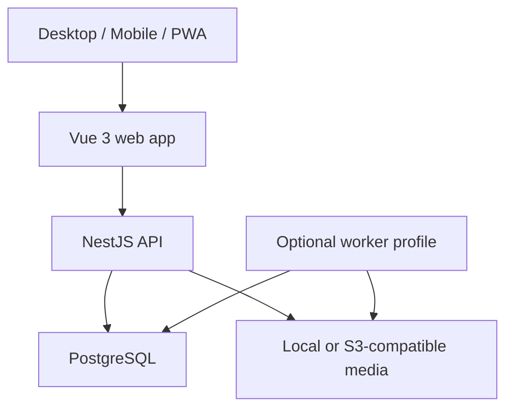

# Inventory Atlas Implementation Blueprint

> Status: Approved for implementation  
> Blueprint version: 0.2  
> Source baseline: `docs/product/inventory-atlas-design-document-v0.3.1.pdf`  
> Source status: Final and approved after errata E1  
> Prepared: 2026-08-28  
> Default product locale: English  
> Required MVP locale: Ukrainian

## Changes in blueprint v0.2

| Review item | Implemented correction |
| --- | --- |
| C1.1 | Projection writes resolve and lock the destination storage path inside the supplied transaction; the conflicting standalone Storage guard is removed |
| C1.2 | Node attributes are part of the StorageNode aggregate and are written atomically through `AttributeValuePort` |
| C1.3 | Every schema-v1 table now has an explicit owner, read client, and write path |
| C2 | Owner is restored as the highest role; Admin restrictions match the approved design baseline |
| C3 | QR tokens use reproducible keyed derivation with generation-based revocation and key versioning |
| C4 | Multiselect has one canonical representation: ordered scalar rows with `value_option_id`; arrays exist only in search/API projections |
| C5 | Environment/bootstrap and database-setting authority is explicit for every overlapping setting |
| Formal | ADR-021 through ADR-026 document the new implementation decisions introduced by this blueprint |

## 1. Purpose and authority

This document translates the approved Inventory Atlas design into an implementation-ready technical plan. It defines the repository, module boundaries, database schema v1, transaction rules, API surface, frontend structure, runtime topology, test gates, and delivery backlog.

The approved design document remains authoritative for product behavior and architectural intent. This blueprint is authoritative for implementation structure unless it conflicts with the design document. Any conflict must stop implementation and be resolved by an ADR before code continues.

Normative terms:

- **MUST**: required for correctness, security, portability, or the MVP release gate.
- **SHOULD**: expected default; deviation requires a documented engineering reason.
- **MAY**: optional within the approved scope.
- **Deferred**: explicitly outside the MVP implementation sequence and must not block it.

## 2. Approved baseline

The following decisions are frozen for schema v1 and the MVP:

| Area | Binding decision |
| --- | --- |
| Architecture | Modular monolith, not microservices |
| Runtime | Node.js 24 LTS |
| Frontend | Vue 3 SFC, Composition API, modern JavaScript, Vite, `checkJs` |
| UI | PrimeVue behind an internal UI facade; one modern theme in MVP |
| Backend | NestJS with TypeScript and Fastify adapter |
| API | REST under `/api/v1`; OpenAPI is the contract source |
| Database | PostgreSQL is the only required infrastructure dependency |
| Core data | Typed EAV is the source of truth for dynamic attributes |
| Storage tree | `parent_id` plus `ltree path`, `depth`, and `tree_root_id` |
| Search | PostgreSQL `item_search` materialized read model |
| Data access | Prisma CRUD plus Kysely for specialized Storage/Search/Jobs access |
| Transactions | One business transaction uses exactly one client; projection/outbox writes join the source transaction through ports |
| Authentication | Opaque server-side sessions; Argon2id password hashing |
| Media | Local storage by default; S3-compatible adapter optional |
| Jobs | PostgreSQL queue with `FOR UPDATE SKIP LOCKED`, lease, retry, and dead-letter state |
| Localization | English source/default; complete Ukrainian UI selectable in MVP |
| Deployment | Docker Compose for local, homelab, and dedicated server use |
| Public access | Configurable; exact storage path and sensitive fields private by default |
| MVP estimate | 22-30 weeks for one experienced full-time developer |

Forbidden implementation drift:

- Do not introduce Redis, RabbitMQ, Kafka, OpenSearch, Elasticsearch, or a mandatory S3 service in MVP.
- Do not split the system into deployable microservices.
- Do not replace typed EAV with a single untyped JSON document.
- Do not expose private values to any search vector or result count available to Viewer/Editor roles.
- Do not add offline mutations, automatic marketplace publication, or carrier shipment creation to MVP.
- Do not use both Prisma and Kysely clients inside one database transaction.

## 3. Delivery scope

### 3.1 MVP scope

MVP is stages 0-6 and MUST include:

- One-command Docker Compose deployment.
- Owner bootstrap, authentication, users, and roles.
- Item catalog with versioned edits, categories, lifecycle statuses, tags, and typed dynamic fields.
- Arbitrarily nested storage nodes with safe atomic moves and movement history.
- Main image, image gallery, thumbnails, metadata policy, and HEIC/HEIF support.
- Public/authenticated/private/unlisted visibility behavior.
- PostgreSQL search, typed filters, stable cursors, bounded relevance mode, saved views, and bulk actions.
- QR and Code 128 label generation, printable PDF batches, scan resolution, and mobile scanner mode.
- Portable export/import including media and an operational backup/restore procedure.
- English as the default UI and complete Ukrainian localization selectable without restart.
- Automated tests, CI, health checks, structured logs, and release artifacts.

### 3.2 Post-MVP scope already modeled

These capabilities MAY have schema/contracts reserved but MUST NOT delay the MVP:

- Inventory count sessions.
- Manual shipment tracking, then Nova Poshta and Ukrposhta tracking adapters.
- Listing drafts and marketplace adapters.
- Separate worker deployment, S3/MinIO, and read replicas when metrics justify them.

### 3.3 Explicit non-goals

- Native mobile applications.
- Offline-first synchronization or offline mutations.
- Multi-tenant SaaS billing or team workspaces.
- External search infrastructure.
- Automatic sales publishing in the first release.
- Destructive hard delete as a normal user action.
- Arbitrary JavaScript in display-name templates or field validation.

## 4. System context



The compact profile runs the HTTP API and lightweight job runner in one API container. Media decoding still runs in a resource-capped child process. The expanded profile disables job claiming in the API and starts a dedicated worker container.

## 5. Repository blueprint

Use a Corepack-pinned pnpm workspace. The lockfile is committed. Frontend source remains JavaScript; generated declaration files and backend source may be TypeScript.

```text
inventory-atlas/
├─ apps/
│  ├─ api/                     # NestJS HTTP composition root
│  ├─ worker/                  # NestJS application-context composition root
│  └─ web/                     # Vue 3 application
├─ packages/
│  ├─ backend/                 # Domain, application, ports, adapters, Nest modules
│  ├─ contracts/               # Generated OpenAPI types, JSDoc declarations, Zod schemas
│  ├─ config/                  # Environment parsing and shared runtime configuration
│  ├─ i18n/                    # en/uk resources and coverage tools
│  ├─ ui/                      # App* component facade and semantic tokens
│  └─ testkit/                 # Fixtures, factories, PostgreSQL helpers, auth helpers
├─ db/
│  ├─ migrations/              # Single ordered migration stream
│  ├─ seeds/                   # Idempotent system dictionaries and bootstrap data
│  └─ fixtures/                # Reference and acceptance datasets
├─ infra/
│  ├─ docker/                  # Dockerfiles, entrypoints, health checks
│  ├─ caddy/                   # Reverse proxy and static web configuration
│  └─ compose/                 # Base, development, expanded, backup profiles
├─ scripts/
│  ├─ generate-openapi.mjs
│  ├─ generate-contracts.mjs
│  ├─ check-contract-drift.mjs
│  ├─ check-i18n-coverage.mjs
│  └─ verify-module-boundaries.mjs
├─ docs/
│  ├─ product/                  # Approved product design and source artifacts
│  ├─ adr/
│  ├─ api/
│  ├─ operations/
│  ├─ security/
│  └─ project/                  # Project-wide policies and supporting documentation
├─ .github/workflows/
├─ package.json
├─ pnpm-workspace.yaml
├─ pnpm-lock.yaml
├─ eslint.config.js
├─ jsconfig.json
├─ docker-compose.yml
├─ .env.example
├─ README.md
└─ IMPLEMENTATION-BLUEPRINT.md
```

### 5.1 Composition roots

| Application | Responsibility | Must not contain |
| --- | --- | --- |
| `apps/api` | HTTP server, middleware, OpenAPI generation, compact job scheduler switch | Domain logic, raw repository code |
| `apps/worker` | Queue claim loop and background processor composition | HTTP controllers, duplicated job handlers |
| `apps/web` | Routes, page composition, client-side state and UX | Database assumptions, handwritten duplicate API payload schemas |
| `packages/backend` | Domain model, application services, ports, database/media adapters | Deployment-specific secrets or UI code |

### 5.2 Root commands

The root `package.json` MUST expose these stable commands:

```text
pnpm dev
pnpm build
pnpm lint
pnpm check
pnpm test
pnpm test:integration
pnpm test:e2e
pnpm db:migrate
pnpm db:seed
pnpm db:verify
pnpm api:spec
pnpm contracts:generate
pnpm contracts:check
pnpm i18n:check
pnpm compose:validate
```

`pnpm check` runs frontend `checkJs`, backend type checking, module-boundary checks, and contract drift checks.

## 6. Backend module blueprint

Each module follows this internal structure only when needed:

```text
modules/<module>/
├─ domain/          # Entities, value objects, policies, domain errors
├─ application/     # Commands, queries, orchestration, transaction boundary
├─ ports/           # Repository and integration interfaces
├─ adapters/        # Prisma, Kysely, filesystem, HTTP provider implementations
├─ api/             # Nest controllers and DTOs
├─ jobs/            # Background handlers owned by the module
└─ index.ts          # Explicit public module surface
```

Do not create empty layers. A simple module may begin with `application`, `adapters`, and `api`, then gain domain objects when behavior warrants them.

### 6.1 Module responsibilities

| Module | Owns | Public application surface |
| --- | --- | --- |
| Auth | Users, sessions, invitations, credential lifecycle | `signIn`, `signOut`, `getCurrentUser`, `inviteUser`, `changeRole` |
| Catalog | Items, tags, categories, lifecycle assignments | `createItem`, `updateItem`, `archiveItem`, `bulkAction`, item queries |
| Schema | Field definitions, options, typed-value persistence rules, validation, display templates | `createField`, `updateField`, `archiveField`, `validateAttributes`, `readAttributes`, `replaceAttributes`, `renderDisplayName` |
| Storage | StorageNode aggregate including node attributes, tree/path rules, moves, movement history | `createNode`, `updateNode`, `replaceNodeAttributes`, `renameNode`, `moveNode`, `moveItem`, subtree queries |
| Media | Upload sessions, assets, variants, ordering, storage adapter | `beginUpload`, `finalizeUpload`, `reorderMedia`, `deleteMedia` |
| Search | `item_search`, filters, ranking, saved views | `searchItems`, `writeSync`, `scheduleReindex`, `rebuildProjection` |
| Labels | Entity codes, label templates, batches, PDF generation | `issueCode`, `createBatch`, `renderBatch`, `resolveScanToken` |
| Portability | Portable export/import, manifest validation | `createExport`, `validateImport`, `applyImport`, `getJobProgress` |
| Jobs | Queue, lease, retry, dead-letter, outbox dispatch | `enqueue`, `claim`, `heartbeat`, `complete`, `fail` |
| Audit | Append-only security and domain audit events | `record`, `queryAudit` |
| Inventory | Count sessions and discrepancy reports | Deferred P1 |
| Shipments | Manual shipments, tracking providers, status timeline | Deferred P1 |
| Listings | Listing drafts, channel mapping and state | Deferred P2 |

### 6.2 Dependency rules

- Controllers depend on application services, never repositories.
- Application services depend on ports and domain policies.
- Adapters implement ports and may depend on vendor libraries.
- One module may call another only through its exported application interface or declared port.
- Direct imports into another module's `adapters` or `domain` directory are forbidden.
- Search may read its projection but must not become the source of truth for item edits.
- Shipment and listing providers must not mutate Item directly.
- Media and labels refer to an entity through explicit relations; they do not own entity lifecycle.
- Module-boundary verification runs in CI.

## 7. Data-access and transaction blueprint

### 7.1 Single migration authority

Kysely's migration runner is the sole schema migration mechanism for the complete PostgreSQL database. Migrations may use Kysely schema operations or reviewed parameterized/raw SQL. Prisma Migrate MUST NOT run in deployment.

The Prisma schema models only Prisma-accessible tables and exists for client generation and validation. Kysely types are generated or maintained for Kysely-accessible tables. CI starts a clean PostgreSQL instance, applies every migration, generates both clients, and runs drift checks.

### 7.2 Table ownership and clients

| Tables | Owner | Read client | Write client |
| --- | --- | --- | --- |
| `users` | Auth | Prisma | Prisma transaction |
| `sessions` | Auth | Prisma | Prisma transaction |
| `invitations` | Auth | Prisma | Prisma transaction |
| `app_settings` | Config / Admin | Prisma | Prisma transaction |
| `items` | Catalog | Prisma | Prisma transaction |
| `categories` | Catalog | Prisma | Prisma transaction |
| `lifecycle_statuses` | Catalog | Prisma | Prisma transaction |
| `tags` | Catalog | Prisma | Prisma transaction |
| `item_tags` | Catalog | Prisma | Prisma transaction |
| `field_definitions` | Schema | Prisma | Prisma transaction |
| `field_options` | Schema | Prisma | Prisma transaction |
| `attribute_values` | Schema typed-value store | Prisma | Current Item or StorageNode source transaction through `AttributeValuePort` |
| `storage_nodes` | Storage | Kysely | Kysely transaction |
| `movements` | Storage | Kysely | Current source transaction through `MovementHistoryPort` |
| `media_assets` | Media | Prisma | Prisma transaction |
| `media_relations` | Media | Prisma | Prisma transaction |
| `upload_sessions` | Media | Prisma | Prisma transaction |
| `item_search` | Search | Kysely only | Current source transaction through `SearchProjectionPort` |
| `entity_codes` | Labels | Prisma | Prisma transaction |
| `label_templates` | Labels | Prisma | Prisma transaction |
| `label_batches` | Labels | Prisma | Prisma transaction plus `OutboxPort` for render job |
| `saved_views` | Search preferences | Prisma | Prisma transaction |
| `jobs` | Jobs | Kysely only | Kysely transaction |
| `outbox` | Infrastructure | Kysely only | Current source transaction through `OutboxPort` |
| `audit_events` | Audit | Prisma | Current source transaction through `AuditPort` |
| `idempotency_records` | Infrastructure | Kysely | Reservation through Kysely; completion through current source transaction via `IdempotencyPort` |
| `portability_runs` | Portability | Prisma | Prisma transaction plus `OutboxPort` for background work |
| `inventory_sessions` | Inventory (P1) | Prisma | Prisma transaction |
| `inventory_session_entries` | Inventory (P1) | Prisma | Prisma transaction |
| `shipments` | Shipments (P1) | Prisma | Prisma transaction |
| `shipment_entities` | Shipments (P1) | Prisma | Prisma transaction |
| `tracking_events` | Shipments (P1) | Prisma | Prisma transaction |
| `provider_connections` | Integrations (P1) | Prisma | Prisma transaction; secrets remain outside row payloads |
| `listings` | Listings (P2) | Prisma | Prisma transaction |
| `listing_channel_states` | Listings (P2) | Prisma | Prisma transaction |

Ownership means the named read repository is the only general query path. A transaction-aware write port may execute a narrowly defined parameterized statement against a table owned by another module, but it cannot expose that table as a general repository.

### 7.3 Transaction context contract

One business transaction MUST use exactly one database client.

```ts
export type TransactionContext =
  | { kind: 'prisma'; trx: Prisma.TransactionClient }
  | { kind: 'kysely'; trx: KyselyTransaction<Database> }

export interface SearchProjectionPort {
  writeSync(ctx: TransactionContext, command: ProjectionCommand): Promise<void>
}

export interface OutboxPort {
  enqueue(ctx: TransactionContext, message: OutboxMessage): Promise<void>
}

export interface MovementHistoryPort {
  append(ctx: TransactionContext, movement: MovementRecord): Promise<void>
}

export interface AuditPort {
  record(ctx: TransactionContext, event: AuditRecord): Promise<void>
}

export interface AttributeValuePort {
  replace(ctx: TransactionContext, command: ReplaceAttributeValues): Promise<void>
}

export interface IdempotencyPort {
  complete(ctx: TransactionContext, result: IdempotentResult): Promise<void>
}
```

Implementation requirements:

- Each transaction-aware port has Prisma and Kysely adapters with the same SQL semantics.
- The Prisma adapter uses parameterized `$executeRaw` on the supplied `Prisma.TransactionClient`.
- The Kysely adapter executes through the supplied Kysely transaction.
- A port MUST NOT obtain a pool connection or open/commit a transaction.
- Search and Outbox read paths remain Kysely-only; movement and audit reads stay with their owning repositories.
- `MovementHistoryPort` is required when a Prisma-owned Item changes its storage node.
- `AuditPort` is required when a Kysely-owned Storage mutation must record audit in the same transaction.
- `AttributeValuePort` allows both Prisma-owned Item and Kysely-owned StorageNode aggregates to replace their typed values atomically; general attribute reads remain Prisma-owned.
- `IdempotencyPort` finalizes a reserved request record in the source transaction so a committed effect and its replayable result cannot diverge.
- `SearchProjectionPort.writeSync` has one named cross-ownership exception: its parameterized projection statement MAY resolve `path_text`, `public_path_text`, effective visibility, and `tree_root_id` from `storage_nodes`. It returns no Storage domain row and is not a general read API.
- Before resolving a non-null destination path, the projection adapter acquires the same transaction-level advisory lock for the destination `tree_root_id` used by node move/rename. The path resolution and projection upsert then execute in the supplied transaction. All node mutations that can change breadcrumb or visibility acquire that root lock before their source update.
- The standalone `StorageDestinationGuardPort` is removed. Missing or archived destinations cause the projection statement to affect no valid source row and raise a domain error, rolling back the Item mutation.
- A rollback of the source mutation MUST roll back synchronous projection, attributes, movement, audit, idempotency completion, and outbox writes.
- Integration tests prove both Prisma-source and Kysely-source paths.

### 7.4 Transaction ownership examples

| Use case | Source client | Same-transaction work | After commit |
| --- | --- | --- | --- |
| Create/update Item | Prisma | Item, attributes through `AttributeValuePort`, display name, `item_search`, audit, idempotency, outbox | Optional media/vector jobs |
| Move Item | Prisma | Item destination, movement history, projection, audit, outbox | Optional vector job |
| Create/update StorageNode | Kysely | Node, node attributes through `AttributeValuePort`, projection invalidation, audit, idempotency, outbox | Optional vector job |
| Change field definition | Prisma | Definition, audit, reindex outbox record | Mass projection rebuild job |
| Rename category/option | Prisma | Source row, audit, reindex outbox record | Vector rebuild job |
| Move/rename node | Kysely | Tree rows, movement, path/visibility projections, audit, outbox | Vector rebuild job |
| Change item visibility | Prisma | Item and safe public projection | None unless vector content changes |

## 8. PostgreSQL schema v1

### 8.1 Required extensions

Migration 0001 MUST enable:

```sql
CREATE EXTENSION IF NOT EXISTS ltree;
CREATE EXTENSION IF NOT EXISTS pg_trgm;
CREATE EXTENSION IF NOT EXISTS unaccent;
```

Use UUID primary keys generated by the application. UUIDv7 is preferred where the selected runtime library is stable; random UUID remains acceptable. Public identifiers and scan tokens are separate from internal IDs.

### 8.2 Shared conventions

- All timestamps are `timestamptz` in UTC.
- Business tables use `created_at` and `updated_at`.
- Mutable aggregates use `version bigint NOT NULL DEFAULT 1`.
- User-facing mutable records use `archived_at`; normal workflows do not hard-delete them.
- External/provider payloads may use JSONB, but queryable domain values remain typed.
- Enum-like values are database check constraints or lookup tables, not unconstrained strings.
- Money uses `numeric(19,4)` plus uppercase ISO 4217 currency code.
- Locale-label JSON has the form `{ "en": "...", "uk": "..." }`; `en` is required.

### 8.3 Identity and authorization tables

#### `users`

| Column | Type | Rules |
| --- | --- | --- |
| `id` | uuid | PK |
| `email_normalized` | text | Unique, lower-case |
| `display_name` | text | Required |
| `password_hash` | text | Argon2id encoded hash |
| `role` | text | `viewer`, `editor`, `owner`, `admin` |
| `locale` | text | `en` or `uk`; default `en` |
| `status` | text | `active`, `disabled` |
| `last_login_at` | timestamptz | Nullable |
| timestamps/version | standard | Required |

The public anonymous actor is not a stored role.

#### `sessions`

Stores only a hash of the opaque session token. Required fields: `user_id`, `token_hash`, `csrf_secret_hash`, `created_at`, `last_seen_at`, `idle_expires_at`, `absolute_expires_at`, `revoked_at`, `ip_hash`, and normalized user-agent metadata.

#### `invitations`

Stores hashed one-time tokens, intended role, expiry, inviter, accepted timestamp, and revocation timestamp.

#### `app_settings`

Stores validated mutable installation settings such as catalog access mode, canonical public base URL, default locale, and user-facing media policy. Every key has a typed parser in code; arbitrary runtime config is not accepted. Infrastructure selection and safety ceilings, including `MEDIA_DRIVER`, credentials, decode memory, pixel limits, and filesystem paths, remain environment-only and are never shadowed by this table. Section 18 defines bootstrap and conflict precedence for every overlapping key.

### 8.4 Catalog tables

#### `items`

| Column | Type | Rules |
| --- | --- | --- |
| `id` | uuid | PK |
| `public_id` | uuid | Unique, immutable, used in stable URLs |
| `slug` | text | Decorative only; routing never depends on it |
| `category_id` | uuid | FK categories |
| `lifecycle_status_id` | uuid | FK lifecycle statuses |
| `storage_node_id` | uuid | Nullable FK storage node |
| `display_name` | text | Derived and cached |
| `description` | text | Optional |
| `visibility` | text | `public`, `authenticated`, `private`, `unlisted` |
| `version` | bigint | Increment on any item/attribute aggregate mutation |
| timestamps/archive | standard | Required |

#### `categories`

`id`, optional `parent_id`, unique stable `key`, `label_i18n jsonb`, `display_template`, `display_order`, timestamps, and `archived_at`.

#### `lifecycle_statuses`

`id`, unique stable `key`, `label_i18n`, semantic `color_token`, `display_order`, timestamps, and `archived_at`. Seed examples: `stored`, `reserved`, `lent`, `for_sale`, `sold`, `lost`, and `archived`.

#### `tags` and `item_tags`

Tags have normalized unique names. `item_tags` has a composite PK `(item_id, tag_id)`.

### 8.5 Dynamic schema and typed EAV

#### `field_definitions`

Required columns:

- `id`, stable `key`, `scope`, optional `category_id`.
- `label_i18n`, optional `help_i18n`.
- `data_type`: `text`, `long_text`, `number`, `boolean`, `date`, `datetime`, `select`, `multiselect`, `url`, `email`, `money`, or `reference`.
- `required`, `repeatable`, `searchable`, `filterable`, `sortable`.
- `visibility`: `public`, `authenticated`, or `private`.
- `unit`, `default_value_json`, `validation_json`, `display_order`.
- timestamps, `version`, and `archived_at`.

Uniqueness is `(scope, category_id, key)` with a partial unique index excluding archived definitions.

#### `field_options`

`id`, `field_definition_id`, stable `key`, `label_i18n`, `display_order`, timestamps, and `archived_at`. Unique active key per field.

#### `attribute_values`

The table supports item and storage-node scopes while keeping real foreign keys:

- `id`, `field_definition_id`.
- Exactly one owner: `item_id` or `storage_node_id`.
- `position` is the only multiplicity mechanism and is required for every stored row.
- Typed slots: `value_text`, `value_number`, `value_boolean`, `value_date`, `value_datetime`, `value_option_id`, `value_money_amount`, `value_money_currency`, `value_reference_item_id`, `value_reference_node_id`.
- timestamps.

Database checks MUST enforce:

- Exactly one owner is non-null.
- Exactly one value group is populated.
- Money amount and currency are both set or both null.
- `position >= 0`.
- `(owner, field_definition_id, position)` is unique.
- Active multiselect option rows are unique by `(owner, field_definition_id, value_option_id)`.

Application validation MUST additionally enforce that the populated slot matches `field_definitions.data_type`, option IDs belong to the field, required fields exist, and values satisfy validation rules.

Canonical multiplicity rules:

- Non-repeatable scalar and `select` fields store exactly one row at `position = 0`.
- Repeatable scalar fields store one typed row per value with contiguous positions `0..N-1`.
- `multiselect` stores one row per selected option using `value_option_id` and contiguous positions. It never stores a PostgreSQL UUID array.
- `repeatable = true` is invalid for `select` and `multiselect`; use `multiselect` when several options are allowed.
- API payloads and `item_search.attrs` / `public_attrs` expose multiselect as an ordered array assembled from these rows. The array is a projection, not a second persistence representation.

Changing a field's data type after values exist requires a conversion plan, preview, background conversion where needed, and an audit record. Direct mutation is rejected.

### 8.6 Storage tables

#### `storage_nodes`

| Column | Type | Rules |
| --- | --- | --- |
| `id` | uuid | PK |
| `public_id` | uuid | Unique stable URL identity |
| `parent_id` | uuid | Nullable self FK |
| `path` | ltree | Required materialized path |
| `depth` | integer | Required, non-negative |
| `tree_root_id` | uuid | Required; root node ID for lock/index |
| `node_type` | text | `site`, `room`, `zone`, `rack`, `shelf`, `container`, `custom` |
| `title` | text | Required |
| `code` | text | Optional human code, unique when present |
| `visibility` | text | `public`, `authenticated`, `private`, `unlisted` |
| `version` | bigint | Optimistic concurrency |
| timestamps/archive | standard | Required |

Each `ltree` label is `n` plus the node UUID as 32 lower-case hex characters without hyphens. A rename never changes `path`; a move does.

Indexes:

- GiST on `path`.
- B-tree on `parent_id`.
- B-tree on `(tree_root_id, depth)`.
- Partial unique index on `code` where active and non-null.

#### `movements`

Append-only records for item and node moves:

- `id`, `entity_type`, `item_id` or `storage_node_id`.
- `from_node_id`, `to_node_id`.
- `from_path_snapshot`, `to_path_snapshot`.
- `actor_user_id`, `reason`, `occurred_at`, `correlation_id`.

Normal application roles cannot update or delete movement rows.

### 8.7 Media tables

#### `media_assets`

Stores asset identity and technical metadata: storage key, original filename, MIME type, byte size, width, height, checksum, processing state, source asset relation, metadata JSON, timestamps, and delayed-deletion timestamp.

#### `media_relations`

Links an asset to exactly one Item or StorageNode and stores `role` (`primary`, `gallery`, `container_photo`), `position`, alt text, and visibility. Only one active primary image is allowed per owner.

#### `upload_sessions`

Short-lived upload authorization with expected size/type, owner, temp storage key, expiry, and finalize state.

### 8.8 Search read model

#### `item_search`

One row per Item:

| Column | Purpose |
| --- | --- |
| `item_id` | PK/FK to Item |
| `display_name`, `description` | Projected display/search content |
| `category_id`, `lifecycle_status_id` | Hot scalar filters |
| `path_text` | Authenticated breadcrumb text |
| `public_path_text` | Public-safe path; empty by default |
| `search_vector` | Public plus authenticated searchable content |
| `public_search_vector` | Public-only searchable content |
| `attrs` | Authenticated filterable attributes |
| `public_attrs` | Public-safe filterable attributes |
| `visibility` | Effective item/node discoverability |
| `index_state` | `ready` or `stale` |
| `item_updated_at` | Business ordering timestamp copied from Item |
| `indexed_at` | Technical rebuild timestamp |

Private values MUST NOT enter vectors, JSON projections, derived tokens, or counts available to Viewer/Editor. Owner/Admin exact private lookup queries typed EAV with a role check.

Indexes:

- GIN on both tsvectors.
- GIN `jsonb_path_ops` on both attrs columns.
- B-tree on `(item_updated_at DESC, item_id DESC)`.
- B-tree on `(category_id, lifecycle_status_id, item_updated_at DESC)`.
- Trigram expression indexes for configured contains/similarity fields.

### 8.9 Labels, scans, and saved views

#### `entity_codes`

`id`, entity owner, `kind` (`qr` or `code128`), short human code where applicable, `code_generation`, `key_version`, token hash, token prefix for lookup, issued timestamp, revoked timestamp, and optional expiry. Raw scan tokens are never stored.

The current QR token is reproducible for reprint without storing plaintext:

```text
token_bytes = HMAC-SHA-256(
  scan_key[key_version],
  "inventory-atlas:scan:v1" || entity_type || entity_public_id || code_generation
)
token = base64url(first_128_bits(token_bytes))
```

The stored prefix/hash supports indexed resolution and constant-time verification. Reprinting derives the same current token from the entity public ID, generation, and retained key version. Revoke/reissue increments `code_generation`, derives a new token, and invalidates all labels using the previous generation. Secret rotation adds a new key version; old keys remain in the scan key ring until every code that references them is reissued or retired.

#### `label_templates`

Stores template name, page size, label size, grid/gap/margins, supported code types, field layout JSON, version, and archive timestamp. The initial templates are A4 grid and custom 50x30 mm.

#### `label_batches`

Stores requested entities, template snapshot, render state, output media asset, actor, and timestamps. A batch is idempotent by request key.

#### `saved_views`

`id`, owner user, name, visibility, versioned filter/sort/projection JSON, timestamps. Filter JSON is validated against an explicit schema version.

### 8.10 Jobs and outbox

#### `jobs`

Required fields:

- `id`, `type`, `payload_json`, `state`.
- `priority`, `attempt`, `max_attempts`.
- `available_at`, `leased_until`, `heartbeat_at`.
- `worker_id`, `idempotency_key`, `progress_json`.
- `last_error_code`, bounded `last_error_message`.
- timestamps and `completed_at`.

States: `queued`, `running`, `succeeded`, `retry_wait`, `dead`, `cancelled`.

#### `outbox`

Required fields: `id`, `topic`, `aggregate_type`, `aggregate_id`, `payload_json`, `deduplication_key`, `created_at`, `published_at`, `attempt`, `available_at`, and last error fields.

Outbox rows are inserted in the source transaction through `OutboxPort`. Dispatch creates or wakes an idempotent Job and marks the outbox row published in one Kysely transaction.

### 8.11 Audit and idempotency

#### `audit_events`

Append-only: actor, action, entity type/ID, correlation ID, request ID, safe before/after diff, IP hash, user-agent summary, and timestamp. Password hashes, tokens, secrets, and full private media metadata are never stored in audit payloads.

#### `idempotency_records`

Stores actor/scope, idempotency key hash, request fingerprint, state (`reserved`, `completed`, `failed`), response status/body snapshot, reservation lease, created/expiry timestamps. A repeated key with a different fingerprint returns a conflict.

Reservation is created through Kysely before the business mutation. The source transaction completes it through `IdempotencyPort` together with the aggregate effect. A retry returns the stored completed response, waits/retries a live reservation, or safely reclaims an expired reservation. Completion MUST NOT be committed separately from the business effect.

### 8.12 Portability and deferred integration tables

`portability_runs` stores export/import kind, state, manifest checksum, artifact relation, progress, validation report, actor, and timestamps.

The following tables are created only in their delivery stage unless an earlier FK is required:

- `inventory_sessions`, `inventory_session_entries` - P1.
- `shipments`, `shipment_entities`, `tracking_events`, `provider_connections` - P1.
- `listings`, `listing_channel_states` - P2.

## 9. Core algorithms

### 9.1 Item aggregate mutation

1. Authorize action and resolve visible field definitions.
2. Start Prisma interactive transaction.
3. Lock or version-check Item using `If-Match`/expected version.
4. Validate core fields and typed dynamic values.
5. Insert or update the Item core row.
6. Replace typed values through `AttributeValuePort` using the supplied Prisma transaction.
7. Recompute cached display name, increment Item version, and update `updated_at`.
8. Call `SearchProjectionPort.writeSync` with the Prisma transaction. For a non-null destination, the adapter resolves `storage_nodes.path`, effective visibility, and `tree_root_id` in its parameterized projection statement after acquiring the destination root advisory lock. A missing or archived destination is a domain error.
9. Record audit through `AuditPort` and required outbox messages through `OutboxPort` in the same transaction.
10. If the storage node changed, append movement history through `MovementHistoryPort` in the same transaction.
11. Complete the reserved request through `IdempotencyPort` when the endpoint is idempotent.
12. Commit and return new version/ETag.

If any step fails, no source or projection change is committed.

### 9.2 Storage node move

The Storage service performs the following in one Kysely transaction:

1. Load source and target; reject missing/archived nodes.
2. Acquire `FOR UPDATE` row locks in deterministic UUID order.
3. Acquire transaction-level advisory locks for affected root IDs in deterministic order.
4. Reject `target.path <@ source.path` to prevent cycles.
5. Compute new subtree prefix, depth delta, and new `tree_root_id`.
6. Update `parent_id`, `path`, `depth`, and `tree_root_id` for the entire subtree.
7. Insert append-only movement record through the Kysely `MovementHistoryPort` adapter.
8. Synchronize affected `item_search.path_text`, `public_path_text`, and effective visibility through the Kysely projection adapter.
9. Record audit through the Kysely `AuditPort` adapter.
10. Enqueue vector rebuild through `OutboxPort` using the same transaction.
11. Commit.

Cross-root moves lock both roots. No process-local mutex is accepted as the correctness mechanism.

#### 9.2.1 StorageNode aggregate mutation

Creating or updating a StorageNode, including its dynamic attributes, is one Kysely transaction:

1. Authorize and load the applicable node-scoped field definitions.
2. Start a Kysely transaction and lock/version-check the node when updating.
3. Acquire the affected root advisory lock before changing name, parent, visibility, or any value used in breadcrumbs/projections.
4. Validate core fields and typed node attributes against the captured definition versions.
5. Insert or update the StorageNode core row.
6. Replace node-owned rows through the Kysely `AttributeValuePort` adapter. Its parameterized statements validate definition/option ownership and write only `attribute_values`; it does not expose Schema repositories.
7. Increment the node version, synchronize affected projections, and write movement, audit, outbox, and idempotency completion where applicable.
8. Commit.

Required fields, node attributes, version increment, and projection effects therefore succeed or roll back as one aggregate mutation.

### 9.3 Display-name templates

Template syntax is a restricted token grammar such as:

```text
{{type}} {{brand}} {{model}} {{condition}}
```

Rules:

- Tokens reference whitelisted core or field keys.
- Missing values are skipped.
- Repeated whitespace is collapsed.
- No loops, expressions, JavaScript, HTML, or network calls.
- Preview and saved output use the same renderer.
- A change to a referenced field rebuilds display name and search projection while public ID and QR remain stable.

### 9.4 Search invalidation registry

| Event | Synchronous source transaction | Asynchronous work |
| --- | --- | --- |
| `ItemCreated` / `AttributeChanged` | Entire `item_search` row | None unless media text changes |
| `NodeMoved` | Paths and visibility for subtree | Both search vectors |
| `NodeRenamed` | Paths for subtree | Both search vectors |
| `NodeVisibilityChanged` | Visibility and all public projections | None |
| `CategoryRenamed` | Outbox record | Vectors for category items |
| `FieldDefinitionChanged` | Outbox record | Attrs and vectors for affected items; UI warning |
| `FieldOptionLabelChanged` | Outbox record | Vectors for affected items |
| `ItemVisibilityChanged` | Visibility and public projections | None unless searchable content changes |

`stale` excludes a row only from relevance mode. It remains visible in permitted catalog/default-search results.

### 9.5 Search execution

Default mode:

- Stable order: `item_updated_at DESC, item_id DESC`.
- Opaque cursor contains those two values.
- No OFFSET for deep pages.

Relevance mode:

- Order: rank, `item_updated_at`, `item_id`.
- Maximum 500 results and 20 pages.
- Rows with `index_state = stale` are temporarily excluded from relevance mode only.

Locale handling:

- English and Ukrainian labels for categories, statuses, and options enter the same vectors.
- User-entered values enter once.
- Use simple normalization, lower-case, unaccent where appropriate, and trigram matching.
- Do not use language stemming that damages models, codes, or serial numbers.

## 10. REST and OpenAPI blueprint

### 10.1 Protocol rules

- Base path: `/api/v1`.
- JSON UTF-8 except multipart uploads and generated files.
- Errors use `application/problem+json` with stable machine code, title, status, detail, request ID, and field errors.
- Mutations on versioned resources require `If-Match` or explicit expected version.
- Idempotent job/batch/create endpoints accept `Idempotency-Key`.
- List endpoints use opaque cursors and server-enforced maximum limits.
- Public, authenticated, and privileged schemas are explicit; fields are not hidden only by UI.
- OpenAPI operation IDs are stable and unique.

### 10.2 Authentication and system endpoints

| Method | Path | Purpose |
| --- | --- | --- |
| POST | `/auth/session` | Sign in and establish opaque session |
| DELETE | `/auth/session` | Sign out current session |
| DELETE | `/auth/sessions/{id}` | Revoke another session |
| GET | `/auth/me` | Current actor, role, locale, permissions |
| POST | `/auth/password-reset/request` | Optional configured reset flow |
| POST | `/auth/password-reset/confirm` | Consume one-time reset token |
| GET | `/health/live` | Process liveness |
| GET | `/health/ready` | DB, migration and media capability readiness |
| GET | `/meta` | API/build/schema version and supported locales |

### 10.3 Catalog endpoints

| Method | Path | Notes |
| --- | --- | --- |
| GET | `/items` | Search, filters, sort, cursor, field projection |
| POST | `/items` | Create item aggregate; idempotent |
| GET | `/items/{publicId}` | Visibility-aware item card |
| PATCH | `/items/{publicId}` | Versioned aggregate update |
| DELETE | `/items/{publicId}` | Archive, not hard delete |
| POST | `/items/{publicId}/move` | Move item to storage node |
| POST | `/items/bulk-actions` | Per-item expected versions and conflict report |
| GET | `/categories` | Active tree and localized labels |
| POST/PATCH | `/categories...` | Admin schema management |
| GET | `/lifecycle-statuses` | Ordered localized dictionary |
| GET/POST | `/saved-views` | User saved searches |

Bulk response shape:

```json
{
  "succeeded": [{ "id": "...", "version": 12 }],
  "conflicted": [{ "id": "...", "currentVersion": 13, "diff": {} }],
  "failed": [{ "id": "...", "code": "VALIDATION_FAILED", "fields": {} }]
}
```

### 10.4 Schema endpoints

| Method | Path | Purpose |
| --- | --- | --- |
| GET | `/field-definitions` | Resolved schema by scope/category |
| POST | `/field-definitions` | Create definition |
| PATCH | `/field-definitions/{id}` | Versioned update; mass reindex warning where needed |
| DELETE | `/field-definitions/{id}` | Archive or explicit destructive migration flow |
| POST | `/field-definitions/{id}/conversion-preview` | Preview controlled type conversion |
| GET/POST/PATCH | `/field-definitions/{id}/options...` | Manage localized options |

### 10.5 Storage endpoints

| Method | Path | Purpose |
| --- | --- | --- |
| GET | `/storage-nodes` | Roots or children; no full-tree payload by default |
| POST | `/storage-nodes` | Create node under parent/root |
| GET | `/storage-nodes/{publicId}` | Node card, breadcrumb, paged contents |
| PATCH | `/storage-nodes/{publicId}` | Rename or metadata update |
| POST | `/storage-nodes/{publicId}/move` | Atomic subtree move |
| GET | `/storage-nodes/{publicId}/movements` | Paged append-only history |

### 10.6 Media, labels, scan, and portability

| Method | Path | Purpose |
| --- | --- | --- |
| POST | `/media/upload-sessions` | Negotiate multipart/presigned upload |
| POST | `/media/upload-sessions/{id}/finalize` | Validate checksum and enqueue processing |
| PATCH | `/media/relations/reorder` | Reorder gallery with expected owner version |
| DELETE | `/media/relations/{id}` | Detach and schedule delayed cleanup |
| GET/POST | `/label-templates` | Manage print templates |
| POST | `/label-batches` | Create idempotent PDF batch job |
| GET | `/label-batches/{id}` | Status and download relation |
| GET | `/scan/{token}` | Visibility-aware code resolution |
| POST | `/exports` | Create portable archive job |
| GET | `/exports/{id}` | Progress and artifact |
| POST | `/imports/validate` | Upload and dry-run validation |
| POST | `/imports/{id}/apply` | Apply validated import |

### 10.7 Admin and deferred endpoints

Admin endpoints cover users, invitations, app settings, audit, failed jobs, and capability status. Inventory, shipment, and listing routes are introduced only with their delivery stage and remain under `/api/v1`.

### 10.8 Contract generation

1. Nest DTOs and decorators generate the OpenAPI document.
2. `pnpm api:spec` emits a deterministic normalized spec.
3. `pnpm contracts:generate` creates frontend declaration/JSDoc types, client operations, and Zod runtime schemas from the same spec revision.
4. Generated files include a source-spec checksum.
5. Handwritten duplicate payload schemas are forbidden.
6. CI regenerates contracts and fails on a dirty diff.

## 11. Frontend blueprint

### 11.1 Application structure

```text
apps/web/src/
├─ app/                 # Router, app shell, providers, error boundary
├─ pages/               # Route-level composition only
├─ features/            # items, storage, schema, search, labels, portability, admin
├─ entities/            # item/node/media view models and presentational pieces
├─ shared/
│  ├─ api/              # Generated client wrapper and auth/error interceptors
│  ├─ ui/               # Re-exports from packages/ui
│  ├─ i18n/
│  ├─ lib/
│  └─ composables/
└─ main.js
```

Feature directories may depend on `entities` and `shared`; entities may depend only on shared. Pages orchestrate features but contain no reusable business logic.

### 11.2 State rules

- Vue Query owns server state, caching, invalidation, request cancellation, and mutation state.
- Pinia owns session summary, preferences, navigation state, and local UI state only.
- Forms keep local draft state and map generated Zod errors to fields.
- The client never performs optimistic mutation when the server version is unknown.
- A conflict response opens a compare/reload workflow; it never silently overwrites.

### 11.3 Routes

```text
/
/items
/items/new
/items/:publicId
/items/:publicId/edit
/storage
/storage/:publicId
/scan
/labels
/labels/batches/:id
/portability
/admin/fields
/admin/categories
/admin/statuses
/admin/users
/admin/settings
/admin/audit
```

Public routing and authenticated routing use the same page components with server-provided field projections. The client must not infer authorization from hidden controls.

### 11.4 Schema-driven forms

The field engine maps each `data_type` to an internal component and canonical value serializer. It supports required state, repeatability, units, localized labels, validation hints, conditional category schema, and preview of the resulting display name.

Mobile quick-add shows photo, category, short name, container, and Save first. The full editor remains available. Desktop uses sections and a sticky action bar.

### 11.5 UI facade

Domain code imports only these semantic components:

```text
AppButton
AppInput
AppTextarea
AppSelect
AppMultiSelect
AppDateField
AppMoneyField
AppField
AppFormSection
AppTable
AppDataView
AppDialog
AppDrawer
AppMenu
AppToast
AppBreadcrumb
AppFileUpload
AppPagination
```

PrimeVue components are wrapped inside `packages/ui`. Exceptions require a documented facade gap and must be removed before MVP release.

### 11.6 Semantic design tokens

Token names are stable; initial values may be tuned without changing domain components.

```css
:root {
  --ia-color-brand-700: #0b5f62;
  --ia-color-brand-600: #0e777a;
  --ia-color-brand-100: #dceff0;
  --ia-color-accent-600: #b56a2a;
  --ia-color-surface-0: #ffffff;
  --ia-color-surface-50: #f7f8f9;
  --ia-color-surface-100: #eceff1;
  --ia-color-text: #17212b;
  --ia-color-text-muted: #5d6872;
  --ia-color-border: #c9d0d6;
  --ia-color-danger: #a83232;
  --ia-radius-sm: 4px;
  --ia-radius-md: 8px;
  --ia-radius-lg: 12px;
  --ia-space-1: 4px;
  --ia-space-2: 8px;
  --ia-space-3: 12px;
  --ia-space-4: 16px;
  --ia-space-6: 24px;
  --ia-control-min-height: 44px;
  --ia-content-max-width: 1440px;
}
```

Contrast, focus visibility, keyboard operation, touch targets, reduced motion, and 200% zoom are release criteria.

### 11.7 Localization

- `en` is the source and fallback locale.
- `uk` must have 100% coverage for all MVP routes, validation messages, statuses, fields, and empty/error states.
- No hardcoded UI strings in domain components.
- Browser locale may suggest Ukrainian but cannot change the default automatically.
- Anonymous preference is stored locally; authenticated preference is stored in the user profile.
- User-entered content is never machine-translated.

## 12. Media processing blueprint

### 12.1 Upload flow

1. Client requests an upload session with owner, filename, size, and MIME type.
2. Server validates permission, limits, and extension/MIME agreement.
3. Client uploads multipart in local mode or to a presigned URL in S3 mode.
4. Finalize verifies size and checksum, creates `media_assets`, and enqueues processing.
5. Processor strips unsafe metadata, applies orientation, creates thumbnails/WebP variants, and records dimensions.
6. Client polls/subscribes through normal API refresh; no WebSocket is required for MVP.

### 12.2 HEIC isolation

- Sharp/libvips/libheif decoding never executes in the API process.
- Compact mode launches a one-shot child process through a Linux resource-limit wrapper.
- Enforce input byte limit, decoded pixel limit, timeout, address-space/RSS cap, and Sharp concurrency 1.
- Child crash or OOM fails/retries the job without killing the API.
- Expanded mode runs the same processor in a worker container, media concurrency 1 by default and at most 2 after load testing.
- Startup capability checks decode known JPEG, PNG, WebP, and HEIC fixtures.
- Publishing a prebuilt HEVC-enabled image to a public registry requires a separate distribution/licensing review; this is an engineering gate, not a legal conclusion.

## 13. Labels and scanning

### 13.1 Codes

- QR is default and encodes a short HTTPS URL with an opaque token.
- Code 128 is optional on the same template and encodes a compact human code.
- Each rendered label contains exactly one selected code type. QR and Code 128
  are never rendered together on the same label.
- Entity titles and database IDs are not embedded as authorization data.
- QR tokens are deterministically derived with the versioned HMAC scheme in section 8.9, then resolved through prefix lookup plus constant-time hash verification.
- Reprinting an existing code derives the identical active token; it does not revoke working labels.
- Explicit revoke/reissue increments `code_generation`; key rotation follows the retained key-ring policy.
- Scan resolution performs the same visibility/authorization checks as direct cards.

### 13.2 PDF rendering

Label PDFs are rendered server-side from a versioned template snapshot. Required template parameters: page size, label width/height, margins, row/column gap, code type, error correction, text fields, font size, and safe padding.

The MVP physical test matrix includes:

- A4 grid and 50x30 mm labels.
- QR and Code 128.
- Laser/inkjet output at actual size.
- iPhone and Android scanning.
- Low light, mild blur, and worn-label samples.

## 14. Jobs and background processing

### 14.1 Claim loop

Workers claim due jobs in a short Kysely transaction using `FOR UPDATE SKIP LOCKED`. The transaction sets worker ID, lease expiry, heartbeat timestamp, and running state. Work executes outside the claim transaction.

### 14.2 Reliability rules

- Every handler declares idempotency behavior.
- Heartbeat extends a live lease.
- Expired leases return to retry unless attempts are exhausted.
- Backoff is exponential with jitter and a per-type maximum.
- Permanent validation errors go directly to dead state.
- Admin can retry or cancel safe job types.
- Job payloads are versioned.
- Progress updates are bounded and must not generate unbounded rows.
- Per-type concurrency limits separate media, import/export, reindex, and provider tracking.

### 14.3 Initial job types

```text
search.rebuild-items.v1
search.rebuild-subtree-v1
media.process-v1
labels.render-batch-v1
portability.export-v1
portability.import-validate-v1
portability.import-apply-v1
media.cleanup-v1
```

P1 adds carrier tracking jobs. P2 adds marketplace synchronization jobs only after a provider contract is approved.

## 15. Portability, backup, and restore

### 15.1 Portable archive

Use a ZIP archive with this logical layout:

```text
inventory-atlas-export/
├─ manifest.json
├─ data/
│  ├─ categories.ndjson
│  ├─ lifecycle-statuses.ndjson
│  ├─ field-definitions.ndjson
│  ├─ storage-nodes.ndjson
│  ├─ items.ndjson
│  ├─ attribute-values.ndjson
│  └─ relations.ndjson
└─ media/
   └─ <checksum-based paths>
```

Manifest fields include format version, application version, created time, record counts, file checksums, media checksums, source locale, and required feature flags.

Import is always two-step:

1. Validate/dry run: archive structure, checksums, versions, IDs, references, storage cycles, field compatibility, media limits, and estimated changes.
2. Apply: resumable batches with a durable progress cursor and final count/checksum report.

No import result is declared complete until search projections are rebuilt.

### 15.2 Operational backup

Operational backup is separate from portable export:

- PostgreSQL dump in a versioned backup directory.
- Media snapshot or synchronized checksum copy.
- Configuration and release version manifest without secrets.
- Documented restore command and quarterly restore test.
- Backup before migrations that are not trivially reversible.

## 16. Authentication, authorization, and security

### 16.1 Role capability matrix

| Capability | Public | Viewer | Editor | Owner | Admin |
| --- | ---: | ---: | ---: | ---: | ---: |
| View public listed cards | Configurable | Yes | Yes | Yes | Yes |
| View authenticated fields | No | Yes | Yes | Yes | Yes |
| View private fields/path | No | No | No | Yes | Yes |
| Create/edit items | No | No | Yes | Yes | Yes |
| Move items/nodes | No | No | Yes | Yes | Yes |
| Manage schema | No | No | No | Yes | Yes |
| Manage users/settings | No | No | No | Yes | Limited* |
| Backup, import, and integrations | No | No | No | Yes | By permission* |
| Exact private EAV search | No | No | No | Yes | Yes |
| Audit/job administration | No | No | No | Yes | By permission* |

Owner is the highest installation role and retains every capability. `*` Admin permissions are installation-configurable and never allow an Admin to delete the last Owner, remove the last Owner's role, assume Owner-only authority, or bypass explicit Owner confirmation for a last-Owner change.

### 16.2 Visibility behavior

| Visibility | Public search/list | Viewer/Editor search/list | Owner/Admin |
| --- | --- | --- | --- |
| `public` | Public vectors/attrs | Visible | Visible |
| `authenticated` | Excluded | Authenticated vectors/attrs | Visible |
| `private` | Excluded and not indexed | Excluded and not indexed | Role-checked exact EAV lookup |
| `unlisted` | Direct permitted URL/token only | Direct permitted URL/token only | Visible in search/list |

`unlisted` changes discoverability, not authorization.

### 16.3 Mandatory controls

- Argon2id password hashing with parameters recorded in the encoded hash.
- Opaque session tokens stored only as hashes.
- Secure, HttpOnly, SameSite cookies; HTTPS in non-local deployments.
- CSRF protection for cookie-auth mutations.
- Strict same-origin CORS by default.
- Rate limits on login, scan resolution, public search, token workflows, and uploads.
- DTO validation and parameterized SQL only.
- Upload MIME/signature/size/pixel validation.
- Secrets through environment/Docker secrets, never committed files.
- Non-root containers and a database not published externally by default.
- Audit of authentication, permission, schema, move, import, export, and destructive maintenance actions.
- Private values excluded from logs, metrics labels, search vectors, and problem details.

## 17. Docker and deployment blueprint

### 17.1 Images

| Image | Contents |
| --- | --- |
| `inventory-atlas-api` | API runtime, migration command, compact scheduler, media child launcher |
| `inventory-atlas-worker` | Same backend build with worker entrypoint and processor dependencies |
| `inventory-atlas-web` | Static Vue build served by Caddy image/stage |

Images are multi-stage, run as non-root, have read-only root filesystems where practical, and expose only required writable paths.

### 17.2 Compose services

Base profile:

```text
caddy       public 80/443; static web; /api reverse proxy
api         private 3000; compact job claims enabled
db          private 5432; persistent PostgreSQL volume
```

Expanded profile:

```text
worker      no public port; compact job claims disabled in API
```

Operational profiles:

```text
migrate     one-shot before new API version
backup      one-shot scheduled/manual backup
restore     manual protected profile
```

Persistent volumes:

```text
postgres_data
media_data
backup_data
caddy_data
```

### 17.3 Startup order

1. PostgreSQL becomes healthy.
2. One-shot migration acquires an advisory migration lock and applies pending migrations.
3. API starts, validates environment and schema version, then runs media capability fixtures.
4. Caddy routes only after API readiness succeeds.
5. Worker starts after database migration and capability checks.

### 17.4 Connection budget

Initial application limits:

- Compact API total: at most 12 connections across Prisma and Kysely pools.
- Expanded API plus worker: at most 24 without capacity review.
- Pool sizes, reserve, and PostgreSQL `max_connections` are verified in the first load test and adjusted before production deployment.

## 18. Configuration contract

`.env.example` documents every variable without secrets.

| Variable | Required | Purpose |
| --- | ---: | --- |
| `NODE_ENV` | Yes | `development`, `test`, `production` |
| `APP_BASE_URL` | Yes | Canonical external URL for QR/routes |
| `DATABASE_URL` | Yes | Prisma connection URL |
| `KYSELY_DATABASE_URL` | Yes | Kysely connection URL; may target same DB with separate pool settings |
| `SESSION_SECRET` | Yes | Session token derivation/rotation input |
| `COOKIE_SECURE` | Yes in production | Secure cookie enforcement |
| `DEFAULT_LOCALE` | No | Must default to `en` |
| `PUBLIC_CATALOG_MODE` | No | `public` or `authenticated` |
| `MEDIA_DRIVER` | Yes | `local` or `s3` |
| `MEDIA_LOCAL_PATH` | Local mode | Persistent media directory |
| `MEDIA_MAX_UPLOAD_BYTES` | Yes | Upload limit |
| `MEDIA_MAX_PIXELS` | Yes | Decode-bomb limit |
| `MEDIA_CHILD_RSS_MB` | Yes | Child process memory cap |
| `MEDIA_CHILD_TIMEOUT_MS` | Yes | Decode timeout |
| `S3_*` | S3 mode | Endpoint, bucket, region, credentials refs |
| `JOB_RUNNER_MODE` | Yes | `compact`, `worker`, or `disabled` |
| `PRISMA_POOL_MAX` | Yes | Prisma pool limit |
| `KYSELY_POOL_MAX` | Yes | Kysely pool limit |
| `LOG_LEVEL` | No | Structured log threshold |
| `TRUST_PROXY` | Deployment-specific | Reverse-proxy trust policy |

Startup fails on invalid or unsafe production configuration.

### 18.1 Settings authority and bootstrap precedence

The first successful installation transaction copies bootstrap-capable environment values into `app_settings` and records `settings_initialized_at`. Later environment changes MUST NOT silently overwrite database settings.

| Setting | Initialization source | Authority after initialization | Conflict behavior |
| --- | --- | --- | --- |
| `APP_BASE_URL` | Required environment value | `app_settings` | Production mismatch is fatal; changing it in Admin shows that printed QR URLs depend on the canonical base URL |
| `DEFAULT_LOCALE` | Environment value or `en` | `app_settings` | Mismatch logs a warning and database wins; supported values are `en` and `uk` |
| `PUBLIC_CATALOG_MODE` | Environment value or approved seed default | `app_settings` | Production mismatch is fatal because it changes anonymous access policy |
| `MEDIA_DRIVER` | Environment | Environment only | Database shadow value is rejected |
| `MEDIA_MAX_UPLOAD_BYTES` | Environment hard ceiling | Effective policy is the lower of the environment ceiling and optional database user policy | A database value above the ceiling is rejected |
| `MEDIA_MAX_PIXELS`, child limits/timeouts, paths, S3 credentials, pool limits | Environment | Environment only | Database shadow values are rejected |

Production mismatch checks run before readiness becomes healthy. Development may emit the same mismatch as an actionable error except for the documented `DEFAULT_LOCALE` warning; tests explicitly set the desired authority state.

## 19. Observability and operations

### 19.1 Structured logs

Every request log includes request ID, correlation ID, route template, actor ID where authenticated, status, duration, and safe error code. Never log raw session/scan tokens, passwords, private attribute values, full upload paths, or provider credentials.

### 19.2 Metrics

Initial metrics:

- HTTP rate, error rate, and duration by route template.
- DB query/transaction duration and pool utilization by client.
- Job queued/running/dead counts, age, attempts, and duration by type.
- Projection stale count and oldest stale age.
- Media processing duration/failure by input type.
- Import/export progress and failures.
- Storage move duration and affected subtree size.

Do not use entity IDs, tokens, item names, or user emails as metric labels.

### 19.3 Health

- Liveness checks process responsiveness only.
- Readiness checks DB access, schema version, required directories/object storage, and essential media capabilities.
- External carrier/marketplace failures do not make the core catalog unready.

## 20. Test blueprint

### 20.1 Test layers

| Layer | Tooling target | Scope |
| --- | --- | --- |
| Unit | Vitest/Jest | Domain policies, templates, validation, provider mapping |
| Integration | Real PostgreSQL via isolated container/database | Transactions, repositories, indexes, queue, migrations |
| API contract | Nest test app + OpenAPI snapshot | Schemas, auth, errors, cursors, concurrency |
| E2E | Playwright | Add, find, move, labels, scan, export/import, localization |
| Visual | Playwright screenshots | Mobile/desktop layouts and print preview |
| Physical | Manual release protocol | Printed QR/Code 128 and phone scanning |
| Recovery | Disposable environment | Backup restore and portable round trip |

SQLite, mocks, or in-memory repositories must not replace PostgreSQL in integration tests for tree, JSONB, search, transaction, or queue behavior.

### 20.2 Critical acceptance tests

- Reject moving a node into its own descendant without partial updates.
- Serialize opposing concurrent moves and retain an acyclic connected tree.
- Update `path`, `depth`, and `tree_root_id` for every descendant on cross-root move.
- Rename a container and synchronously update breadcrumbs for all nested Items.
- Keep allowed catalog rows visible while vector rebuild marks them stale.
- Create/update an Item through Prisma and atomically write projection/outbox through ports in the same transaction.
- Roll back source, projection, and outbox together when either port fails.
- Move a node through Kysely with no Prisma client query inside the transaction; movement, audit, projection, and outbox ports use the supplied Kysely handle.
- Move an Item through Prisma and atomically update destination, movement history, audit, projection, and outbox through Prisma-aware ports.
- Reject an archived/missing Item destination when the projection path-resolution statement finds no writable node, rolling back the entire Prisma transaction.
- Serialize a concurrent Item create/move against destination-node move/rename with the shared root advisory lock and commit only a path consistent with the final tree state.
- Replace StorageNode attributes through the Kysely `AttributeValuePort`; required-field failure rolls back node, values, version, projection, audit, and outbox together.
- Persist multiselect as ordered scalar option rows only; reject wrong-field options, duplicates, gaps, and any array-shaped persistence representation.
- Reprint the same active scan token, invalidate its prior generation on revoke/reissue, and resolve retained key versions during rotation.
- Apply bootstrap/database configuration precedence and fail startup on production conflicts for canonical base URL or public catalog mode.
- Remove a field value from public projections after `public_visibility` changes.
- Prevent Viewer inference of a private value through text search, typed filter, or result count.
- Exclude unlisted entities from Public/Viewer/Editor lists while permitted direct URLs/tokens work.
- Keep public ID and QR valid after display-name changes.
- Return per-item bulk success/conflict/failure without replaying successful effects.
- Resume reindex/import after worker restart without duplicate final effects.
- Restore export/import counts, relations, media ordering, and checksums.
- Reject an incorrect generated-client runtime type before mutation and reject it again at backend DTO validation.
- Start in English; switch to complete Ukrainian UI without restart.

### 20.3 Performance acceptance dataset

Reference dataset:

- 100,000 Items.
- 1,000 storage nodes with at least one 8-level subtree.
- 30 field definitions across several data types.
- 10-20 attribute values per average Item.
- Representative tags, media metadata, and mixed English/Ukrainian labels.

Warm homelab reference targets:

- p95 Item read under 300 ms.
- p95 default search under 800 ms.
- No external search engine.
- Storage move performance recorded against subtree sizes of 10, 100, 1,000, and 10,000 nodes/items.

Targets are release gates only after reference hardware and test procedure are recorded.

## 21. CI and release blueprint

### 21.1 Pull-request pipeline

Run in this order where dependencies allow parallel execution:

1. Install with frozen lockfile and verify Node/pnpm versions.
2. Formatting and lint.
3. Module-boundary validation.
4. Frontend `checkJs` and backend type check.
5. Unit tests.
6. Start clean PostgreSQL and apply migrations.
7. Generate Prisma/Kysely clients and verify schema drift.
8. Integration tests.
9. Generate OpenAPI and contracts; fail on diff.
10. Check English/Ukrainian localization coverage.
11. Build web, API, and worker.
12. E2E smoke tests in Docker Compose.
13. Dependency/security audit.
14. Container build and Compose validation.

### 21.2 Release pipeline

- Versioned immutable web/API/worker images.
- SBOM and dependency/license report.
- Migration artifact and migration compatibility note.
- Changelog and backup compatibility note.
- Signed checksums for portable binaries/artifacts where distributed.
- Fresh-install smoke test and upgrade-from-previous-release test.
- Backup/restore drill for release candidates containing migration changes.

## 22. Implementation sequence

| Stage | Result | Estimate | Exit gate |
| --- | --- | ---: | --- |
| 0. Discovery | Defaults, reference fixtures, label proof, hardware profile | 1 week | Deferred product choices cannot block schema v1 |
| 1. Foundation | Monorepo, Vue/Nest, PostgreSQL, auth, i18n, Docker, CI | 3-4 weeks | Clean deploy, sign-in, migrations, generated contracts |
| 2. Core catalog | Items, fields, schema forms, display names, media/HEIC | 5-7 weeks | Versioned item aggregate works in en/uk |
| 3. Storage | `ltree` tree, moves, breadcrumbs, history, container cards | 3-4 weeks | Concurrency and cycle tests pass |
| 4. Find | `item_search`, visibility, filters, cursors, saved views, bulk | 4-6 weeks | 100k dataset search and privacy tests pass |
| 5. Labels and scan | QR, Code 128, templates, PDF, scanner | 3-4 weeks | Physical label matrix passes |
| 6. Portability | Export/import, backup docs, restore and round trip | 3-4 weeks | Fresh-instance round trip passes |

Stages 0-6 total 22-30 weeks for one experienced full-time developer. Each stage ends in a deployable increment.

## 23. Epic and user-story backlog

This backlog defines implementation outcomes and acceptance criteria. A separate `TODO-ROADMAP.md` should later decompose each story into coding tasks, pull requests, and checkboxes without changing these outcomes.

### EPIC FND - Foundation

#### FND-01 Bootstrap the monorepo

As a developer, I can install, lint, check, test, and build the entire repository through stable root commands.

Acceptance criteria:

- [x] Workspace structure matches section 5.
- [x] Node and package-manager versions are pinned.
- [x] Frontend JavaScript `checkJs` and backend TypeScript checks pass.
- [x] Boundary checks reject forbidden cross-module imports.
- [x] Clean checkout requires no undocumented global tools.

#### FND-02 Start the compact environment

As an operator, I can start Inventory Atlas with one Docker Compose command.

Acceptance criteria:

- [x] PostgreSQL, migration, API, static web, and Caddy start in the required order.
- [x] Database is not published publicly by default.
- [x] Liveness/readiness checks report useful states.
- [x] Persistent data survives container recreation.
- [x] `.env.example` documents every setting.

#### FND-03 Generate one API contract

As a frontend developer, I consume generated API declarations and Zod schemas from one OpenAPI revision.

Acceptance criteria:

- [x] One command emits normalized OpenAPI and all client artifacts.
- [x] Generated artifacts carry the same spec checksum.
- [x] CI fails on contract drift.
- [x] A handwritten duplicate payload schema is rejected by review/lint policy.

#### FND-04 Authenticate and authorize users

As an installation owner, I can bootstrap the first account, sign in, invite users, assign roles, and revoke sessions.

Acceptance criteria:

- [x] Argon2id and hashed opaque sessions are implemented.
- [x] Cookie, CSRF, expiry, and revocation tests pass.
- [x] Public, Viewer, Editor, Owner, and Admin permissions match section 16.
- [x] Security events appear in audit without secrets.

#### FND-05 Deliver English and Ukrainian foundations

As a user, I start in English and can select Ukrainian.

Acceptance criteria:

- [x] English is source/default and fallback.
- [x] Locale choice persists for anonymous and authenticated actors.
- [x] Coverage script detects missing Ukrainian MVP keys.
- [x] Browser locale can suggest but cannot silently change the default.

### EPIC CAT - Core catalog and schema

#### CAT-01 Manage item dictionaries

As an Admin, I can manage categories and lifecycle statuses with English and Ukrainian labels.

Acceptance criteria:

- [ ] Stable keys do not change when labels change.
- [ ] English labels are required; Ukrainian labels are supported.
- [ ] Archived entries remain resolvable for historical Items.
- [ ] Rename produces the required search invalidation event.

#### CAT-02 Manage dynamic field definitions

As an Admin, I can create ordered typed fields and options for Item or StorageNode scopes.

Acceptance criteria:

- [ ] All approved field types are represented.
- [ ] Required, repeatable, validation, unit, search/filter/sort, and visibility flags work.
- [ ] Multiselect persists as ordered scalar `value_option_id` rows with option ownership enforced; no UUID-array storage is accepted.
- [ ] `repeatable = true` is rejected for `select` and `multiselect` definitions.
- [ ] Type changes with existing data require conversion preview.
- [ ] Public-visibility/searchability changes warn about mass reindex.

#### CAT-03 Create an Item aggregate

As an Editor, I can create an Item with core fields and typed attributes.

Acceptance criteria:

- [ ] Core and attribute rows commit atomically.
- [ ] Display name and search projection are available immediately.
- [ ] Public ID is immutable and URL-safe.
- [ ] Validation errors map to stable field keys.
- [ ] Duplicate idempotency key does not create a second Item.

#### CAT-04 Edit with optimistic concurrency

As an Editor, I receive a conflict instead of silently overwriting another edit.

Acceptance criteria:

- [ ] Item version increments for core or attribute changes.
- [ ] `If-Match`/expected version is enforced.
- [ ] Conflict contains current version and safe diff.
- [ ] Source, projection, audit, and outbox share one Prisma transaction.

#### CAT-05 Render display names

As an Admin, I can define a safe display-name template and preview its output.

Acceptance criteria:

- [ ] Only approved tokens are allowed.
- [ ] Missing tokens and whitespace are handled deterministically.
- [ ] Stored result and preview use the same renderer.
- [ ] Name changes do not change public ID or issued codes.

### EPIC MED - Media

#### MED-01 Upload and attach images

As an Editor, I can upload a primary image and gallery images for Items and containers.

Acceptance criteria:

- [ ] Upload session, size/type/checksum validation, and finalize flow work.
- [ ] Primary-image uniqueness and gallery order are enforced.
- [ ] Missing media uses a category placeholder.
- [ ] Delayed cleanup does not delete referenced assets.

#### MED-02 Process image variants safely

As an operator, image processing cannot crash the API.

Acceptance criteria:

- [ ] JPEG, PNG, WebP, and HEIC fixtures pass capability checks.
- [ ] Compact mode uses a capped one-shot child process.
- [ ] Pixel, byte, memory, timeout, and concurrency limits are tested.
- [ ] Child crash causes retry/dead state without API termination.

### EPIC STO - Storage

#### STO-01 Build and browse the storage tree

As a user, I can model Warehouse -> Box -> Case with arbitrary supported depth.

Acceptance criteria:

- [ ] Node path labels follow the frozen UUID-hex format.
- [ ] Breadcrumb, children, and paged contents queries use `ltree` indexes.
- [ ] Rename does not rewrite `storage_nodes.path`.
- [ ] Exact path is private by default.

#### STO-02 Move a node atomically

As an Editor, I can move a subtree without cycles or partial updates.

Acceptance criteria:

- [ ] Row and advisory locks follow deterministic ordering.
- [ ] Own-descendant target is rejected.
- [ ] `parent_id`, `path`, `depth`, and `tree_root_id` update for the subtree.
- [ ] Movement, safe search projections, audit, and outbox share one Kysely transaction.
- [ ] Concurrent opposing moves retain a valid tree.

#### STO-03 Move an Item and show history

As an Editor, I can move an Item to a container and see its append-only history.

Acceptance criteria:

- [ ] Item destination and movement record commit atomically.
- [ ] Item breadcrumb is immediately correct.
- [ ] Movement history cannot be edited by normal roles.
- [ ] Conflict/version behavior matches Item aggregate policy.

### EPIC SRCH - Search and bulk work

#### SRCH-01 Maintain the search projection

As the system, I maintain one safe `item_search` row for every active Item.

Acceptance criteria:

- [ ] All eight invalidator paths have integration tests.
- [ ] Prisma and Kysely source transactions use the correct write-port adapter.
- [ ] Private values never enter vectors or attrs projections.
- [ ] Rebuild is idempotent and resumable.

#### SRCH-02 Search and filter items

As a user, I can search all permitted fields and combine typed filters.

Acceptance criteria:

- [ ] English and Ukrainian labels match in one vector.
- [ ] Text, number, date, boolean, option, and reference filters are type-aware.
- [ ] Default cursor is stable under technical reindex.
- [ ] Relevance mode is bounded to 500 results/20 pages.
- [ ] 100k acceptance dataset meets recorded reference targets.

#### SRCH-03 Enforce visibility without inference leaks

As an Owner, I know lower roles cannot infer private values.

Acceptance criteria:

- [ ] Public sees only public vector/attrs.
- [ ] Viewer/Editor sees public and authenticated data only.
- [ ] Viewer cannot confirm a private value through hits, filters, or count.
- [ ] Unlisted direct access follows authorization but does not appear in lower-role lists.

#### SRCH-04 Save views and perform bulk actions

As an Editor, I can save a search and apply an action to many Items safely.

Acceptance criteria:

- [ ] Saved filters are schema-versioned and validated.
- [ ] Bulk request includes expected version per Item.
- [ ] Non-conflicting Items commit independently.
- [ ] Response separates succeeded, conflicted, and failed.
- [ ] Retry with the same idempotency key does not duplicate successful effects.

### EPIC LAB - Labels and scan

#### LAB-01 Issue stable codes

As an Editor, I can issue/revoke QR and Code 128 codes for Items and containers.

Acceptance criteria:

- [ ] QR is default; Code 128 is optional.
- [ ] Token is opaque, reproducible from versioned HMAC derivation, hashed at rest, and never stored as plaintext.
- [ ] Reprint reproduces the active token without invalidating existing labels.
- [ ] Revoke/reissue increments `code_generation`; the previous generation no longer resolves.
- [ ] Key rotation retains old key versions until referenced codes are reissued or retired.
- [ ] Codes remain valid after rename.
- [ ] Scan resolution applies current visibility and authorization.

#### LAB-02 Render printable batches

As a user, I can select entities, choose a template, and download a repeatable label PDF.

Acceptance criteria:

- [ ] A4 grid and custom 50x30 mm templates work.
- [ ] Batch stores an immutable template snapshot.
- [ ] Idempotent retry does not create duplicate batches.
- [ ] Physical scan test matrix passes.

#### LAB-03 Scan on mobile

As a mobile user, I can scan a QR/barcode and open the permitted entity card.

Acceptance criteria:

- [ ] ZXing is primary; BarcodeDetector is optional acceleration.
- [ ] Manual code entry is available as fallback.
- [ ] Permission denial reveals no entity-sensitive data.
- [ ] Camera UX works on current iOS Safari and Android Chrome targets.

### EPIC PORT - Portability and operations

#### PORT-01 Export a portable archive

As an Owner, I can export database content and media into a versioned archive.

Acceptance criteria:

- [ ] Manifest has versions, counts, and checksums.
- [ ] All schema, catalog, storage, codes, relations, and media are represented.
- [ ] Export is resumable and reports progress.
- [ ] Secrets, sessions, and password hashes are excluded.

#### PORT-02 Validate and apply an import

As an Owner, I can inspect a dry-run report before importing.

Acceptance criteria:

- [ ] Invalid checksums, cycles, references, versions, or limits block apply.
- [ ] Apply is resumable and idempotent.
- [ ] Search rebuild completes before final success.
- [ ] Fresh-instance counts, ordering, relations, and checksums match source.

#### PORT-03 Back up and restore operations

As an operator, I can restore the installation after database or host loss.

Acceptance criteria:

- [ ] Database, media, and config-version backup procedure is documented.
- [ ] Secrets are handled separately.
- [ ] Restore works in a clean disposable environment.
- [ ] Release gate records the latest successful restore drill.

## 24. Definition of Done

A story is done only when all applicable items pass:

- [ ] Acceptance criteria are automated where practical and manually verified where physical UX is involved.
- [ ] Authorization and visibility have separate negative tests.
- [ ] API changes are represented in OpenAPI.
- [ ] Generated declarations/JSDoc types and Zod schemas come from the same spec revision.
- [ ] Database change has a forward migration and rollback/restore note.
- [ ] Source transaction, projection, movement history where applicable, audit, and outbox behavior is tested.
- [ ] English and Ukrainian strings are complete for changed MVP UI.
- [ ] Keyboard, focus, mobile layout, and validation UX are tested.
- [ ] Logs and errors contain no secrets or private field values.
- [ ] Operational docs and `.env.example` are updated.
- [ ] Unit, integration, contract, E2E smoke, build, and container checks pass.
- [ ] No frozen ADR or module ownership boundary is violated.

## 25. Traceability to approved ADRs

| ADR | Blueprint implementation |
| --- | --- |
| ADR-001 | Sections 4-6: modular monolith and composition roots |
| ADR-002 | Sections 7-8: PostgreSQL-only required infrastructure |
| ADR-003 | Sections 8.6 and 9.2: `ltree`, root locks, atomic moves |
| ADR-004 | Sections 8.5 and CAT epic: typed EAV |
| ADR-005 | Section 10: REST/OpenAPI `/api/v1` |
| ADR-006 | Sections 5, 10.8, and 11: JS frontend plus generated contracts/Zod |
| ADR-007 | Sections 11.5-11.6: PrimeVue facade and semantic tokens |
| ADR-008 | Section 15: portable archive separate from operational backup |
| ADR-009 | Sections 8.6 and 16: exact path private by default |
| ADR-010 | Sections 8.8 and 9.5: materialized search read model |
| ADR-011 | Section 12.2: isolated HEIC pipeline and release gate |
| ADR-012 | Sections 7.1-7.2: Prisma CRUD plus Kysely specialized access |
| ADR-013 | Sections 9.4 and 14: synchronous safety projections, async vectors/import |
| ADR-014 | Sections 11.7 and FND-05: English default, Ukrainian complete in MVP |
| ADR-015 | Sections 7.3-7.4: one client per transaction and transaction-aware write ports |
| ADR-016 | Sections 8.8 and 16.2: private not indexed; unlisted direct-only discoverability |
| ADR-017 | Section 9.4 and SRCH-01: complete invalidator registry |
| ADR-018 | Section 10.8 and FND-03: one OpenAPI source for types and Zod |
| ADR-019 | Section 10.3 and SRCH-04: per-item bulk conflict report |
| ADR-020 | Sections 8.6 and STO-01: stable `ltree` node label format |
| ADR-021 | Section 7.1: Kysely is the single migration authority |
| ADR-022 | Sections 7.2-7.4 and 8.11: transaction-aware cross-owner write ports |
| ADR-023 | Sections 7.3 and 9.1-9.2: projection path resolution under shared root locks |
| ADR-024 | Section 8.5 and CAT-02: canonical scalar-row EAV multiplicity |
| ADR-025 | Sections 8.9 and 13.1 plus LAB-01: reproducible versioned scan tokens |
| ADR-026 | Sections 8.3 and 18.1: installation-setting authority and bootstrap precedence |

### 25.1 Implementation ADRs introduced in blueprint v0.2

#### ADR-021 - Kysely is the single migration authority

- **Status:** Accepted.
- **Context:** Prisma and Kysely both access the same database; two migration histories would permit drift and conflicting DDL ownership.
- **Decision:** The complete schema uses one ordered Kysely migration stream. Prisma Migrate never runs in deployment; Prisma schema generation is verified against the migrated database in CI.
- **Consequences:** Raw or specialized PostgreSQL features remain expressible, while clean-database and drift checks become mandatory release gates.

#### ADR-022 - Cross-owner writes use transaction-aware ports

- **Status:** Accepted.
- **Context:** Item and StorageNode aggregate mutations must atomically update attributes, movement history, audit, idempotency, projections, and outbox rows owned by other modules without mixing Prisma and Kysely transactions.
- **Decision:** `AttributeValuePort`, `MovementHistoryPort`, `AuditPort`, `IdempotencyPort`, `SearchProjectionPort`, and `OutboxPort` accept the existing source transaction and execute only narrow parameterized writes.
- **Consequences:** No adapter opens a nested transaction or exposes a foreign general repository. Both source-client paths require rollback integration tests.

#### ADR-023 - Projection resolves storage paths under root advisory locks

- **Status:** Accepted.
- **Context:** A separate destination pre-check can race a concurrent node move/rename and conflicts with the approved single-transaction/client boundary.
- **Decision:** The synchronous projection statement resolves the destination path, visibility, and root from `storage_nodes` using the supplied source transaction. It first acquires the same root advisory lock used by node path mutations. Missing or archived destinations fail the aggregate transaction.
- **Consequences:** This is the only named cross-owner Storage read exception and returns no Storage domain rows. All breadcrumb/visibility-changing node mutations must take the same lock.

#### ADR-024 - EAV uses typed scalar rows as its only persistence form

- **Status:** Accepted.
- **Context:** A generic `value_json`, or supporting both arrays and rows for multiselect, would create ambiguous representations and move type/reference integrity out of the database.
- **Decision:** Every dynamic value is stored in an explicit typed scalar slot with `position`; no generic `value_json` is part of schema v1. Multiselect uses one FK-backed `value_option_id` row per selected option, while arrays exist only in API/search projections. `repeatable` is invalid for select and multiselect.
- **Consequences:** Money/reference constraints, referential integrity, and ordering are explicit; schema changes require migrations, and API adapters assemble/disassemble projected arrays at the boundary.

#### ADR-025 - Scan tokens use reproducible versioned derivation

- **Status:** Accepted.
- **Context:** Plaintext-free random tokens cannot be reprinted after issuance, while label reprints must preserve already deployed codes.
- **Decision:** Derive the active token deterministically with HMAC-SHA-256 from purpose, entity identity, generation, and retained key version; store only lookup prefix and hash. Revocation increments generation.
- **Consequences:** Reprints are stable, old generations are invalid, and key rotation requires a managed key ring until referenced codes are retired.

#### ADR-026 - Database settings become authoritative after bootstrap

- **Status:** Accepted.
- **Context:** Several settings appeared in both environment and `app_settings`, leaving runtime precedence ambiguous.
- **Decision:** The first initialization seeds mutable settings from environment, then the database is authoritative. Infrastructure and safety ceilings remain environment-only. Production conflicts in canonical base URL or public catalog mode fail startup; default-locale mismatch warns and the database wins.
- **Consequences:** Configuration changes are predictable and auditable; startup validation and ceiling enforcement are required.

## 26. Decisions intentionally deferred

The following do not block repository bootstrap or schema v1:

- Final public domain name.
- Exact thermal-printer model and printer-specific profile.
- First marketplace connector.
- S3/MinIO deployment until media metrics require it.
- Separate worker until compact-mode load justifies it.
- Real-time carrier tracking until Shipment and provider ports exist.
- Additional UI themes while domain pages remain behind the UI facade.

Any deferred choice that changes an approved module boundary, schema contract, security policy, or public API requires a new ADR.

## 27. Implementation handoff checklist

Before the first feature pull request:

- [x] Copy this file to repository root as `IMPLEMENTATION-BLUEPRINT.md`.
- [x] Copy the approved design document to `docs/product/` without editing it.
- [x] Create ADR files 001-026 with the approved decision text and status.
- [x] Create the workspace and composition roots from section 5.
- [x] Record exact dependency versions in the lockfile.
- [x] Establish the single migration stream and clean-database CI job.
- [x] Implement module-boundary validation.
- [x] Implement normalized OpenAPI generation and contract drift checks.
- [x] Establish English/Ukrainian localization coverage checks.
- [x] Create the first reference PostgreSQL and media fixtures.
- [x] Convert the epic backlog into `TODO-ROADMAP.md` without changing acceptance criteria.

Implementation may begin when every handoff item is assigned and the Foundation epic has an owner.
