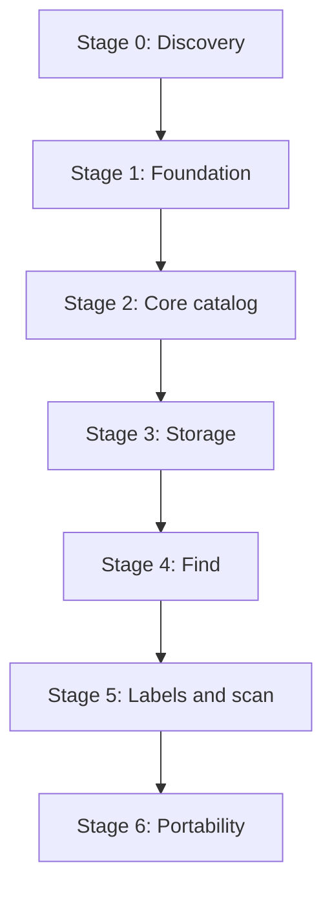

# Inventory Atlas TODO Roadmap

> Status: Ready for execution  
> Roadmap version: 0.2  
> Source of truth: `IMPLEMENTATION-BLUEPRINT.md`, approved blueprint v0.2  
> Product baseline: `docs/product/inventory-atlas-design-document-v0.3.1.pdf`  
> Prepared: 2026-08-28  
> Default product locale: English  
> Required MVP locale: Ukrainian

## Changes in roadmap v0.2

| Review item | Implemented correction |
| --- | --- |
| R1 | Added a Stage-1-owned frontend infrastructure workstream for the complete 18-component UI facade, semantic tokens, PrimeVue import enforcement, and facade-gap closure |
| R2 | Added application structure, shell/router/providers, route baseline, Vue Query/Pinia ownership, conflict handling, and generated API wrapper tasks |
| N1 | Added explicit ownership mapping for all 24 critical acceptance tests from blueprint section 20.2 |
| N2 | Split media delivery timing explicitly: shared/Item media in MED-01 and StorageNode completion in STO-01 |
| N3 | Added the `/meta` system endpoint to FND-02 |
| N4 | Added the eight approved initial job types and their idempotency-contract checklist |

## 1. Purpose and execution rules

This roadmap decomposes the approved blueprint into implementation tasks and reviewable pull requests. It does not add, remove, or reinterpret product functionality.

Execution rules:

- Story acceptance criteria are copied verbatim from blueprint section 23 and are immutable in this file.
- A changed acceptance criterion requires an approved blueprint change before this roadmap is updated.
- Complete stages in order unless a dependency explicitly allows parallel work.
- Keep pull requests independently reviewable, migration-safe, and releasable behind inaccessible routes or disabled composition where necessary.
- Do not mark a story complete until every acceptance criterion and every applicable Definition of Done item passes.
- Check a task only after its code, tests, generated artifacts, and required documentation are committed.
- Deferred P1/P2 modules remain outside this MVP roadmap.

Checkbox meaning:

- `[ ]` not started
- `[x]` completed and verified
- A blocked task stays unchecked and receives a short linked blocker note in the project tracker or pull request.

## 2. Delivery map



| Stage | Stories / work packages | Estimate | Exit gate |
| --- | --- | ---: | --- |
| 0. Discovery | HND-01 through HND-04 | 1 week | Deferred product choices cannot block schema v1 |
| 1. Foundation | FND-01 through FND-05 | 3-4 weeks | Clean deploy, sign-in, migrations, generated contracts |
| 2. Core catalog | CAT-01 through CAT-05, MED-01 through MED-02 | 5-7 weeks | Versioned Item aggregate works in English and Ukrainian |
| 3. Storage | STO-01 through STO-03 | 3-4 weeks | Concurrency and cycle tests pass |
| 4. Find | SRCH-01 through SRCH-04 | 4-6 weeks | 100k dataset search and privacy tests pass |
| 5. Labels and scan | LAB-01 through LAB-03 | 3-4 weeks | Physical label matrix passes |
| 6. Portability | PORT-01 through PORT-03 | 3-4 weeks | Fresh-instance round trip passes |

The approved total remains 22-30 weeks for one experienced full-time developer.

## 3. Dependency register

| Story | Hard dependencies | May proceed in parallel with |
| --- | --- | --- |
| FND-01 | Stage 0 complete | None |
| FND-02 | FND-01 | FND-03, FND-05 |
| FND-03 | FND-01, API skeleton | FND-02, FND-05 |
| FND-04 | FND-02, initial migrations | FND-05 |
| FND-05 | FND-01 | FND-02, FND-03, FND-04 |
| CAT-01 | FND-03, FND-04, FND-05, frontend infrastructure baseline | CAT-05 foundations |
| CAT-02 | CAT-01, migration/tooling foundation | CAT-05 renderer |
| CAT-03 | CAT-01, CAT-02, CAT-05, SRCH-01 write-port skeleton | MED-01 foundations |
| CAT-04 | CAT-03 | MED-01 |
| CAT-05 | CAT-02 | CAT-01 UI work |
| MED-01 | CAT-03, job/outbox foundation | CAT-04 |
| MED-02 | MED-01 | Remaining CAT UI |
| STO-01 | CAT-02, CAT-03 | None |
| STO-02 | STO-01, SRCH-01 Kysely adapter | None |
| STO-03 | STO-01, CAT-04, SRCH-01 Prisma adapter | STO-02 after shared lock primitives |
| SRCH-01 | CAT-02 and transaction ports; completed with Storage events | STO-01 foundations |
| SRCH-02 | SRCH-01, CAT-03, STO-01 | SRCH-03 |
| SRCH-03 | SRCH-01, authorization matrix | SRCH-02 |
| SRCH-04 | SRCH-02, CAT-04, idempotency protocol | SRCH-03 |
| LAB-01 | CAT-03, STO-01, authorization | LAB-02 template groundwork |
| LAB-02 | LAB-01, jobs, media artifact storage | LAB-03 |
| LAB-03 | LAB-01, public/direct card routes | LAB-02 |
| PORT-01 | All source tables stable through LAB | PORT-03 documentation |
| PORT-02 | PORT-01, SRCH-01 rebuild | PORT-03 automation |
| PORT-03 | FND-02, migration stream, media layout | PORT-01, PORT-02 |

## 4. Stage 0 - Discovery and handoff

### HND-01 Freeze approved documentation

- [x] Place `IMPLEMENTATION-BLUEPRINT.md` v0.2 at repository root.
- [x] Place the approved design PDF in `docs/product/` without modifying it.
- [x] Create ADR files ADR-001 through ADR-026 with approved status and decision text.
- [x] Add a documentation index linking the design, blueprint, roadmap, ADRs, API, operations, and security documents.
- [x] Record the rule that blueprint/product conflicts stop implementation pending an ADR.

### HND-02 Record toolchain and dependency baseline

- [x] Select and record exact Node.js 24 LTS and Corepack/pnpm versions.
- [x] Record exact initial Vue, Vite, PrimeVue, NestJS, Fastify, Prisma, Kysely, PostgreSQL, test, and generation dependencies.
- [x] Verify license compatibility and produce the initial dependency/license note.
- [x] Record supported desktop and mobile browser targets.
- [x] Document the update policy for pinned runtime and package versions.

### HND-03 Build proofs and reference fixtures

- [ ] Record reference homelab hardware and storage profile for performance gates.
- [ ] Create representative English/Ukrainian catalog and field fixtures.
- [ ] Create tree fixtures including an eight-level subtree and cross-root move cases.
- [ ] Create known JPEG, PNG, WebP, and HEIC capability fixtures.
- [ ] Produce a proof label for A4 grid and 50x30 mm output.
- [ ] Record printer, iPhone, and Android devices used by the physical label matrix.

### HND-04 Confirm deferred choices do not block schema v1

- [ ] Confirm the final public domain is not required to create schema v1.
- [ ] Confirm printer-specific profiles are deferred beyond the two approved MVP templates.
- [ ] Confirm marketplace and carrier connectors remain post-MVP.
- [ ] Confirm local media is the MVP default and S3/MinIO remains optional.
- [ ] Confirm compact job execution is the default and a separate worker remains an optional deployment profile.

### Stage 0 exit checklist

- [ ] Every task in HND-01 through HND-04 is complete.
- [ ] No deferred choice blocks migration 0001 or repository bootstrap.
- [ ] Reference fixtures and hardware profile are versioned or documented.
- [ ] Stage 1 pull requests are assigned and ordered.

## 5. Stage 1 - Foundation

### FND-01 Bootstrap the monorepo

As a developer, I can install, lint, check, test, and build the entire repository through stable root commands.

Suggested pull requests:

| PR | Outcome |
| --- | --- |
| FND-01A | Pinned pnpm workspace and repository skeleton |
| FND-01B | Shared lint, type/checkJs, test, and build commands |
| FND-01C | Module-boundary enforcement and clean-checkout verification |
| FND-01D | Frontend application architecture, state boundaries, and UI facade baseline |

Tasks:

- [ ] Create `apps/api`, `apps/worker`, `apps/web`, shared packages, database, infrastructure, scripts, and docs directories from blueprint section 5.
- [ ] Pin Node and package-manager versions and commit the lockfile.
- [ ] Configure root workspace scripts with the stable command names from blueprint section 5.2.
- [ ] Bootstrap Vue 3 JavaScript with `checkJs`, NestJS TypeScript, and the worker application context.
- [ ] Configure formatting, linting, unit tests, backend type checking, and frontend `checkJs`.
- [ ] Define module public entry points and forbidden import patterns.
- [ ] Implement `verify-module-boundaries.mjs` and add positive/negative fixtures.
- [ ] Complete the frontend infrastructure workstream in section 11, owned by FND-01D, before Stage 1 exits and before CAT-01 begins.
- [ ] Add minimal build and test smoke cases for every workspace package.
- [ ] Document prerequisites and verify setup in a clean checkout/container.

Acceptance criteria (verbatim from the approved blueprint):

- [ ] Workspace structure matches section 5.
- [ ] Node and package-manager versions are pinned.
- [ ] Frontend JavaScript `checkJs` and backend TypeScript checks pass.
- [ ] Boundary checks reject forbidden cross-module imports.
- [ ] Clean checkout requires no undocumented global tools.

### FND-02 Start the compact environment

As an operator, I can start Inventory Atlas with one Docker Compose command.

Suggested pull requests:

| PR | Outcome |
| --- | --- |
| FND-02A | PostgreSQL, migration, API, web, and Caddy containers |
| FND-02B | Configuration authority, persistence, and health checks |
| FND-02C | Compact/expanded runner profiles and Compose validation |

Tasks:

- [ ] Create multi-stage API/worker and web images with non-root runtime users.
- [ ] Define PostgreSQL, migration, API, static web, Caddy, and optional worker services.
- [ ] Add service dependencies and readiness-based startup ordering.
- [ ] Keep PostgreSQL on the internal network without a public port by default.
- [ ] Create named volumes/bind mounts for database and local media persistence.
- [ ] Implement typed environment parsing and reject unsafe production configuration.
- [ ] Implement first-initialization setting bootstrap and `settings_initialized_at` behavior from ADR-026.
- [ ] Test bootstrap/database precedence and fail production startup on conflicts for `APP_BASE_URL` or `PUBLIC_CATALOG_MODE`; verify that a `DEFAULT_LOCALE` mismatch warns and the database wins.
- [ ] Implement liveness and readiness endpoints with actionable component states.
- [ ] Implement `/api/v1/meta` returning API/build/schema versions and supported locales without secrets.
- [ ] Add compact, expanded, development, backup, and test Compose profiles/overrides.
- [ ] Create `.env.example` with every approved variable and authority note.
- [ ] Add `pnpm compose:validate` and container recreation persistence tests.

Acceptance criteria (verbatim from the approved blueprint):

- [ ] PostgreSQL, migration, API, static web, and Caddy start in the required order.
- [ ] Database is not published publicly by default.
- [ ] Liveness/readiness checks report useful states.
- [ ] Persistent data survives container recreation.
- [ ] `.env.example` documents every setting.

### FND-03 Generate one API contract

As a frontend developer, I consume generated API declarations and Zod schemas from one OpenAPI revision.

Suggested pull requests:

| PR | Outcome |
| --- | --- |
| FND-03A | Normalized OpenAPI generation and checksum |
| FND-03B | Generated declarations, client types, and Zod schemas |
| FND-03C | Drift detection and duplicate-schema policy |

Tasks:

- [ ] Define the normalized `/api/v1` OpenAPI generation pipeline.
- [ ] Add stable sorting/normalization so equivalent specs have identical output.
- [ ] Generate JavaScript-friendly JSDoc declarations and TypeScript declarations from the same spec.
- [ ] Generate runtime Zod schemas from the same normalized spec.
- [ ] Embed the common spec checksum in every generated artifact.
- [ ] Add representative request, response, cursor, problem-details, and optimistic-concurrency contracts.
- [ ] Implement contract drift detection for CI and `pnpm check`.
- [ ] Add lint/review policy preventing handwritten duplicate API payload schemas.
- [ ] Add a runtime negative test for an invalid generated-client payload.

Acceptance criteria (verbatim from the approved blueprint):

- [ ] One command emits normalized OpenAPI and all client artifacts.
- [ ] Generated artifacts carry the same spec checksum.
- [ ] CI fails on contract drift.
- [ ] A handwritten duplicate payload schema is rejected by review/lint policy.

### FND-04 Authenticate and authorize users

As an installation owner, I can bootstrap the first account, sign in, invite users, assign roles, and revoke sessions.

Suggested pull requests:

| PR | Outcome |
| --- | --- |
| FND-04A | Auth migrations, Owner bootstrap, and Argon2id credentials |
| FND-04B | Opaque sessions, cookies, CSRF, expiry, and revocation |
| FND-04C | Invitations, role policy, Admin limitations, and security audit |

Tasks:

- [ ] Add Kysely migrations for users, sessions, invitations, audit events, app settings, and required indexes/checks.
- [ ] Generate Prisma client models from the migrated schema and add drift verification.
- [ ] Implement one-time first-Owner bootstrap with safe concurrency behavior.
- [ ] Implement Argon2id password hashing with parameters encoded in the stored hash.
- [ ] Generate opaque session tokens and store only their hashes.
- [ ] Implement secure cookie, CSRF, idle expiry, absolute expiry, last-seen, and revocation behavior.
- [ ] Implement invite issue, hash, expiry, revoke, and accept flows.
- [ ] Encode the Public, Viewer, Editor, Owner, and Admin capability matrix from blueprint section 16.1.
- [ ] Prevent deletion/demotion of the last Owner and enforce explicit Owner confirmation where required.
- [ ] Add rate limiting to authentication and token workflows.
- [ ] Record safe authentication/authorization audit events without secrets.
- [ ] Add API and UI flows for sign-in, sign-out, invitation acceptance, session management, users, and roles.

Acceptance criteria (verbatim from the approved blueprint):

- [ ] Argon2id and hashed opaque sessions are implemented.
- [ ] Cookie, CSRF, expiry, and revocation tests pass.
- [ ] Public, Viewer, Editor, Owner, and Admin permissions match section 16.
- [ ] Security events appear in audit without secrets.

### FND-05 Deliver English and Ukrainian foundations

As a user, I start in English and can select Ukrainian.

Suggested pull requests:

| PR | Outcome |
| --- | --- |
| FND-05A | Shared `en`/`uk` resources and locale resolver |
| FND-05B | Persistent locale selection in public and authenticated UI |
| FND-05C | MVP translation coverage gate |

Tasks:

- [ ] Create shared English source resources and complete initial Ukrainian resources.
- [ ] Define stable translation-key naming and fallback rules.
- [ ] Implement locale resolution: explicit choice, stored preference, then English fallback.
- [ ] Allow browser locale to suggest Ukrainian without silently switching the application.
- [ ] Persist anonymous locale locally and authenticated locale on the user record.
- [ ] Add a locale selector to public and authenticated shells.
- [ ] Localize validation, problem details, dates, numbers, and accessibility labels.
- [ ] Implement `check-i18n-coverage.mjs` for all MVP-marked keys.
- [ ] Add an E2E test that starts in English and switches to Ukrainian without restart.

Acceptance criteria (verbatim from the approved blueprint):

- [ ] English is source/default and fallback.
- [ ] Locale choice persists for anonymous and authenticated actors.
- [ ] Coverage script detects missing Ukrainian MVP keys.
- [ ] Browser locale can suggest but cannot silently change the default.

### Stage 1 exit checklist

- [ ] FND-01 through FND-05 acceptance criteria pass.
- [ ] Clean checkout installs, checks, tests, builds, migrates, and starts through documented root commands.
- [ ] Owner can sign in and permissions match the approved matrix.
- [ ] OpenAPI, declarations, and Zod artifacts share one checksum.
- [ ] English default and Ukrainian selection pass E2E.
- [ ] FND-01D frontend structure, state ownership, route shell, UI facade, semantic tokens, and boundary checks are complete.
- [ ] Compact Docker Compose deployment is ready for the first catalog increment.

## 6. Stage 2 - Core catalog, schema, and media

### CAT-01 Manage item dictionaries

As an Admin, I can manage categories and lifecycle statuses with English and Ukrainian labels.

Suggested pull requests:

| PR | Outcome |
| --- | --- |
| CAT-01A | Dictionary schema, seeds, repositories, and policies |
| CAT-01B | REST contracts and bilingual Admin UI |
| CAT-01C | Archive/history resolution and invalidation tests |

Tasks:

- [ ] Add migrations, Prisma models, constraints, and indexes for categories and lifecycle statuses.
- [ ] Seed approved stable lifecycle keys idempotently.
- [ ] Implement stable-key, bilingual-label, ordering, archive, and version policies.
- [ ] Add application services and `/api/v1` Admin endpoints.
- [ ] Emit audit and search invalidation outbox records for relevant changes.
- [ ] Build PrimeVue-facade list, create, edit, archive, and validation UI.
- [ ] Preserve historical resolution of archived dictionary entries.
- [ ] Add English/Ukrainian contract, integration, authorization, and UI tests.

Acceptance criteria (verbatim from the approved blueprint):

- [ ] Stable keys do not change when labels change.
- [ ] English labels are required; Ukrainian labels are supported.
- [ ] Archived entries remain resolvable for historical Items.
- [ ] Rename produces the required search invalidation event.

### CAT-02 Manage dynamic field definitions

As an Admin, I can create ordered typed fields and options for Item or StorageNode scopes.

Suggested pull requests:

| PR | Outcome |
| --- | --- |
| CAT-02A | Field-definition, option, and typed-value schema |
| CAT-02B | Validation engine and canonical EAV adapters |
| CAT-02C | Admin field designer, conversion preview, and reindex warnings |

Tasks:

- [ ] Add migrations for field definitions, options, and typed scalar attribute rows.
- [ ] Add database checks for one owner, one typed value group, money pairs, positions, owner/field/position uniqueness, and multiselect option uniqueness.
- [ ] Implement Item and StorageNode scopes with optional category applicability.
- [ ] Implement all approved data types, validation rules, units, defaults, ordering, visibility, and search/filter/sort flags.
- [ ] Implement option ownership and archived-option resolution.
- [ ] Implement `AttributeValuePort` Prisma and Kysely adapters with equivalent parameterized semantics.
- [ ] Store repeatable scalars as contiguous rows and multiselect as ordered `value_option_id` rows only.
- [ ] Reject `repeatable` for select and multiselect definitions.
- [ ] Implement definition-version snapshots and optimistic concurrency.
- [ ] Implement type-change impact analysis and conversion preview without direct destructive mutation.
- [ ] Warn and enqueue the required rebuild when public/search-related behavior changes.
- [ ] Build bilingual Admin field/option editor and dynamic preview controls.
- [ ] Add constraint, adapter parity, rollback, authorization, and UI tests.

Acceptance criteria (verbatim from the approved blueprint):

- [ ] All approved field types are represented.
- [ ] Required, repeatable, validation, unit, search/filter/sort, and visibility flags work.
- [ ] Multiselect persists as ordered scalar `value_option_id` rows with option ownership enforced; no UUID-array storage is accepted.
- [ ] `repeatable = true` is rejected for `select` and `multiselect` definitions.
- [ ] Type changes with existing data require conversion preview.
- [ ] Public-visibility/searchability changes warn about mass reindex.

### CAT-03 Create an Item aggregate

As an Editor, I can create an Item with core fields and typed attributes.

Suggested pull requests:

| PR | Outcome |
| --- | --- |
| CAT-03A | Item schema, public identity, repositories, and transaction ports |
| CAT-03B | Atomic create service, contracts, projection, audit, and idempotency |
| CAT-03C | Mobile-first Item form and immediate Item card |

Tasks:

- [ ] Add Item, tag, Item-tag, idempotency, movement, search projection, and required infrastructure migrations.
- [ ] Implement immutable UUID public IDs and decorative slugs.
- [ ] Implement Item DTO validation using generated contract schemas.
- [ ] Implement idempotency reservation, fingerprint conflict, lease recovery, and transactional completion.
- [ ] Implement the Prisma-source Item transaction from blueprint section 9.1.
- [ ] Validate and replace attributes through `AttributeValuePort` in the same transaction.
- [ ] Write display name and the complete synchronous search projection before commit.
- [ ] Resolve a destination path through `SearchProjectionPort` under the shared root lock when applicable.
- [ ] Write safe audit, movement, and outbox records through transaction-aware ports.
- [ ] Return stable field-key validation errors and the new ETag/version.
- [ ] Build category-driven mobile-first form controls using the UI facade.
- [ ] Build the Item card with core fields, dynamic values, breadcrumb policy, and placeholder media.
- [ ] Add atomic rollback, duplicate-request, public-ID, localization, authorization, and E2E tests.

Acceptance criteria (verbatim from the approved blueprint):

- [ ] Core and attribute rows commit atomically.
- [ ] Display name and search projection are available immediately.
- [ ] Public ID is immutable and URL-safe.
- [ ] Validation errors map to stable field keys.
- [ ] Duplicate idempotency key does not create a second Item.

### CAT-04 Edit with optimistic concurrency

As an Editor, I receive a conflict instead of silently overwriting another edit.

Suggested pull requests:

| PR | Outcome |
| --- | --- |
| CAT-04A | Expected-version enforcement and safe conflict payload |
| CAT-04B | Atomic update transaction and projection invalidation |
| CAT-04C | Conflict-aware edit UI and concurrent-editor E2E tests |

Tasks:

- [ ] Require `If-Match` or expected version for Item update endpoints.
- [ ] Increment Item version on every core or attribute aggregate mutation.
- [ ] Build a safe diff that excludes fields the actor cannot view.
- [ ] Reuse the Item transaction ports for projection, audit, movement, idempotency, and outbox writes.
- [ ] Register all update invalidator events required by the projection registry.
- [ ] Return the current version and stable conflict problem code.
- [ ] Build UI handling to reload, compare, or abandon a conflicted edit without silent overwrite.
- [ ] Add concurrent-edit, rollback, visibility, and retry tests.

Acceptance criteria (verbatim from the approved blueprint):

- [ ] Item version increments for core or attribute changes.
- [ ] `If-Match`/expected version is enforced.
- [ ] Conflict contains current version and safe diff.
- [ ] Source, projection, audit, and outbox share one Prisma transaction.

### CAT-05 Render display names

As an Admin, I can define a safe display-name template and preview its output.

Suggested pull requests:

| PR | Outcome |
| --- | --- |
| CAT-05A | Restricted parser and deterministic renderer |
| CAT-05B | Preview/save contracts and Admin template UI |
| CAT-05C | Recompute and invalidation integration |

Tasks:

- [ ] Define the restricted token grammar and whitelisted core/field key resolver.
- [ ] Reject loops, expressions, JavaScript, HTML, unknown tokens, and network behavior.
- [ ] Implement deterministic missing-value skipping and whitespace collapse.
- [ ] Expose one renderer to preview and persisted Item mutation paths.
- [ ] Add preview/save endpoints with authorization and version checks.
- [ ] Build the Admin editor with token insertion, validation, and live preview.
- [ ] Recompute names and projection content on template/referenced-value changes.
- [ ] Prove public ID and active codes remain unchanged.
- [ ] Add parser fuzz/negative, determinism, localization, and integration tests.

Acceptance criteria (verbatim from the approved blueprint):

- [ ] Only approved tokens are allowed.
- [ ] Missing tokens and whitespace are handled deterministically.
- [ ] Stored result and preview use the same renderer.
- [ ] Name changes do not change public ID or issued codes.

### MED-01 Upload and attach images

As an Editor, I can upload a primary image and gallery images for Items and containers.

Suggested pull requests:

| PR | Outcome |
| --- | --- |
| MED-01A | Media schema, storage adapter, and upload sessions |
| MED-01B | Finalize, relation/order policy, and cleanup jobs |
| MED-01C | Item/container media UI and placeholders |

Tasks:

- [ ] Deliver the shared media model/storage/upload flow and complete Item media in Stage 2; defer only StorageNode-specific authorization, UI wiring, and integration tests until STO-01 creates the node aggregate.
- [ ] Add media asset, relation, and upload-session migrations and Prisma models.
- [ ] Define the local media adapter and optional S3-compatible port without making S3 mandatory.
- [ ] Implement begin-upload authorization, byte limit, declared type, and expiry.
- [ ] Stream uploads to temporary storage while computing checksums.
- [ ] Validate file signature/MIME and atomically finalize metadata/relation state.
- [ ] Enforce one primary image per entity and stable gallery ordering.
- [ ] Implement reorder and archive/delete semantics with optimistic concurrency.
- [ ] Implement delayed orphan cleanup that rechecks references before deletion.
- [ ] Add category placeholder selection when no media is present.
- [ ] Build accessible upload, progress, primary selection, gallery reorder, and error UI.
- [ ] Add Item authorization, race, cleanup, persistence, and E2E tests; keep the reusable StorageNode cases ready for completion in STO-01.

Acceptance criteria (verbatim from the approved blueprint):

- [ ] Upload session, size/type/checksum validation, and finalize flow work.
- [ ] Primary-image uniqueness and gallery order are enforced.
- [ ] Missing media uses a category placeholder.
- [ ] Delayed cleanup does not delete referenced assets.

### MED-02 Process image variants safely

As an operator, image processing cannot crash the API.

Suggested pull requests:

| PR | Outcome |
| --- | --- |
| MED-02A | Resource-capped child processor and capability check |
| MED-02B | Variant jobs, retry/dead behavior, and expanded-worker parity |

Tasks:

- [ ] Implement startup decoding checks for the approved JPEG, PNG, WebP, and HEIC fixtures.
- [ ] Define variant dimensions/formats and metadata/EXIF policy.
- [ ] Launch decoding in a one-shot child process through the resource-limit wrapper.
- [ ] Enforce input bytes, decoded pixels, memory/RSS, timeout, and Sharp concurrency limits.
- [ ] Implement idempotent variant job keys, leases, heartbeats, retry backoff, and dead state.
- [ ] Ensure child crash, OOM, malformed image, and timeout cannot terminate the API.
- [ ] Run the same processor in compact and expanded worker profiles.
- [ ] Store variant checksums/metadata and expose only completed variants.
- [ ] Add capability, resource-limit, crash, retry, and container tests.
- [ ] Record the HEVC-enabled distribution/licensing review gate without making a legal conclusion.

Acceptance criteria (verbatim from the approved blueprint):

- [ ] JPEG, PNG, WebP, and HEIC fixtures pass capability checks.
- [ ] Compact mode uses a capped one-shot child process.
- [ ] Pixel, byte, memory, timeout, and concurrency limits are tested.
- [ ] Child crash causes retry/dead state without API termination.

### Stage 2 exit checklist

- [ ] CAT-01 through CAT-05 and MED-01 through MED-02 acceptance criteria pass.
- [ ] Versioned Item aggregate creates and edits atomically in English and Ukrainian.
- [ ] Dynamic schema, display names, media, and safe projection behavior are integrated.
- [ ] Item API/UI changes pass authorization, accessibility, mobile, and contract checks.
- [ ] No Prisma/Kysely client mixing occurs inside a business transaction.

## 7. Stage 3 - Storage

### STO-01 Build and browse the storage tree

As a user, I can model Warehouse -> Box -> Case with arbitrary supported depth.

Suggested pull requests:

| PR | Outcome |
| --- | --- |
| STO-01A | `ltree` schema, Kysely repository, UUID-hex labels, and fixtures |
| STO-01B | Atomic StorageNode aggregate with dynamic attributes |
| STO-01C | Tree, breadcrumb, contents API, container card, and browse UI |

Tasks:

- [ ] Enable `ltree` and add StorageNode/movement schema, checks, GiST/B-tree indexes, and Kysely types.
- [ ] Implement immutable public IDs and lowercase UUID-hex `ltree` labels.
- [ ] Maintain `parent_id`, `path`, `depth`, `tree_root_id`, visibility, version, and archive state.
- [ ] Implement create/update StorageNode as a Kysely transaction including node attributes through `AttributeValuePort`.
- [ ] Increment node version for core or attribute aggregate changes.
- [ ] Implement indexed breadcrumb, ancestor, children, subtree, and paged direct-content queries.
- [ ] Ensure rename changes display data but never rewrites `storage_nodes.path`.
- [ ] Enforce exact-path privacy and safe public breadcrumb behavior.
- [ ] Build mobile-first tree browser and full container card with attributes, media, code area, child nodes, and direct Items.
- [ ] Complete StorageNode-specific media authorization, attachment/reorder UI wiring, and integration/E2E cases against the shared MED-01 implementation.
- [ ] Add deep-tree, pagination, rename, privacy, node-attribute rollback, and index-plan tests.

Acceptance criteria (verbatim from the approved blueprint):

- [ ] Node path labels follow the frozen UUID-hex format.
- [ ] Breadcrumb, children, and paged contents queries use `ltree` indexes.
- [ ] Rename does not rewrite `storage_nodes.path`.
- [ ] Exact path is private by default.

### STO-02 Move a node atomically

As an Editor, I can move a subtree without cycles or partial updates.

Suggested pull requests:

| PR | Outcome |
| --- | --- |
| STO-02A | Deterministic row/root locking and atomic move algorithm |
| STO-02B | Projection, movement, audit, outbox, and rollback adapters |
| STO-02C | Move UI and concurrency acceptance suite |

Tasks:

- [ ] Implement deterministic UUID row-lock ordering for source and target.
- [ ] Implement transaction-level advisory locks for affected roots in deterministic order.
- [ ] Reject missing, archived, and own-descendant targets before subtree mutation.
- [ ] Update parent, materialized path prefix, depth delta, and root ID for the complete subtree.
- [ ] Append movement snapshots through the Kysely adapter.
- [ ] Synchronize affected path/public-path/effective-visibility projections in the same transaction.
- [ ] Record audit and vector-rebuild outbox rows in the same transaction.
- [ ] Implement conflict/error mapping without partial tree disclosure.
- [ ] Build destination picker, confirmation, progress/error, and refreshed-tree UI.
- [ ] Test cycle rejection, cross-root moves, forced rollback, opposing moves, rename/move interaction, and large subtrees.

Acceptance criteria (verbatim from the approved blueprint):

- [ ] Row and advisory locks follow deterministic ordering.
- [ ] Own-descendant target is rejected.
- [ ] `parent_id`, `path`, `depth`, and `tree_root_id` update for the subtree.
- [ ] Movement, safe search projections, audit, and outbox share one Kysely transaction.
- [ ] Concurrent opposing moves retain a valid tree.

### STO-03 Move an Item and show history

As an Editor, I can move an Item to a container and see its append-only history.

Suggested pull requests:

| PR | Outcome |
| --- | --- |
| STO-03A | Prisma-source Item move transaction and root-lock projection resolution |
| STO-03B | Movement-history query/API and authorization |
| STO-03C | Move/history UI and concurrency tests |

Tasks:

- [ ] Require the expected Item version and validate move authorization.
- [ ] Use the Prisma source transaction and transaction-aware movement, projection, audit, outbox, and idempotency ports.
- [ ] Acquire the destination root advisory lock inside the projection adapter.
- [ ] Resolve only writable destination path/visibility/root data through the named projection exception.
- [ ] Reject missing/archived destinations by rolling back the complete mutation.
- [ ] Persist before/after node and path snapshots in append-only movement history.
- [ ] Increment Item version and return a new ETag.
- [ ] Expose role-filtered, paginated movement history without normal-role mutation endpoints.
- [ ] Build Item move control, destination picker, immediate breadcrumb update, and history timeline.
- [ ] Test concurrent node move/rename versus Item move, stale versions, authorization, and forced port rollback.

Acceptance criteria (verbatim from the approved blueprint):

- [ ] Item destination and movement record commit atomically.
- [ ] Item breadcrumb is immediately correct.
- [ ] Movement history cannot be edited by normal roles.
- [ ] Conflict/version behavior matches Item aggregate policy.

### Stage 3 exit checklist

- [ ] STO-01 through STO-03 acceptance criteria pass.
- [ ] Cycle, cross-root, opposing-move, and Item/node race tests pass on real PostgreSQL.
- [ ] Container cards include attributes, media, children, direct Items, and authorized path display.
- [ ] Storage mutations preserve source/projection/history/audit/outbox atomicity.

## 8. Stage 4 - Search and bulk work

### SRCH-01 Maintain the search projection

As the system, I maintain one safe `item_search` row for every active Item.

Suggested pull requests:

| PR | Outcome |
| --- | --- |
| SRCH-01A | Projection schema, builders, and Prisma/Kysely write adapters |
| SRCH-01B | Complete invalidator registry and synchronous safety updates |
| SRCH-01C | Resumable vector rebuild and stale-state operations |

Tasks:

- [ ] Add `pg_trgm`/`unaccent`, `item_search`, vector, JSONB, cursor, category/status, and trigram indexes.
- [ ] Implement role-safe full/public vectors and typed attrs/public attrs builders.
- [ ] Implement Prisma and Kysely `SearchProjectionPort` adapters with equivalent SQL semantics.
- [ ] Resolve Storage path fields only through the named statement/lock exception.
- [ ] Register and integration-test all eight invalidator paths from blueprint section 9.4.
- [ ] Keep safety-critical rows/columns synchronous with the source transaction.
- [ ] Implement idempotent resumable vector rebuild jobs with stale markers and bounded batches.
- [ ] Exclude stale rows only from relevance mode, not from safe catalog listing.
- [ ] Add stale count/age metrics and operational rebuild controls.
- [ ] Add source/projection rollback, adapter parity, privacy, restart, and reconciliation tests.

Acceptance criteria (verbatim from the approved blueprint):

- [ ] All eight invalidator paths have integration tests.
- [ ] Prisma and Kysely source transactions use the correct write-port adapter.
- [ ] Private values never enter vectors or attrs projections.
- [ ] Rebuild is idempotent and resumable.

### SRCH-02 Search and filter items

As a user, I can search all permitted fields and combine typed filters.

Suggested pull requests:

| PR | Outcome |
| --- | --- |
| SRCH-02A | Search query grammar, authorization scope, and cursor engine |
| SRCH-02B | Typed filters, sorting, bilingual matching, and relevance mode |
| SRCH-02C | Responsive search UI and 100k performance suite |

Tasks:

- [ ] Define versioned search/filter/sort request contracts and stable problem codes.
- [ ] Select full or public projection columns from actor capability before query construction.
- [ ] Implement normalized English/Ukrainian text matching and configured trigram behavior.
- [ ] Implement type-aware text, number, date, boolean, option, money, and reference filters supported by the approved field types.
- [ ] Implement stable default keyset cursor independent of technical reindex timestamp.
- [ ] Implement bounded relevance cursor/window with the approved 500-result/20-page limit.
- [ ] Validate requested filters/sorts against active searchable/filterable/sortable definitions.
- [ ] Build mobile search, filter builder, active-filter chips, sort controls, loading/empty/error states, and desktop result layout.
- [ ] Generate the 100k Item acceptance dataset and record query plans/reference hardware.
- [ ] Add API contract, authorization, cursor-stability, localization, and performance tests.

Acceptance criteria (verbatim from the approved blueprint):

- [ ] English and Ukrainian labels match in one vector.
- [ ] Text, number, date, boolean, option, and reference filters are type-aware.
- [ ] Default cursor is stable under technical reindex.
- [ ] Relevance mode is bounded to 500 results/20 pages.
- [ ] 100k acceptance dataset meets recorded reference targets.

### SRCH-03 Enforce visibility without inference leaks

As an Owner, I know lower roles cannot infer private values.

Suggested pull requests:

| PR | Outcome |
| --- | --- |
| SRCH-03A | Visibility policy and projection/query enforcement |
| SRCH-03B | Direct unlisted access policy and negative privacy suite |

Tasks:

- [ ] Centralize public/authenticated/private/unlisted authorization and discoverability policies.
- [ ] Exclude private values from vectors, JSON projections, derived tokens, snippets, facets, and lower-role counts.
- [ ] Permit Owner/Admin exact private EAV lookup only after an explicit role check.
- [ ] Ensure unlisted entities are absent from Public/Viewer/Editor lists and search.
- [ ] Apply authorization independently to permitted direct URL/token access.
- [ ] Prevent error, timing, pagination, facet, and count differences from confirming a private value.
- [ ] Remove values synchronously from safe public projections when visibility changes.
- [ ] Add role-by-visibility matrix integration and E2E tests, including negative inference cases.

Acceptance criteria (verbatim from the approved blueprint):

- [ ] Public sees only public vector/attrs.
- [ ] Viewer/Editor sees public and authenticated data only.
- [ ] Viewer cannot confirm a private value through hits, filters, or count.
- [ ] Unlisted direct access follows authorization but does not appear in lower-role lists.

### SRCH-04 Save views and perform bulk actions

As an Editor, I can save a search and apply an action to many Items safely.

Suggested pull requests:

| PR | Outcome |
| --- | --- |
| SRCH-04A | Versioned saved-view schema, validation, API, and UI |
| SRCH-04B | Per-Item bulk command engine with version/idempotency policy |
| SRCH-04C | Bulk result/retry UI and mixed-outcome tests |

Tasks:

- [ ] Add saved-view schema, ownership, visibility, version, and archive behavior.
- [ ] Store schema-versioned filters and validate/migrate/reject them against active definitions.
- [ ] Implement saved-view list/create/update/archive APIs and responsive UI.
- [ ] Define supported MVP bulk actions without adding new domain behavior.
- [ ] Require expected version per Item and one request idempotency key.
- [ ] Process each Item in an independent business transaction.
- [ ] Preserve already successful effects on later conflicts/failures.
- [ ] Return ordered succeeded/conflicted/failed results with safe reasons and current versions.
- [ ] Make retry skip/replay completed effects without duplication.
- [ ] Build selection, confirmation, progress, mixed-result, and retry UI.
- [ ] Add schema-change, mixed-conflict, authorization, idempotency, and restart tests.

Acceptance criteria (verbatim from the approved blueprint):

- [ ] Saved filters are schema-versioned and validated.
- [ ] Bulk request includes expected version per Item.
- [ ] Non-conflicting Items commit independently.
- [ ] Response separates succeeded, conflicted, and failed.
- [ ] Retry with the same idempotency key does not duplicate successful effects.

### Stage 4 exit checklist

- [ ] SRCH-01 through SRCH-04 acceptance criteria pass.
- [ ] All invalidators and both transaction-source adapters pass real-PostgreSQL integration tests.
- [ ] Privacy tests prove no lower-role inference through search, filters, lists, facets, or counts.
- [ ] The 100k reference dataset meets recorded p95 targets on recorded hardware.
- [ ] Saved views and bulk actions preserve optimistic concurrency and idempotency.

## 9. Stage 5 - Labels and scan

### LAB-01 Issue stable codes

As an Editor, I can issue/revoke QR and Code 128 codes for Items and containers.

Suggested pull requests:

| PR | Outcome |
| --- | --- |
| LAB-01A | Code schema, HMAC key ring, issuance, and resolution |
| LAB-01B | Reprint, revoke/reissue, rotation, and authorization |
| LAB-01C | Code controls on Item and container cards |

Tasks:

- [ ] Add entity-code schema with entity ownership, kind, generation, key version, prefix/hash, lifecycle timestamps, and indexes.
- [ ] Define the scan-key-ring secret format and active/retained version configuration.
- [ ] Implement purpose-separated HMAC-SHA-256 derivation and base64url truncation exactly as ADR-025.
- [ ] Store only token prefix/hash and compare candidate hashes in constant time.
- [ ] Implement QR default and optional compact Code 128 human code.
- [ ] Re-derive the identical active token for reprint without changing code state.
- [ ] Revoke/reissue by incrementing generation and invalidating the prior generation.
- [ ] Resolve retained key versions until every referenced code is reissued or retired.
- [ ] Keep codes stable across entity rename/display-name changes.
- [ ] Apply current visibility and authorization during scan resolution.
- [ ] Add rate limits and safe errors that do not reveal entity-sensitive data.
- [ ] Build issue, reprint, revoke/reissue, status, and preview controls on authorized cards.
- [ ] Add deterministic vectors, no-plaintext, revocation, rotation, rename, rate-limit, and role tests.

Acceptance criteria (verbatim from the approved blueprint):

- [ ] QR is default; Code 128 is optional.
- [ ] Token is opaque, reproducible from versioned HMAC derivation, hashed at rest, and never stored as plaintext.
- [ ] Reprint reproduces the active token without invalidating existing labels.
- [ ] Revoke/reissue increments `code_generation`; the previous generation no longer resolves.
- [ ] Key rotation retains old key versions until referenced codes are reissued or retired.
- [ ] Codes remain valid after rename.
- [ ] Scan resolution applies current visibility and authorization.

### LAB-02 Render printable batches

As a user, I can select entities, choose a template, and download a repeatable label PDF.

Suggested pull requests:

| PR | Outcome |
| --- | --- |
| LAB-02A | Template/batch schema, validation, snapshots, and render jobs |
| LAB-02B | Deterministic server PDF renderer and stored artifact |
| LAB-02C | Batch UI, print preview, and physical release protocol |

Tasks:

- [ ] Add label-template and label-batch schema, versions, archive state, template snapshot, request entities, output relation, and render state.
- [ ] Define/seed A4 grid and custom 50x30 mm templates.
- [ ] Validate dimensions, margins, gaps, safe padding, code type, font size, field layout, and page fit.
- [ ] Capture an immutable template/entity/code-generation snapshot for every batch.
- [ ] Reserve idempotency before creating a batch and enqueue rendering through outbox.
- [ ] Implement deterministic server-side QR/Code 128 and PDF rendering.
- [ ] Store output as a media asset with checksum and authorized download.
- [ ] Make render jobs resumable/idempotent and expose progress/failure.
- [ ] Build entity selection, template choice, preview, progress, retry, and download UI.
- [ ] Render black-and-white-safe output at actual physical size without browser scaling.
- [ ] Execute and record the printer/iPhone/Android physical scan matrix.
- [ ] Add snapshot, duplicate retry, pagination, authorization, PDF geometry, and job-restart tests.

Acceptance criteria (verbatim from the approved blueprint):

- [ ] A4 grid and custom 50x30 mm templates work.
- [ ] Batch stores an immutable template snapshot.
- [ ] Idempotent retry does not create duplicate batches.
- [ ] Physical scan test matrix passes.

### LAB-03 Scan on mobile

As a mobile user, I can scan a QR/barcode and open the permitted entity card.

Suggested pull requests:

| PR | Outcome |
| --- | --- |
| LAB-03A | Mobile scanner route and ZXing integration |
| LAB-03B | Optional BarcodeDetector acceleration and manual fallback |
| LAB-03C | iOS/Android camera, denial, and accessibility tests |

Tasks:

- [ ] Build a mobile-first scanner route with explicit camera start/stop lifecycle.
- [ ] Integrate ZXing as the required decoding implementation.
- [ ] Use BarcodeDetector only as optional acceleration with feature detection.
- [ ] Add manual token/human-code entry and validation fallback.
- [ ] Resolve codes through the same authorization service used by direct cards.
- [ ] Return neutral permission/not-found states without sensitive entity details.
- [ ] Handle camera permission denial, unavailable camera, backgrounding, rotation, and retry.
- [ ] Provide keyboard/screen-reader accessible manual and result flows.
- [ ] Verify current supported iOS Safari and Android Chrome targets on physical devices.
- [ ] Add unit, E2E fallback, authorization-negative, and manual physical tests.

Acceptance criteria (verbatim from the approved blueprint):

- [ ] ZXing is primary; BarcodeDetector is optional acceleration.
- [ ] Manual code entry is available as fallback.
- [ ] Permission denial reveals no entity-sensitive data.
- [ ] Camera UX works on current iOS Safari and Android Chrome targets.

### Stage 5 exit checklist

- [ ] LAB-01 through LAB-03 acceptance criteria pass.
- [ ] Reprint, revoke/reissue, and key-rotation behavior pass deterministic tests.
- [ ] A4 and 50x30 mm batches pass geometry and physical scan tests.
- [ ] Mobile scanning and manual fallback pass supported iOS/Android checks.
- [ ] Printed URLs/codes remain stable after entity rename.

## 10. Stage 6 - Portability and operations

### PORT-01 Export a portable archive

As an Owner, I can export database content and media into a versioned archive.

Suggested pull requests:

| PR | Outcome |
| --- | --- |
| PORT-01A | Canonical manifest/schema and bounded export planner |
| PORT-01B | Resumable data/media export jobs and checksums |
| PORT-01C | Owner export UI, download, expiry, and audit |

Tasks:

- [ ] Define the portable archive layout and versioned canonical manifest schema.
- [ ] Define stable serialization order, identifiers, timestamps, typed values, relations, and media metadata.
- [ ] Inventory every included schema/catalog/storage/code/relation/media record type.
- [ ] Explicitly exclude secrets, provider credentials, sessions, invitations, password hashes, and temporary uploads.
- [ ] Add portability-run state, progress, validation report, artifact relation, and audit behavior.
- [ ] Implement consistent database snapshot/read strategy and bounded streaming export.
- [ ] Stream media, calculate checksums, and avoid loading the whole archive into memory.
- [ ] Implement idempotent/resumable chunk and finalization behavior.
- [ ] Write counts/checksums/versions into the signed-off manifest and verify before success.
- [ ] Build Owner-only create, progress, failure, retry, expiring download, and audit UI.
- [ ] Add completeness, deterministic-order, exclusion, checksum, restart, and large-fixture tests.

Acceptance criteria (verbatim from the approved blueprint):

- [ ] Manifest has versions, counts, and checksums.
- [ ] All schema, catalog, storage, codes, relations, and media are represented.
- [ ] Export is resumable and reports progress.
- [ ] Secrets, sessions, and password hashes are excluded.

### PORT-02 Validate and apply an import

As an Owner, I can inspect a dry-run report before importing.

Suggested pull requests:

| PR | Outcome |
| --- | --- |
| PORT-02A | Safe archive intake, limits, checksum, and dry-run validator |
| PORT-02B | Dependency-ordered idempotent apply engine |
| PORT-02C | Search rebuild, round-trip verification, and Owner UI |

Tasks:

- [ ] Upload/import archives to isolated temporary storage with byte/file/count/path traversal limits.
- [ ] Parse only supported manifest/schema versions and reject malformed or unsafe archives.
- [ ] Verify every checksum before apply.
- [ ] Validate tree cycles, depths, references, option ownership, entity/code relations, media relations, and uniqueness constraints.
- [ ] Produce a complete dry-run report without mutating source tables.
- [ ] Require explicit Owner confirmation after a successful dry run.
- [ ] Apply records in dependency order using bounded idempotent chunks and portability checkpoints.
- [ ] Preserve public IDs, versions, ordering, relations, media checksums, and code generations/key-version references.
- [ ] Make retry resume from committed checkpoints without duplicate effects.
- [ ] Rebuild search projections/vectors and withhold final success until rebuild completes.
- [ ] Compare source/export and fresh-instance counts, ordering, relations, and checksums.
- [ ] Build validate/report/confirm/progress/retry/result UI and safe audit events.
- [ ] Add hostile-archive, rollback, restart, version, cycle, checksum, and full round-trip tests.

Acceptance criteria (verbatim from the approved blueprint):

- [ ] Invalid checksums, cycles, references, versions, or limits block apply.
- [ ] Apply is resumable and idempotent.
- [ ] Search rebuild completes before final success.
- [ ] Fresh-instance counts, ordering, relations, and checksums match source.

### PORT-03 Back up and restore operations

As an operator, I can restore the installation after database or host loss.

Suggested pull requests:

| PR | Outcome |
| --- | --- |
| PORT-03A | Versioned backup procedure and Compose backup profile |
| PORT-03B | Clean-environment restore automation and verification |
| PORT-03C | Release restore-drill gate and operator runbook |

Tasks:

- [ ] Document the distinction between portable export/import and operational backup/restore.
- [ ] Create a versioned PostgreSQL dump procedure compatible with the migration stream.
- [ ] Create a media snapshot/checksum-copy procedure consistent with the database backup point.
- [ ] Capture non-secret configuration and release/schema versions.
- [ ] Document separate secure handling and recovery requirements for secrets and scan key ring.
- [ ] Create the backup Compose profile/commands and retention example.
- [ ] Create clean-disposable-environment restore commands and verification script.
- [ ] Verify database schema, counts, media checksums, settings version, health, sign-in, scan resolution, and representative search after restore.
- [ ] Require backup before non-trivially reversible migrations.
- [ ] Add quarterly/manual restore-drill record and release-candidate gate for migration releases.
- [ ] Add failure/recovery tests and an operator troubleshooting section.

Acceptance criteria (verbatim from the approved blueprint):

- [ ] Database, media, and config-version backup procedure is documented.
- [ ] Secrets are handled separately.
- [ ] Restore works in a clean disposable environment.
- [ ] Release gate records the latest successful restore drill.

### Stage 6 exit checklist

- [ ] PORT-01 through PORT-03 acceptance criteria pass.
- [ ] Portable export/import succeeds on a clean instance with matching counts, relations, ordering, and checksums.
- [ ] Operational backup restore succeeds in a disposable environment.
- [ ] Search rebuild finishes before import success is reported.
- [ ] The latest restore drill is recorded for the release gate.

## 11. Cross-cutting infrastructure workstream

These tasks are scheduled alongside the first story that needs them and remain shared infrastructure, not new product stories.

### Frontend infrastructure (owned by FND-01D)

This workstream MUST finish during Stage 1 before CAT-01 starts. It provides the shared frontend mechanisms consumed by later UI stories.

Application architecture and state:

- [ ] Create `apps/web/src/app`, `pages`, `features`, `entities`, and `shared/{api,ui,i18n,lib,composables}` with `main.js` exactly as defined in blueprint section 11.1.
- [ ] Enforce dependency direction: pages orchestrate features; features may depend on entities/shared; entities may depend only on shared; shared cannot import upward.
- [ ] Add positive and negative frontend dependency fixtures to `verify-module-boundaries.mjs`.
- [ ] Implement the application shell, Vue Router, providers, app-level error boundary/fallback, public/authenticated layouts, and not-found/error routes.
- [ ] Register the blueprint section 11.3 route baseline as real routes or explicit inaccessible placeholders that are replaced by their delivery stage.
- [ ] Use the same page components for public and authenticated routes, driven by server-provided field projections; hidden controls MUST NOT be treated as authorization.
- [ ] Implement `shared/api` as the single wrapper over generated operations/Zod contracts, including credentials, request/correlation headers, cancellation, and normalized problem/conflict errors.
- [ ] Configure Vue Query as the sole owner of server state, caching, invalidation, request cancellation, and mutation state.
- [ ] Restrict Pinia to session summary, preferences, navigation, and local UI state; add a lint/architecture check and negative fixture that rejects API entity collections or response caches in Pinia stores.
- [ ] Keep form drafts local and map generated Zod/stable field-key errors into the shared form controls.
- [ ] Implement one conflict handler that requires a known expected version for optimistic mutation and opens compare/reload/abandon handling; it never silently overwrites.
- [ ] Add architecture tests for query cancellation, cache invalidation, session clearing, unknown-version mutation rejection, and conflict routing.

Route baseline:

```text
/
/items
/items/new
/items/:publicId
/items/:publicId/edit
/storage
/storage/:publicId
/scan
/labels
/labels/batches/:id
/portability
/admin/fields
/admin/categories
/admin/statuses
/admin/users
/admin/settings
/admin/audit
```

UI facade and tokens:

- [ ] Implement and export all 18 required semantic components from `packages/ui`: `AppButton`, `AppInput`, `AppTextarea`, `AppSelect`, `AppMultiSelect`, `AppDateField`, `AppMoneyField`, `AppField`, `AppFormSection`, `AppTable`, `AppDataView`, `AppDialog`, `AppDrawer`, `AppMenu`, `AppToast`, `AppBreadcrumb`, `AppFileUpload`, and `AppPagination`.
- [ ] Define stable framework-neutral props/events/slots for each facade component and contract-test default, loading, empty, error, validation, disabled, and relevant responsive states.
- [ ] Implement keyboard behavior, focus visibility/return, labels/descriptions/errors, touch targets, reduced motion, and 200% zoom behavior required by each component.
- [ ] Re-export facade components only through `apps/web/src/shared/ui`; domain pages/features/entities import the semantic facade rather than vendor components.
- [ ] Implement the complete stable semantic token set from blueprint section 11.6; values may be tuned, but names cannot change without an ADR-compatible migration.
- [ ] Add a boundary rule forbidding direct `primevue` imports anywhere under `apps/web/src`; only the `packages/ui` adapter implementation may import PrimeVue.
- [ ] Add positive/negative import fixtures proving the PrimeVue rule fails CI when violated.
- [ ] Create `docs/frontend/ui-facade-gaps.md` with owner, reason, affected route, replacement target, and due stage for every temporary gap.
- [ ] Fail the MVP release checklist while any facade-gap entry remains open.

Stable token names:

```text
--ia-color-brand-700
--ia-color-brand-600
--ia-color-brand-100
--ia-color-accent-600
--ia-color-surface-0
--ia-color-surface-50
--ia-color-surface-100
--ia-color-text
--ia-color-text-muted
--ia-color-border
--ia-color-danger
--ia-radius-sm
--ia-radius-md
--ia-radius-lg
--ia-space-1
--ia-space-2
--ia-space-3
--ia-space-4
--ia-space-6
--ia-control-min-height
--ia-content-max-width
```

### Database and transaction infrastructure

- [ ] Establish Kysely as the sole migration runner for the complete schema.
- [ ] Prevent Prisma Migrate from running in deployment.
- [ ] Apply all migrations to a clean PostgreSQL database in CI.
- [ ] Generate and drift-check Prisma and Kysely clients/types after migration.
- [ ] Implement `TransactionContext` and Prisma/Kysely adapters for SearchProjection, Outbox, MovementHistory, Audit, AttributeValue, and Idempotency ports.
- [ ] Prove every port uses only the supplied transaction and never opens or commits one.
- [ ] Maintain a table-owner/read-client/write-path verification test or reviewed registry.

### Jobs and outbox

- [ ] Add PostgreSQL queue/outbox migrations, indexes, state constraints, and deduplication keys.
- [ ] Implement `FOR UPDATE SKIP LOCKED` claim, lease, heartbeat, retry backoff, dead, and cancellation behavior.
- [ ] Implement transactional outbox dispatch to idempotent job creation/wakeup.
- [ ] Add per-job-type concurrency and compact/expanded runner switches.
- [ ] Register exactly the initial MVP job types `search.rebuild-items.v1`, `search.rebuild-subtree-v1`, `media.process-v1`, `labels.render-batch-v1`, `portability.export-v1`, `portability.import-validate-v1`, `portability.import-apply-v1`, and `media.cleanup-v1`.
- [ ] Document and test the payload version, deduplication/idempotency key, safe retry boundary, progress contract, concurrency limit, and permanent-validation-error behavior for each initial job type.
- [ ] Add restart, expired-lease, duplicate-message, and dead-letter tests.

### Observability and operations

- [ ] Add structured request logs with request/correlation IDs, safe actor ID, route template, status, duration, and error code.
- [ ] Redact tokens, passwords, private values, full upload paths, and provider secrets.
- [ ] Add HTTP, database pool, job, stale projection, media, portability, and storage-move metrics without high-cardinality labels.
- [ ] Wire liveness/readiness checks to database, schema version, media capabilities, and required storage.
- [ ] Add operator documentation for reindex, dead jobs, media failures, backup, restore, and import recovery.

### CI and release

- [ ] Run formatting, lint, module boundaries, JS/TS checks, unit tests, migrations, client generation, drift checks, integration tests, contract generation, i18n coverage, builds, Docker E2E, security audit, and Compose validation in the approved order.
- [ ] Build immutable versioned web/API/worker images.
- [ ] Produce SBOM and dependency/license report.
- [ ] Attach migration compatibility, changelog, and backup compatibility notes.
- [ ] Run fresh-install and upgrade-from-previous-release smoke tests.
- [ ] Run the restore drill when a release candidate contains migrations.

### Critical acceptance test ownership

Every mandatory test from blueprint section 20.2 has an explicit delivery owner. A shared owner means the final test is merged with the later-listed story after both sides of the scenario exist.

| Gate | Critical acceptance test (verbatim) | Owner |
| --- | --- | --- |
| [ ] | Reject moving a node into its own descendant without partial updates. | STO-02 |
| [ ] | Serialize opposing concurrent moves and retain an acyclic connected tree. | STO-02 |
| [ ] | Update `path`, `depth`, and `tree_root_id` for every descendant on cross-root move. | STO-02 |
| [ ] | Rename a container and synchronously update breadcrumbs for all nested Items. | STO-01 + SRCH-01 |
| [ ] | Keep allowed catalog rows visible while vector rebuild marks them stale. | SRCH-01 |
| [ ] | Create/update an Item through Prisma and atomically write projection/outbox through ports in the same transaction. | CAT-03 + CAT-04 |
| [ ] | Roll back source, projection, and outbox together when either port fails. | CAT-03 + CAT-04 |
| [ ] | Move a node through Kysely with no Prisma client query inside the transaction; movement, audit, projection, and outbox ports use the supplied Kysely handle. | STO-02 |
| [ ] | Move an Item through Prisma and atomically update destination, movement history, audit, projection, and outbox through Prisma-aware ports. | STO-03 |
| [ ] | Reject an archived/missing Item destination when the projection path-resolution statement finds no writable node, rolling back the entire Prisma transaction. | STO-03 |
| [ ] | Serialize a concurrent Item create/move against destination-node move/rename with the shared root advisory lock and commit only a path consistent with the final tree state. | CAT-03 + STO-03 |
| [ ] | Replace StorageNode attributes through the Kysely `AttributeValuePort`; required-field failure rolls back node, values, version, projection, audit, and outbox together. | STO-01 |
| [ ] | Persist multiselect as ordered scalar option rows only; reject wrong-field options, duplicates, gaps, and any array-shaped persistence representation. | CAT-02 |
| [ ] | Reprint the same active scan token, invalidate its prior generation on revoke/reissue, and resolve retained key versions during rotation. | LAB-01 |
| [ ] | Apply bootstrap/database configuration precedence and fail startup on production conflicts for canonical base URL or public catalog mode. | FND-02 |
| [ ] | Remove a field value from public projections after `public_visibility` changes. | SRCH-03 |
| [ ] | Prevent Viewer inference of a private value through text search, typed filter, or result count. | SRCH-03 |
| [ ] | Exclude unlisted entities from Public/Viewer/Editor lists while permitted direct URLs/tokens work. | SRCH-03 |
| [ ] | Keep public ID and QR valid after display-name changes. | CAT-05 + LAB-01 |
| [ ] | Return per-item bulk success/conflict/failure without replaying successful effects. | SRCH-04 |
| [ ] | Resume reindex/import after worker restart without duplicate final effects. | SRCH-01 + PORT-02 |
| [ ] | Restore export/import counts, relations, media ordering, and checksums. | PORT-02 |
| [ ] | Reject an incorrect generated-client runtime type before mutation and reject it again at backend DTO validation. | FND-03 + CAT-03 |
| [ ] | Start in English; switch to complete Ukrainian UI without restart. | FND-05 |

## 12. Definition of Done

A story is complete only when every applicable item below passes. This checklist is copied verbatim from blueprint section 24.

- [ ] Acceptance criteria are automated where practical and manually verified where physical UX is involved.
- [ ] Authorization and visibility have separate negative tests.
- [ ] API changes are represented in OpenAPI.
- [ ] Generated declarations/JSDoc types and Zod schemas come from the same spec revision.
- [ ] Database change has a forward migration and rollback/restore note.
- [ ] Source transaction, projection, movement history where applicable, audit, and outbox behavior is tested.
- [ ] English and Ukrainian strings are complete for changed MVP UI.
- [ ] Keyboard, focus, mobile layout, and validation UX are tested.
- [ ] Logs and errors contain no secrets or private field values.
- [ ] Operational docs and `.env.example` are updated.
- [ ] Unit, integration, contract, E2E smoke, build, and container checks pass.
- [ ] No frozen ADR or module ownership boundary is violated.

## 13. MVP release checklist

- [ ] All Stage 0-6 exit checklists are complete.
- [ ] All FND, CAT, MED, STO, SRCH, LAB, and PORT acceptance criteria are complete.
- [ ] Every applicable Definition of Done item passes for every completed story.
- [ ] All 24 critical acceptance test gates in section 11 are complete.
- [ ] All 18 `App*` facade components and the stable semantic token set are present, direct PrimeVue imports outside `packages/ui` are rejected, and `docs/frontend/ui-facade-gaps.md` has no open entries.
- [ ] The reference 100k dataset meets recorded p95 Item-read and default-search targets.
- [ ] Storage move performance is recorded for 10, 100, 1,000, and 10,000 affected nodes/items.
- [ ] Physical A4 and 50x30 mm QR/Code 128 scan matrix passes on the recorded devices.
- [ ] English starts by default and complete Ukrainian remains selectable without restart.
- [ ] Public/authenticated/private/unlisted negative security tests pass.
- [ ] Fresh installation, previous-release upgrade, portable round trip, and operational restore pass.
- [ ] Release images, SBOM, dependency/license report, migration notes, changelog, backup compatibility note, and checksums are produced.
- [ ] No deferred P1/P2 functionality has become an MVP blocker.
- [ ] Approved design document, blueprint, roadmap, ADRs, API contract, and operator documentation are mutually consistent.
