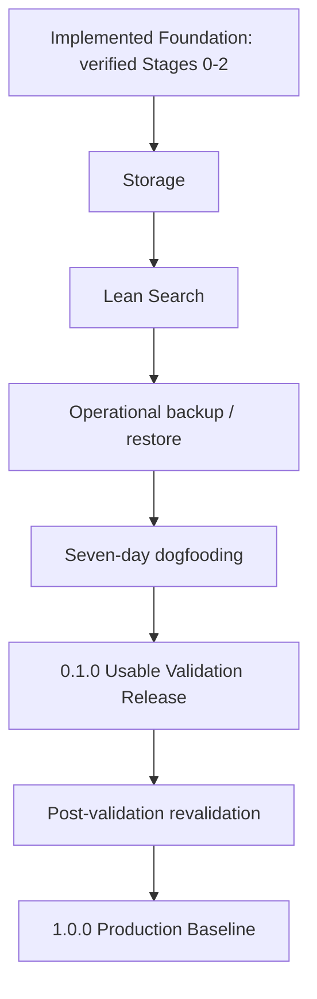

# Inventory Atlas TODO Roadmap

> Status: Ready for execution
>
> Roadmap version: 0.3.1
>
> Source of truth: `IMPLEMENTATION-BLUEPRINT.md`, approved blueprint v0.3.1
>
> Product baseline: `docs/product/inventory-atlas-design-document-v0.3.1.pdf`  
> Prepared: 2026-08-28; scope revision: 2026-09-12
>
> Current development version: `0.1.0-dev.1`
> Default product locale: English  
> Required `0.1.0 Usable Validation Release` locale: Ukrainian

## Changes in roadmap v0.3.1

| Review item | Implemented correction |
| --- | --- |
| DOC-F1 | Matched Blueprint v0.3.1: restrictive `FieldDefinitionChanged` mutations synchronously remove unsafe public projection content and have blocking rollback/retry tests |
| DOC-F2 | Assigned every SRCH-02 task to `0.1.0 blocking` or `Post-validation / revalidation required` and added an independent subset exit |
| DOC-F3 | Made the horizon-specific release checklists authoritative and kept production-only artifacts and certification out of the `0.1.0` blocking gate |

## Changes in roadmap v0.3

| Review item | Implemented correction |
| --- | --- |
| MVP-S1 | Replaced the single Stage 0-6 MVP chain with Implemented Foundation, `0.1.0 Usable Validation Release`, Post-validation Backlog, and `1.0.0 Production Baseline` |
| MVP-S2 | Put Storage, Lean Search, operational recovery, and seven-day dogfooding on the validation critical path; made convenience QR non-blocking |
| MVP-S3 | Kept all original story IDs and verbatim production acceptance criteria while moving saved views/bulk, Labels/Scanner, portable interchange, and scale certification to post-validation revalidation |
| Audit | Recorded implementation evidence, partial work, and checkbox corrections in `docs/project/mvp-scope-simplification-audit.md` |

## Changes in roadmap v0.2

| Review item | Implemented correction |
| --- | --- |
| R1 | Added a Stage-1-owned frontend infrastructure workstream for the complete 18-component UI facade, semantic tokens, PrimeVue import enforcement, and facade-gap closure |
| R2 | Added application structure, shell/router/providers, route baseline, Vue Query/Pinia ownership, conflict handling, and generated API wrapper tasks |
| N1 | Added explicit ownership mapping for all 24 critical acceptance tests from blueprint section 20.2 |
| N2 | Split media delivery timing explicitly: shared/Item media in MED-01 and StorageNode completion in STO-01 |
| N3 | Added the `/meta` system endpoint to FND-02 |
| N4 | Added the eight approved initial job types and their idempotency-contract checklist |

## 1. Purpose and execution rules

This roadmap decomposes the approved blueprint into implementation tasks and reviewable pull requests. It does not add, remove, or reinterpret product functionality.

Execution rules:

- Story acceptance criteria are copied verbatim from blueprint section 23 and are immutable in this file.
- A changed acceptance criterion requires an approved blueprint change before this roadmap is updated.
- Within a delivery horizon, follow the dependency graph rather than numeric stage order. The v0.3 horizon map explicitly lets the operational PORT-03 subset follow Lean Search without completing post-validation Stage 5.
- Keep pull requests independently reviewable, migration-safe, and releasable behind inaccessible routes or disabled composition where necessary.
- Do not mark a story complete until every acceptance criterion and every applicable Definition of Done item passes.
- Check a task only after its code, tests, generated artifacts, and required documentation are committed.
- Post-validation stories retain their IDs and verbatim production acceptance criteria but do not block `0.1.0` until revalidated.
- Deferred P1/P2 modules remain outside the `1.0.0 Production Baseline` roadmap.

Checkbox meaning:

- `[ ]` not started
- `[x]` completed and verified
- `unverified` means the audit lacked enough evidence to decide; it is referred to the owner and is never treated as `not implemented` automatically
- A blocked task stays unchecked and receives a short linked blocker note in the project tracker or pull request.
- Removing an existing `[x]` requires separate owner confirmation before the documentation diff is merged. Adding `[x]` still requires code, tests, contracts, localization, documentation, and applicable Definition of Done evidence.

## 2. Delivery map



| Horizon / step | Stories / work packages | Forecast | Exit gate |
| --- | --- | ---: | --- |
| Implemented Foundation | Verified HND, FND, CAT, and MED work | Complete at audited baseline | Existing changed-area checks remain green |
| `0.1.0` Storage | STO-01 through STO-03, with node attributes conditional as one complete contract | About 3-4 person-weeks | Mandatory integrity and mobile workflow tests pass |
| `0.1.0` Lean Search | SRCH-01, shipped subset of SRCH-02, authenticated subset of SRCH-03 | Included in 7-11 total; main uncertainty | Shipped filters, all eight invalidators, role/privacy, rebuild, and location tests pass |
| `0.1.0` Recovery | Operational subset of PORT-03 | Included in 7-11 total | Clean disposable restore smoke passes |
| `0.1.0` Dogfooding | VAL-01 | At least 7 elapsed calendar days | Findings and next candidates recorded |
| Stretch | QR-CONV-01 convenience QR | No critical-path allocation | Included only if it cannot delay blocking work |
| Post-validation | Remaining SRCH-02/03, SRCH-04, LAB-01 through LAB-03, PORT-01/02 and remaining PORT-03 hardening | Re-estimate after validation | Original production criteria revalidated |

The remaining `0.1.0` forecast is 7-11 person-weeks and roughly 8-12 calendar weeks for one experienced full-time developer. Re-estimate after this audit and after the first Search schema/query/invalidation vertical slice. Forecasts are not acceptance criteria.

## 3. Dependency register

| Story | Hard dependencies | May proceed in parallel with |
| --- | --- | --- |
| FND-01 | Stage 0 complete | None |
| FND-02 | FND-01 | FND-03, FND-05 |
| FND-03 | FND-01, API skeleton | FND-02, FND-05 |
| FND-04 | FND-02, initial migrations | FND-05 |
| FND-05 | FND-01 | FND-02, FND-03, FND-04 |
| CAT-01 | FND-03, FND-04, FND-05, frontend infrastructure baseline | CAT-05 foundations |
| CAT-02 | CAT-01, migration/tooling foundation | CAT-05 renderer |
| CAT-03 | CAT-01, CAT-02, CAT-05, SRCH-01 write-port skeleton | MED-01 foundations |
| CAT-04 | CAT-03 | MED-01 |
| CAT-05 | CAT-02 | CAT-01 UI work |
| MED-01 | CAT-03, job/outbox foundation | CAT-04 |
| MED-02 | MED-01 | Remaining CAT UI |
| STO-01 | CAT-02, CAT-03 | None |
| STO-02 | STO-01, SRCH-01 Kysely adapter | None |
| STO-03 | STO-01, CAT-04, SRCH-01 Prisma adapter | STO-02 after shared lock primitives |
| SRCH-01 | CAT-02 and transaction ports; completed with Storage events | STO-01 foundations |
| SRCH-02 | SRCH-01, CAT-03, STO-01 | SRCH-03 |
| SRCH-03 | SRCH-01, authorization matrix | SRCH-02 |
| SRCH-04 | SRCH-02, CAT-04, idempotency protocol | SRCH-03 |
| QR-CONV-01 | CAT-03, STO-01, authenticated canonical routes | No blocking work; stretch only |
| LAB-01 | CAT-03, STO-01, authorization | LAB-02 template groundwork |
| LAB-02 | LAB-01, jobs, media artifact storage | LAB-03 |
| LAB-03 | LAB-01, public/direct card routes | LAB-02 |
| PORT-01 | All source tables stable through LAB | PORT-03 documentation |
| PORT-02 | PORT-01, SRCH-01 rebuild | PORT-03 automation |
| PORT-03 | FND-02, migration stream, media layout | PORT-01, PORT-02 |
| VAL-01 | STO-03, delivered SRCH-01/02/03 scope, operational PORT-03 subset | Development/fixes during the seven-day observation window |

For `0.1.0`, the hard chain is the audited foundation -> STO-01/02/03 -> SRCH-01 plus the delivered SRCH-02/03 subset -> the operational subset of PORT-03 -> VAL-01. SRCH-04, LAB-01/02/03, PORT-01/02, deferred SRCH-02/03 scope, and the remaining PORT-03 production hardening have no edge into the validation-release graph. QR-CONV-01 is a stretch leaf only.

## 4. Stage 0 - Discovery and handoff

### HND-01 Freeze approved documentation

- [x] Place `IMPLEMENTATION-BLUEPRINT.md` v0.2 at repository root.
- [x] Place the approved design PDF in `docs/product/` without modifying it.
- [x] Create ADR files ADR-001 through ADR-026 with approved status and decision text.
- [x] Add a documentation index linking the design, blueprint, roadmap, ADRs, API, operations, and security documents.
- [x] Record the rule that blueprint/product conflicts stop implementation pending an ADR.

### HND-02 Record toolchain and dependency baseline

- [x] Select and record exact Node.js 24 LTS and Corepack/pnpm versions.
- [x] Record exact initial Vue, Vite, PrimeVue, NestJS, Fastify, Prisma, Kysely, PostgreSQL, test, and generation dependencies.
- [x] Verify license compatibility and produce the initial dependency/license note.
- [x] Record supported desktop and mobile browser targets.
- [x] Document the update policy for pinned runtime and package versions.

### HND-03 Build proofs and reference fixtures

- [x] Record reference homelab hardware and storage profile for performance gates.
- [x] Create representative English/Ukrainian catalog and field fixtures.
- [x] Create tree fixtures including an eight-level subtree and cross-root move cases.
- [x] Create known JPEG, PNG, WebP, and HEIC capability fixtures.
- [x] Produce a proof label for A4 grid and 50x30 mm output.
- [x] Record printer, iPhone, and Android devices used by the physical label matrix.

### HND-04 Confirm deferred choices do not block schema v1

- [x] Confirm the final public domain is not required to create schema v1.
- [x] Confirm printer-specific profiles are deferred beyond the two templates approved for the `1.0.0 Production Baseline`.
- [x] Confirm marketplace and carrier connectors remain post-`1.0.0 Production Baseline`.
- [x] Confirm local media is the `1.0.0 Production Baseline` default and S3/MinIO remains optional.
- [x] Confirm compact job execution is the default and a separate worker remains an optional deployment profile.

### Stage 0 exit checklist

- [x] Every task in HND-01 through HND-04 is complete.
- [x] No deferred choice blocks migration 0001 or repository bootstrap.
- [x] Reference fixtures and hardware profile are versioned or documented.
- [x] Stage 1 pull requests are assigned and ordered.

## 5. Stage 1 - Foundation

### FND-01 Bootstrap the monorepo

As a developer, I can install, lint, check, test, and build the entire repository through stable root commands.

Suggested pull requests:

| PR | Outcome |
| --- | --- |
| FND-01A | Pinned pnpm workspace and repository skeleton |
| FND-01B | Shared lint, type/checkJs, test, and build commands |
| FND-01C | Module-boundary enforcement and clean-checkout verification |
| FND-01D | Frontend application architecture, state boundaries, and UI facade baseline |

Tasks:

- [x] Create `apps/api`, `apps/worker`, `apps/web`, shared packages, database, infrastructure, scripts, and docs directories from blueprint section 5.
- [x] Pin Node and package-manager versions and commit the lockfile.
- [x] Configure root workspace scripts with the stable command names from blueprint section 5.2.
- [x] Bootstrap Vue 3 JavaScript with `checkJs`, NestJS TypeScript, and the worker application context.
- [x] Configure formatting, linting, unit tests, backend type checking, and frontend `checkJs`.
- [x] Define module public entry points and forbidden import patterns.
- [x] Implement `verify-module-boundaries.mjs` and add positive/negative fixtures.
- [x] Complete the frontend infrastructure workstream in section 12, owned by FND-01D, before Stage 1 exits and before CAT-01 begins.
- [x] Add minimal build and test smoke cases for every workspace package.
- [x] Document prerequisites and verify setup in a clean checkout/container.

Acceptance criteria (verbatim from the approved blueprint):

- [x] Workspace structure matches section 5.
- [x] Node and package-manager versions are pinned.
- [x] Frontend JavaScript `checkJs` and backend TypeScript checks pass.
- [x] Boundary checks reject forbidden cross-module imports.
- [x] Clean checkout requires no undocumented global tools.

### FND-02 Start the compact environment

As an operator, I can start Inventory Atlas with one Docker Compose command.

Suggested pull requests:

| PR | Outcome |
| --- | --- |
| FND-02A | PostgreSQL, migration, API, web, and Caddy containers |
| FND-02B | Configuration authority, persistence, and health checks |
| FND-02C | Compact/expanded runner profiles and Compose validation |

Tasks:

- [x] Create multi-stage API/worker and web images with non-root runtime users.
- [x] Define PostgreSQL, migration, API, static web, Caddy, and optional worker services.
- [x] Add service dependencies and readiness-based startup ordering.
- [x] Keep PostgreSQL on the internal network without a public port by default.
- [x] Create named volumes/bind mounts for database and local media persistence.
- [x] Implement typed environment parsing and reject unsafe production configuration.
- [x] Implement first-initialization setting bootstrap and `settings_initialized_at` behavior from ADR-026.
- [x] Test bootstrap/database precedence and fail production startup on conflicts for `APP_BASE_URL` or `PUBLIC_CATALOG_MODE`; verify that a `DEFAULT_LOCALE` mismatch warns and the database wins.
- [x] Implement liveness and readiness endpoints with actionable component states.
- [x] Implement `/api/v1/meta` returning API/build/schema versions and supported locales without secrets.
- [x] Add compact, expanded, development, backup, and test Compose profiles/overrides.
- [x] Create `.env.example` with every approved variable and authority note.
- [x] Add `pnpm compose:validate` and container recreation persistence tests.
- [x] Verify the Docker-only developer workflow (`compose.dev.yml`): clean install without host Node/pnpm, API/Vue hot reload, isolated dependency volumes, real-PostgreSQL integration tests, Playwright and container-driven Compose checks. This supports FND-02 without changing its verbatim acceptance criteria.

Acceptance criteria (verbatim from the approved blueprint):

- [x] PostgreSQL, migration, API, static web, and Caddy start in the required order.
- [x] Database is not published publicly by default.
- [x] Liveness/readiness checks report useful states.
- [x] Persistent data survives container recreation.
- [x] `.env.example` documents every setting.

### FND-03 Generate one API contract

As a frontend developer, I consume generated API declarations and Zod schemas from one OpenAPI revision.

Suggested pull requests:

| PR | Outcome |
| --- | --- |
| FND-03A | Normalized OpenAPI generation and checksum |
| FND-03B | Generated declarations, client types, and Zod schemas |
| FND-03C | Drift detection and duplicate-schema policy |

Tasks:

- [x] Define the normalized `/api/v1` OpenAPI generation pipeline.
- [x] Add stable sorting/normalization so equivalent specs have identical output.
- [x] Generate JavaScript-friendly JSDoc declarations and TypeScript declarations from the same spec.
- [x] Generate runtime Zod schemas from the same normalized spec.
- [x] Embed the common spec checksum in every generated artifact.
- [x] Add representative request, response, cursor, problem-details, and optimistic-concurrency contracts.
- [x] Implement contract drift detection for CI and `pnpm check`.
- [x] Add lint/review policy preventing handwritten duplicate API payload schemas.
- [x] Add a runtime negative test for an invalid generated-client payload.

Acceptance criteria (verbatim from the approved blueprint):

- [x] One command emits normalized OpenAPI and all client artifacts.
- [x] Generated artifacts carry the same spec checksum.
- [x] CI fails on contract drift.
- [x] A handwritten duplicate payload schema is rejected by review/lint policy.

### FND-04 Authenticate and authorize users

As an installation owner, I can bootstrap the first account, sign in, invite users, assign roles, and revoke sessions.

Suggested pull requests:

| PR | Outcome |
| --- | --- |
| FND-04A | Auth migrations, Owner bootstrap, and Argon2id credentials |
| FND-04B | Opaque sessions, cookies, CSRF, expiry, and revocation |
| FND-04C | Invitations, role policy, Admin limitations, and security audit |

Tasks:

- [x] Add Kysely migrations for users, sessions, invitations, audit events, app settings, and required indexes/checks.
- [x] Generate Prisma client models from the migrated schema and add drift verification.
- [x] Implement one-time first-Owner bootstrap with safe concurrency behavior.
- [x] Implement Argon2id password hashing with parameters encoded in the stored hash.
- [x] Generate opaque session tokens and store only their hashes.
- [x] Implement secure cookie, CSRF, idle expiry, absolute expiry, last-seen, and revocation behavior.
- [x] Implement invite issue, hash, expiry, revoke, and accept flows.
- [x] Encode the Public, Viewer, Editor, Owner, and Admin capability matrix from blueprint section 16.1.
- [x] Prevent deletion/demotion of the last Owner and enforce explicit Owner confirmation where required.
- [x] Add rate limiting to authentication and token workflows.
- [x] Record safe authentication/authorization audit events without secrets.
- [x] Add API and UI flows for sign-in, sign-out, invitation acceptance, session management, users, and roles.

Implementation evidence: [Auth credential adapter and checks](docs/project/authentication.md).
The owner approved the development-only Prisma dependency exception; CLI tooling
is available under [the scoped license and security policy](docs/project/dependency-remediation.md).
Auth model generation and migrated-schema drift verification run against a clean,
Kysely-migrated PostgreSQL schema in the integration pipeline.

Acceptance criteria (verbatim from the approved blueprint):

- [x] Argon2id and hashed opaque sessions are implemented.
- [x] Cookie, CSRF, expiry, and revocation tests pass.
- [x] Public, Viewer, Editor, Owner, and Admin permissions match section 16.
- [x] Security events appear in audit without secrets.

### FND-05 Deliver English and Ukrainian foundations

As a user, I start in English and can select Ukrainian.

Suggested pull requests:

| PR | Outcome |
| --- | --- |
| FND-05A | Shared `en`/`uk` resources and locale resolver |
| FND-05B | Persistent locale selection in public and authenticated UI |
| FND-05C | `0.1.0 Usable Validation Release` translation coverage gate |

Tasks:

- [x] Create shared English source resources and complete initial Ukrainian resources.
- [x] Define stable translation-key naming and fallback rules.
- [x] Implement locale resolution: explicit choice, stored preference, then English fallback.
- [x] Allow browser locale to suggest Ukrainian without silently switching the application.
- [x] Persist anonymous locale locally and authenticated locale on the user record.
- [x] Add a locale selector to public and authenticated shells.
- [x] Localize validation, problem details, dates, numbers, and accessibility labels.
- [x] Implement `check-i18n-coverage.mjs` for all keys required by the `0.1.0 Usable Validation Release`.
- [x] Add an E2E test that starts in English and switches to Ukrainian without restart.

Implementation evidence: [Localization foundation and verification](docs/project/localization.md).

Acceptance criteria (verbatim from the approved blueprint):

- [x] English is source/default and fallback.
- [x] Locale choice persists for anonymous and authenticated actors.
- [x] Coverage script detects missing Ukrainian MVP keys.
- [x] Browser locale can suggest but cannot silently change the default.

### Stage 1 exit checklist

- [x] FND-01 through FND-05 acceptance criteria pass.
- [x] Clean checkout installs, checks, tests, builds, migrates, and starts through documented root commands.
- [x] Owner can sign in and permissions match the approved matrix.
- [x] OpenAPI, declarations, and Zod artifacts share one checksum.
- [x] English default and Ukrainian selection pass E2E.
- [x] FND-01D frontend structure, state ownership, route shell, UI facade, semantic tokens, and boundary checks are complete.
- [x] Compact Docker Compose deployment is ready for the first catalog increment.

## 6. Stage 2 - Core catalog, schema, and media

### CAT-01 Manage item dictionaries

As an Admin, I can manage categories and lifecycle statuses with English and Ukrainian labels.

Suggested pull requests:

| PR | Outcome |
| --- | --- |
| CAT-01A | Dictionary schema, seeds, repositories, and policies |
| CAT-01B | REST contracts and bilingual Admin UI |
| CAT-01C | Archive/history resolution and invalidation tests |

Tasks:

- [x] Add migrations, Prisma models, constraints, and indexes for categories and lifecycle statuses.
- [x] Seed approved stable lifecycle keys idempotently.
- [x] Implement stable-key, bilingual-label, ordering, archive, and version policies.
- [x] Add application services and `/api/v1` Admin endpoints.
- [x] Emit audit and search invalidation outbox records for relevant changes.
- [x] Build PrimeVue-facade list, create, edit, archive, and validation UI.
- [x] Preserve historical resolution of archived dictionary entries.
- [x] Add English/Ukrainian contract, integration, authorization, and UI tests.

Acceptance criteria (verbatim from the approved blueprint):

- [x] Stable keys do not change when labels change.
- [x] English labels are required; Ukrainian labels are supported.
- [x] Archived entries remain resolvable for historical Items.
- [x] Rename produces the required search invalidation event.

### CAT-02 Manage dynamic field definitions

As an Admin, I can create ordered typed fields and options for Item or StorageNode scopes.

Suggested pull requests:

| PR | Outcome |
| --- | --- |
| CAT-02A | Field-definition, option, and typed-value schema |
| CAT-02B | Validation engine and canonical EAV adapters |
| CAT-02C | Admin field designer, conversion preview, and reindex warnings |

Tasks:

- [x] Add migrations for field definitions, options, and typed scalar attribute rows.
- [x] Add database checks for one owner, one typed value group, money pairs, positions, owner/field/position uniqueness, and multiselect option uniqueness.
- [x] Implement Item and StorageNode scopes with optional category applicability.
- [x] Implement all approved data types, validation rules, units, defaults, ordering, visibility, and search/filter/sort flags.
- [x] Implement option ownership and archived-option resolution.
- [x] Implement `AttributeValuePort` Prisma and Kysely adapters with equivalent parameterized semantics.
- [x] Store repeatable scalars as contiguous rows and multiselect as ordered `value_option_id` rows only.
- [x] Reject `repeatable` for select and multiselect definitions.
- [x] Implement definition-version snapshots and optimistic concurrency.
- [x] Implement type-change impact analysis and conversion preview without direct destructive mutation.
- [x] Warn and enqueue the required rebuild when public/search-related behavior changes.
- [x] Build bilingual Admin field/option editor and dynamic preview controls.
- [x] Add constraint, adapter parity, rollback, authorization, and UI tests.

Implementation evidence: [Dynamic field schema and typed EAV](docs/project/dynamic-schema.md).

Acceptance criteria (verbatim from the approved blueprint):

- [x] All approved field types are represented.
- [x] Required, repeatable, validation, unit, search/filter/sort, and visibility flags work.
- [x] Multiselect persists as ordered scalar `value_option_id` rows with option ownership enforced; no UUID-array storage is accepted.
- [x] `repeatable = true` is rejected for `select` and `multiselect` definitions.
- [x] Type changes with existing data require conversion preview.
- [x] Public-visibility/searchability changes warn about mass reindex.

### CAT-03 Create an Item aggregate

As an Editor, I can create an Item with core fields and typed attributes.

Suggested pull requests:

| PR | Outcome |
| --- | --- |
| CAT-03A | Item schema, public identity, repositories, and transaction ports |
| CAT-03B | Atomic create service, contracts, projection, audit, and idempotency |
| CAT-03C | Mobile-first Item form and immediate Item card |

Tasks:

- [x] Add Item, tag, Item-tag, idempotency, movement, search projection, and required infrastructure migrations.
- [x] Implement immutable UUID public IDs and decorative slugs.
- [x] Implement Item DTO validation using generated contract schemas.
- [x] Implement idempotency reservation, fingerprint conflict, lease recovery, and transactional completion.
- [x] Implement the Prisma-source Item transaction from blueprint section 9.1.
- [x] Validate and replace attributes through `AttributeValuePort` in the same transaction.
- [x] Write display name and the complete synchronous search projection before commit.
- [x] Write safe audit, movement, and outbox records through transaction-aware ports.
- [x] Return stable field-key validation errors and the new ETag/version.
- [x] Build category-driven mobile-first form controls using the UI facade.
- [x] Build the Item card with core fields, dynamic values, breadcrumb policy, and placeholder media.
- [x] Add atomic rollback, duplicate-request, public-ID, localization, authorization, and E2E tests.

Conditional ownership note: destination path resolution could not exist before the Storage aggregate. The unchecked CAT-03 task moved without scope loss to STO-03, which owns the Item destination mutation and shared root-lock race tests. This keeps the verified Stage 2 acceptance criteria complete without claiming the later Storage dependency is implemented.

Acceptance criteria (verbatim from the approved blueprint):

- [x] Core and attribute rows commit atomically.
- [x] Display name and search projection are available immediately.
- [x] Public ID is immutable and URL-safe.
- [x] Validation errors map to stable field keys.
- [x] Duplicate idempotency key does not create a second Item.

### CAT-04 Edit with optimistic concurrency

As an Editor, I receive a conflict instead of silently overwriting another edit.

Suggested pull requests:

| PR | Outcome |
| --- | --- |
| CAT-04A | Expected-version enforcement and safe conflict payload |
| CAT-04B | Atomic update transaction and projection invalidation |
| CAT-04C | Conflict-aware edit UI and concurrent-editor E2E tests |

Tasks:

- [x] Require `If-Match` or expected version for Item update endpoints.
- [x] Increment Item version on every core or attribute aggregate mutation.
- [x] Build a safe diff that excludes fields the actor cannot view.
- [x] Reuse the Item transaction ports for projection, audit, movement, idempotency, and outbox writes.
- [x] Register all update invalidator events required by the projection registry.
- [x] Return the current version and stable conflict problem code.
- [x] Build UI handling to reload, compare, or abandon a conflicted edit without silent overwrite.
- [x] Add concurrent-edit, rollback, visibility, and retry tests.

Implementation evidence: [Item editing with optimistic concurrency](docs/project/item-editing.md).

Acceptance criteria (verbatim from the approved blueprint):

- [x] Item version increments for core or attribute changes.
- [x] `If-Match`/expected version is enforced.
- [x] Conflict contains current version and safe diff.
- [x] Source, projection, audit, and outbox share one Prisma transaction.

### CAT-05 Render display names

As an Admin, I can define a safe display-name template and preview its output.

Suggested pull requests:

| PR | Outcome |
| --- | --- |
| CAT-05A | Restricted parser and deterministic renderer |
| CAT-05B | Preview/save contracts and Admin template UI |
| CAT-05C | Recompute and invalidation integration |

Tasks:

- [x] Define the restricted token grammar and whitelisted core/field key resolver.
- [x] Reject loops, expressions, JavaScript, HTML, unknown tokens, and network behavior.
- [x] Implement deterministic missing-value skipping and whitespace collapse.
- [x] Expose one renderer to preview and persisted Item mutation paths.
- [x] Add preview/save endpoints with authorization and version checks.
- [x] Build the Admin editor with token insertion, validation, and live preview.
- [x] Recompute names and projection content on template/referenced-value changes.
- [x] Prove public ID and active codes remain unchanged.
- [x] Add parser fuzz/negative, determinism, localization, and integration tests.

Implementation evidence: [Display-name templates](docs/project/display-names.md).

Acceptance criteria (verbatim from the approved blueprint):

- [x] Only approved tokens are allowed.
- [x] Missing tokens and whitespace are handled deterministically.
- [x] Stored result and preview use the same renderer.
- [x] Name changes do not change public ID or issued codes.

### MED-01 Upload and attach images

As an Editor, I can upload a primary image and gallery images for Items and containers.

Suggested pull requests:

| PR | Outcome |
| --- | --- |
| MED-01A | Media schema, storage adapter, and upload sessions |
| MED-01B | Finalize, relation/order policy, and cleanup jobs |
| MED-01C | Item/container media UI and placeholders |

Tasks:

- [x] Deliver the shared media model/storage/upload flow and complete Item media in Stage 2; defer only StorageNode-specific authorization, UI wiring, and integration tests until STO-01 creates the node aggregate.
- [x] Add media asset, relation, and upload-session migrations and Prisma models.
- [x] Define the local media adapter and optional S3-compatible port without making S3 mandatory.
- [x] Implement begin-upload authorization, byte limit, declared type, and expiry.
- [x] Stream uploads to temporary storage while computing checksums.
- [x] Validate file signature/MIME and atomically finalize metadata/relation state.
- [x] Enforce one primary image per entity and stable gallery ordering.
- [x] Implement reorder and archive/delete semantics with optimistic concurrency.
- [x] Implement delayed orphan cleanup that rechecks references before deletion.
- [x] Add category placeholder selection when no media is present.
- [x] Build accessible upload, progress, primary selection, gallery reorder, and error UI.
- [x] Add Item authorization, race, cleanup, persistence, and E2E tests; keep the reusable StorageNode cases ready for completion in STO-01.

Implementation evidence: [Media uploads and attachments](docs/project/media-uploads.md).

Acceptance criteria (verbatim from the approved blueprint):

- [x] Upload session, size/type/checksum validation, and finalize flow work.
- [x] Primary-image uniqueness and gallery order are enforced.
- [x] Missing media uses a category placeholder.
- [x] Delayed cleanup does not delete referenced assets.

### MED-02 Process image variants safely

As an operator, image processing cannot crash the API.

Suggested pull requests:

| PR | Outcome |
| --- | --- |
| MED-02A | Resource-capped child processor and capability check |
| MED-02B | Variant jobs, retry/dead behavior, and expanded-worker parity |

Tasks:

- [x] Implement startup decoding checks for the approved JPEG, PNG, WebP, and HEIC fixtures.
- [x] Define variant dimensions/formats and metadata/EXIF policy.
- [x] Launch decoding in a one-shot child process through the resource-limit wrapper.
- [x] Enforce input bytes, decoded pixels, memory/RSS, timeout, and Sharp concurrency limits.
- [x] Implement idempotent variant job keys, leases, heartbeats, retry backoff, and dead state.
- [x] Ensure child crash, OOM, malformed image, and timeout cannot terminate the API.
- [x] Run the same processor in compact and expanded worker profiles.
- [x] Store variant checksums/metadata and expose only completed variants.
- [x] Add capability, resource-limit, crash, retry, and container tests.
- [x] Record the HEVC-enabled distribution/licensing review gate without making a legal conclusion.

Acceptance criteria (verbatim from the approved blueprint):

- [x] JPEG, PNG, WebP, and HEIC fixtures pass capability checks.
- [x] Compact mode uses a capped one-shot child process.
- [x] Pixel, byte, memory, timeout, and concurrency limits are tested.
- [x] Child crash causes retry/dead state without API termination.

### Stage 2 exit checklist

- [x] CAT-01 through CAT-05 and MED-01 through MED-02 acceptance criteria pass.
- [x] Versioned Item aggregate creates and edits atomically in English and Ukrainian.
- [x] Dynamic schema, display names, media, and safe projection behavior are integrated.
- [x] Item API/UI changes pass authorization, accessibility, mobile, and contract checks.
- [x] No Prisma/Kysely client mixing occurs inside a business transaction.

## 7. Stage 3 - Storage

**Horizon:** blocking for `0.1.0`. StorageNode dynamic attributes and extended node-media UX may move only with their whole owned contract to Post-validation; all tree, move, location, authorization, and privacy behavior remains blocking.

### STO-01 Build and browse the storage tree

As a user, I can model Warehouse -> Box -> Case with arbitrary supported depth.

Suggested pull requests:

| PR | Outcome |
| --- | --- |
| STO-01A | `ltree` schema, Kysely repository, UUID-hex labels, and fixtures |
| STO-01B | Atomic StorageNode aggregate with dynamic attributes |
| STO-01C | Tree, breadcrumb, contents API, container card, and browse UI |

Tasks:

- [x] Enable `ltree` and add StorageNode/movement schema, checks, GiST/B-tree indexes, and Kysely types.
- [x] Implement immutable public IDs and lowercase UUID-hex `ltree` labels.
- [x] Maintain `parent_id`, `path`, `depth`, `tree_root_id`, visibility, version, and archive state.
- [x] Implement create/update StorageNode as a Kysely transaction including node attributes through `AttributeValuePort`.
- [x] Increment node version for core or attribute aggregate changes.
- [x] Implement indexed breadcrumb, ancestor, children, subtree, and paged direct-content queries.
- [x] Ensure rename changes display data but never rewrites `storage_nodes.path`.
- [x] Enforce exact-path privacy and safe public breadcrumb behavior.
- [x] Build the mobile-first tree browser and core container card with breadcrumb, child nodes, and direct Items; include attributes, node media, and convenience QR only when their complete conditional packages ship.
- [ ] Complete StorageNode-specific media authorization, attachment/reorder UI wiring, and integration/E2E cases against the shared MED-01 implementation.
- [x] Add deep-tree, pagination, rename, privacy, node-attribute rollback, and index-plan tests.

Conditional package: if StorageNode dynamic attributes do not ship in `0.1.0`, defer the node-attribute mutation task, node attribute UI, and owned rollback test together. Extended StorageNode media UI may also remain post-validation. Neither deferral permits the release to claim those container-card capabilities.

Acceptance criteria (verbatim from the approved blueprint):

- [x] Node path labels follow the frozen UUID-hex format.
- [x] Breadcrumb, children, and paged contents queries use `ltree` indexes.
- [x] Rename does not rewrite `storage_nodes.path`.
- [x] Exact path is private by default.

### STO-02 Move a node atomically

As an Editor, I can move a subtree without cycles or partial updates.

Suggested pull requests:

| PR | Outcome |
| --- | --- |
| STO-02A | Deterministic row/root locking and atomic move algorithm |
| STO-02B | Projection, movement, audit, outbox, and rollback adapters |
| STO-02C | Move UI and concurrency acceptance suite |

Tasks:

- [x] Implement deterministic UUID row-lock ordering for source and target.
- [x] Implement transaction-level advisory locks for affected roots in deterministic order.
- [x] Reject missing, archived, and own-descendant targets before subtree mutation.
- [x] Update parent, materialized path prefix, depth delta, and root ID for the complete subtree.
- [x] Append movement snapshots through the Kysely adapter.
- [x] Synchronize affected path/public-path/effective-visibility projections in the same transaction.
- [x] Record audit and vector-rebuild outbox rows in the same transaction.
- [x] Implement conflict/error mapping without partial tree disclosure.
- [x] Build destination picker, confirmation, progress/error, and refreshed-tree UI.
- [x] Test cycle rejection, cross-root moves, forced rollback, opposing moves, and rename/move interaction; keep the 1,000/10,000-descendant performance matrix post-validation.

Acceptance criteria (verbatim from the approved blueprint):

- [x] Row and advisory locks follow deterministic ordering.
- [x] Own-descendant target is rejected.
- [x] `parent_id`, `path`, `depth`, and `tree_root_id` update for the subtree.
- [x] Movement, safe search projections, audit, and outbox share one Kysely transaction.
- [x] Concurrent opposing moves retain a valid tree.

### STO-03 Move an Item and show history

As an Editor, I can move an Item to a container and see its append-only history.

Suggested pull requests:

| PR | Outcome |
| --- | --- |
| STO-03A | Prisma-source Item move transaction and root-lock projection resolution |
| STO-03B | Movement-history query/API and authorization |
| STO-03C | Move/history UI and concurrency tests |

Tasks:

- [ ] Require the expected Item version and validate move authorization.
- [ ] Use the Prisma source transaction and transaction-aware movement, projection, audit, outbox, and idempotency ports.
- [ ] Acquire the destination root advisory lock inside the projection adapter.
- [ ] Resolve a destination path through `SearchProjectionPort` under the shared root lock, including only writable destination path/visibility/root data through the named projection exception. This task moved from CAT-03 because STO-01 supplies the destination aggregate.
- [ ] Reject missing/archived destinations by rolling back the complete mutation.
- [ ] Persist before/after node and path snapshots in append-only movement history.
- [ ] Increment Item version and return a new ETag.
- [ ] Expose role-filtered, paginated movement history without normal-role mutation endpoints.
- [ ] Build Item move control, destination picker, immediate breadcrumb update, and history timeline.
- [ ] Test concurrent node move/rename versus Item move, stale versions, authorization, and forced port rollback.

Acceptance criteria (verbatim from the approved blueprint):

- [ ] Item destination and movement record commit atomically.
- [ ] Item breadcrumb is immediately correct.
- [ ] Movement history cannot be edited by normal roles.
- [ ] Conflict/version behavior matches Item aggregate policy.

### Stage 3 exit checklist

- [ ] STO-01 through STO-03 acceptance criteria pass.
- [ ] Cycle, cross-root, opposing-move, and Item/node race tests pass on real PostgreSQL.
- [ ] Container cards include children, direct Items, and authorized path display; attributes and node media are required only when their complete conditional packages ship.
- [ ] Storage mutations preserve source/projection/history/audit/outbox atomicity.

## 8. Stage 4 - Lean Search and post-validation search work

**Horizon:** SRCH-01, the delivered SRCH-02 subset, and authenticated SRCH-03 block `0.1.0`. Remaining generic typed-filter breadth, 100k certification, Public Search, saved views, and bulk actions are `post-validation / revalidation required` under their original stories.

### SRCH-01 Maintain the search projection

**Horizon:** blocking for `0.1.0`; all eight invalidator paths and shipped rebuild contracts are included.

As the system, I maintain one safe `item_search` row for every active Item.

Suggested pull requests:

| PR | Outcome |
| --- | --- |
| SRCH-01A | Projection schema, builders, and Prisma/Kysely write adapters |
| SRCH-01B | Complete invalidator registry and synchronous safety updates |
| SRCH-01C | Resumable vector rebuild and stale-state operations |

Tasks:

- [x] Preserve the existing `item_search` table with full/public vectors, JSONB attrs, stable-order, and category/status indexes.
- [ ] Add `pg_trgm`/`unaccent` plus the trigram/expression indexes actually used by delivered queries.
- [ ] Implement role-safe full/public vectors and typed attrs/public attrs builders.
- [ ] Implement Prisma and Kysely `SearchProjectionPort` adapters with equivalent SQL semantics.
- [ ] Resolve Storage path fields only through the named statement/lock exception.
- [ ] Complete and regression-test `ItemCreated` / `AttributeChanged` full-row projection writes against the SRCH builder.
- [ ] Implement `NodeMoved` path/visibility synchronization and subtree-vector rebuild enqueue.
- [ ] Implement `NodeRenamed` synchronous nested-Item breadcrumbs and subtree-vector rebuild enqueue.
- [ ] Implement `NodeVisibilityChanged` effective visibility and public-projection synchronization.
- [ ] Preserve `CategoryRenamed` outbox emission and implement/test its affected-Item rebuild consumer.
- [ ] Preserve `FieldDefinitionChanged` outbox emission; implement/test ordinary affected attrs/vector rebuild and synchronous public-projection cleanup for restrictive changes.
- [ ] Preserve `FieldOptionLabelChanged` outbox emission and implement/test its affected-Item vector rebuild.
- [ ] Complete and regression-test `ItemVisibilityChanged` removal/update of public projections.
- [ ] Keep safety-critical rows/columns synchronous with the source transaction.
- [ ] Implement idempotent resumable vector rebuild jobs with stale markers and bounded batches.
- [ ] Exclude stale rows only from relevance mode, not from safe catalog listing.
- [ ] Post-validation: add stale count/age dashboards and broad operational rebuild controls; `0.1.0` still requires safe retry/restart operation for shipped jobs.
- [ ] Add source/projection rollback, adapter parity, privacy, restart, and reconciliation tests.

Category and option label rebuilds are asynchronous. Operator guidance MUST document the bounded prior-label window, while retry/restart tests prove the idempotent jobs eventually close it. Container breadcrumbs and visibility-sensitive projections remain synchronous.

Ordinary `FieldDefinitionChanged` label/schema changes may use the documented asynchronous affected-Item rebuild. Any change that reduces `public_visibility`, disables public searchability or filterability, or otherwise makes a field more restrictive MUST synchronously remove the affected values from `public_attrs`, `public_search_vector`, derived public tokens, facets, and counts before commit. The source transaction may conservatively clear affected public projection content and mark rows `stale`; an idempotent job may rebuild only currently permitted content afterward. No background-job delay may expose a value that has become private. Failure of the synchronous privacy update rolls back the field-definition mutation and its outbox record.

Blocking `0.1.0` integration tests MUST prove that immediately after commit, Viewer and Editor cannot find or confirm the removed value through hits, filters, facets, or counts, and that retry/restart rebuilds restore only values permitted by the updated definition.

Acceptance criteria (verbatim from the approved blueprint):

- [ ] All eight invalidator paths have integration tests.
- [ ] Prisma and Kysely source transactions use the correct write-port adapter.
- [ ] Private values never enter vectors or attrs projections.
- [ ] Rebuild is idempotent and resumable.

### SRCH-02 Search and filter items

**Horizon:** split. The Lean Search subset blocks `0.1.0`; generic typed-filter breadth, extensive relevance tuning, and 100k certification are `post-validation / revalidation required`.

As a user, I can search all permitted fields and combine typed filters.

Suggested pull requests:

| PR | Outcome |
| --- | --- |
| SRCH-02A | Search query grammar, authorization scope, and cursor engine |
| SRCH-02B | Typed filters, sorting, bilingual matching, and relevance mode |
| SRCH-02C | Responsive search UI and 100k performance suite |

Tasks:

`0.1.0 blocking`:

- [ ] Define versioned contracts and stable problem codes for authenticated text search, category/lifecycle-status/storage-location filters, exposed typed filters, and stable bounded cursor pagination.
- [ ] Select full or public projection columns from actor capability before query construction.
- [ ] Implement normalized English/Ukrainian text matching over permitted content and the configured trigram behavior required by shipped queries.
- [ ] Implement category, lifecycle-status, and storage-location filters plus every typed filter actually exposed by the `0.1.0` API/UI.
- [ ] Implement a stable bounded default keyset cursor independent of technical reindex timestamp.
- [ ] Validate every shipped filter and sort against active searchable/filterable/sortable definitions.
- [ ] Return the current permitted location in every search result.
- [ ] Build the mobile and desktop Lean Search UI with complete English/Ukrainian loading, empty, error, result, and shipped filter states.
- [ ] Add API contract, authorization, privacy, cursor-stability, localization, and relevant real-PostgreSQL integration tests for the shipped query and filter surface.

`Post-validation / revalidation required`:

- [ ] Complete generic type-aware text, number, date, boolean, option, money, and reference filter breadth beyond the types shipped in `0.1.0`.
- [ ] Implement the bounded relevance cursor/window with the approved 500-result/20-page limit, advanced relevance tuning, and the full relevance UI.
- [ ] Complete generic filter-builder, active-filter-chip, sorting, and other UI capabilities not required by the shipped Lean Search contract.
- [ ] Generate the 100k Item acceptance dataset and record query plans/reference hardware.
- [ ] Add the deferred generic-filter, relevance, sorting, UI, and performance certification tests.

`0.1.0` blocks on authenticated text search, category/lifecycle/storage filters, stable bounded cursors, current permitted location, and only the typed filter kinds exposed by its API/UI. The remaining generic typed-filter builder, extensive relevance tuning, and 100k performance suite stay under SRCH-02 as `post-validation / revalidation required`.

`0.1.0` subset exit (tracked independently; checking it does not complete SRCH-02):

- [ ] The `0.1.0 blocking` subset and its API, authorization, privacy, cursor, localization, and PostgreSQL integration tests pass.

Acceptance criteria (verbatim from the approved blueprint):

- [ ] English and Ukrainian labels match in one vector.
- [ ] Text, number, date, boolean, option, and reference filters are type-aware.
- [ ] Default cursor is stable under technical reindex.
- [ ] Relevance mode is bounded to 500 results/20 pages.
- [ ] 100k acceptance dataset meets recorded reference targets.

SRCH-02 remains incomplete until its post-validation work is revalidated and every original production acceptance criterion above passes.

### SRCH-03 Enforce visibility without inference leaks

**Horizon:** blocking on every shipped `0.1.0` Search surface. The Public-search acceptance criterion is `post-validation / revalidation required` because Public Search is disabled for validation.

As an Owner, I know lower roles cannot infer private values.

Suggested pull requests:

| PR | Outcome |
| --- | --- |
| SRCH-03A | Visibility policy and projection/query enforcement |
| SRCH-03B | Direct unlisted access policy and negative privacy suite |

Tasks:

- [ ] Centralize public/authenticated/private/unlisted authorization and discoverability policies.
- [ ] Exclude private values from vectors, JSON projections, derived tokens, snippets, facets, and lower-role counts.
- [ ] Permit Owner/Admin exact private EAV lookup only after an explicit role check.
- [ ] Ensure unlisted entities are absent from Public/Viewer/Editor lists and search.
- [ ] Apply authorization independently to permitted direct URL/token access.
- [ ] Prevent error, timing, pagination, facet, and count differences from confirming a private value.
- [ ] Remove values synchronously from safe public projections when visibility changes.
- [ ] Add role-by-visibility matrix integration and E2E tests, including negative inference cases.

`0.1.0` role decision: Viewer and Editor use the authenticated Search surface over public/authenticated vectors, attrs, locations, filters, and counts. Owner and Admin also receive a separately authorized exact private-EAV lookup. Public Search is disabled: unauthenticated API requests are rejected and no public Search UI route is shipped. Test Viewer and Editor private-value non-inference, Owner/Admin exact-lookup authorization, and Public negative unavailability. A future Public Search surface inherits the full SRCH-03 suite before it can ship.

Acceptance criteria (verbatim from the approved blueprint):

- [ ] Public sees only public vector/attrs.
- [ ] Viewer/Editor sees public and authenticated data only.
- [ ] Viewer cannot confirm a private value through hits, filters, or count.
- [ ] Unlisted direct access follows authorization but does not appear in lower-role lists.

### SRCH-04 Save views and perform bulk actions

**Horizon:** `post-validation / revalidation required`; all original acceptance criteria below remain intact.

As an Editor, I can save a search and apply an action to many Items safely.

Suggested pull requests:

| PR | Outcome |
| --- | --- |
| SRCH-04A | Versioned saved-view schema, validation, API, and UI |
| SRCH-04B | Per-Item bulk command engine with version/idempotency policy |
| SRCH-04C | Bulk result/retry UI and mixed-outcome tests |

Tasks:

- [ ] Add saved-view schema, ownership, visibility, version, and archive behavior.
- [ ] Store schema-versioned filters and validate/migrate/reject them against active definitions.
- [ ] Implement saved-view list/create/update/archive APIs and responsive UI.
- [ ] Define supported production-baseline bulk actions without adding new domain behavior.
- [ ] Require expected version per Item and one request idempotency key.
- [ ] Process each Item in an independent business transaction.
- [ ] Preserve already successful effects on later conflicts/failures.
- [ ] Return ordered succeeded/conflicted/failed results with safe reasons and current versions.
- [ ] Make retry skip/replay completed effects without duplication.
- [ ] Build selection, confirmation, progress, mixed-result, and retry UI.
- [ ] Add schema-change, mixed-conflict, authorization, idempotency, and restart tests.

Acceptance criteria (verbatim from the approved blueprint):

- [ ] Saved filters are schema-versioned and validated.
- [ ] Bulk request includes expected version per Item.
- [ ] Non-conflicting Items commit independently.
- [ ] Response separates succeeded, conflicted, and failed.
- [ ] Retry with the same idempotency key does not duplicate successful effects.

### Stage 4 exit checklist

- [ ] `0.1.0` SRCH-01 and shipped SRCH-02/SRCH-03 acceptance scope passes; deferred portions remain explicitly tracked under their original stories.
- [ ] All invalidators and both transaction-source adapters pass real-PostgreSQL integration tests.
- [ ] Viewer/Editor privacy tests, Owner/Admin exact-lookup authorization, and Public Search unavailability pass for every shipped surface.
- [ ] Post-validation: the 100k reference dataset meets recorded p95 targets on recorded hardware.
- [ ] Post-validation: saved views and bulk actions preserve optimistic concurrency and idempotency.

## 9. Stage 5 - Labels and scan

**Horizon:** LAB-01 through LAB-03 are `post-validation / revalidation required` and do not block `0.1.0`. QR-CONV-01 below is the only optional validation-release QR scope.

### QR-CONV-01 Add an authenticated convenience QR

**Horizon:** non-blocking `0.1.0` stretch goal. Start only when it cannot delay Storage, Lean Search, recovery, or dogfooding.

As an authenticated user, I can open a permitted Item or StorageNode route from a convenience QR.

Tasks:

- [ ] Encode the canonical authenticated Item/StorageNode route using its stable public ID.
- [ ] Make the native phone camera open that route and return the user to the target after sign-in.
- [ ] Label the output as an authenticated convenience link, never as a public/revocable scan token.
- [ ] Prove a display-name or container rename leaves the public-ID route valid.

Acceptance criteria:

- [ ] A native phone camera opens the canonical route.
- [ ] Authentication returns the user to the requested permitted target.
- [ ] The QR remains valid after rename because the stable public ID is unchanged.
- [ ] No LAB-01 token, generation, revocation, key-ring, Code 128, batch, or scanner behavior is claimed.

### LAB-01 Issue stable codes

**Horizon:** `post-validation / revalidation required`; QR-CONV-01 does not satisfy this story.

As an Editor, I can issue/revoke QR and Code 128 codes for Items and containers.

Suggested pull requests:

| PR | Outcome |
| --- | --- |
| LAB-01A | Code schema, HMAC key ring, issuance, and resolution |
| LAB-01B | Reprint, revoke/reissue, rotation, and authorization |
| LAB-01C | Code controls on Item and container cards |

Tasks:

- [ ] Add entity-code schema with entity ownership, kind, generation, key version, prefix/hash, lifecycle timestamps, and indexes.
- [ ] Define the scan-key-ring secret format and active/retained version configuration.
- [ ] Implement purpose-separated HMAC-SHA-256 derivation and base64url truncation exactly as ADR-025.
- [ ] Store only token prefix/hash and compare candidate hashes in constant time.
- [ ] Implement QR default and optional compact Code 128 human code.
- [ ] Re-derive the identical active token for reprint without changing code state.
- [ ] Revoke/reissue by incrementing generation and invalidating the prior generation.
- [ ] Resolve retained key versions until every referenced code is reissued or retired.
- [ ] Keep codes stable across entity rename/display-name changes.
- [ ] Apply current visibility and authorization during scan resolution.
- [ ] Add rate limits and safe errors that do not reveal entity-sensitive data.
- [ ] Build issue, reprint, revoke/reissue, status, and preview controls on authorized cards.
- [ ] Add deterministic vectors, no-plaintext, revocation, rotation, rename, rate-limit, and role tests.

Acceptance criteria (verbatim from the approved blueprint):

- [ ] QR is default; Code 128 is optional.
- [ ] Token is opaque, reproducible from versioned HMAC derivation, hashed at rest, and never stored as plaintext.
- [ ] Reprint reproduces the active token without invalidating existing labels.
- [ ] Revoke/reissue increments `code_generation`; the previous generation no longer resolves.
- [ ] Key rotation retains old key versions until referenced codes are reissued or retired.
- [ ] Codes remain valid after rename.
- [ ] Scan resolution applies current visibility and authorization.

### LAB-02 Render printable batches

**Horizon:** `post-validation / revalidation required`.

As a user, I can select entities, choose a template, and download a repeatable label PDF.

Suggested pull requests:

| PR | Outcome |
| --- | --- |
| LAB-02A | Template/batch schema, validation, snapshots, and render jobs |
| LAB-02B | Deterministic server PDF renderer and stored artifact |
| LAB-02C | Batch UI, print preview, and physical release protocol |

Tasks:

- [ ] Add label-template and label-batch schema, versions, archive state, template snapshot, request entities, output relation, and render state.
- [ ] Define/seed A4 grid and custom 50x30 mm templates.
- [ ] Render exactly one selected symbology per label: QR by default or Code 128 when explicitly selected.
- [ ] Validate dimensions, margins, gaps, safe padding, code type, font size, field layout, and page fit.
- [ ] Capture an immutable template/entity/code-generation snapshot for every batch.
- [ ] Reserve idempotency before creating a batch and enqueue rendering through outbox.
- [ ] Implement deterministic server-side QR/Code 128 and PDF rendering.
- [ ] Store output as a media asset with checksum and authorized download.
- [ ] Make render jobs resumable/idempotent and expose progress/failure.
- [ ] Build entity selection, template choice, preview, progress, retry, and download UI.
- [ ] Render black-and-white-safe output at actual physical size without browser scaling.
- [ ] Execute and record the printer/iPhone/Android physical scan matrix.
- [ ] Add snapshot, duplicate retry, pagination, authorization, PDF geometry, and job-restart tests.

Acceptance criteria (verbatim from the approved blueprint):

- [ ] A4 grid and custom 50x30 mm templates work.
- [ ] Batch stores an immutable template snapshot.
- [ ] Idempotent retry does not create duplicate batches.
- [ ] Physical scan test matrix passes.

### LAB-03 Scan on mobile

**Horizon:** `post-validation / revalidation required`.

As a mobile user, I can scan a QR/barcode and open the permitted entity card.

Suggested pull requests:

| PR | Outcome |
| --- | --- |
| LAB-03A | Mobile scanner route and ZXing integration |
| LAB-03B | Optional BarcodeDetector acceleration and manual fallback |
| LAB-03C | iOS/Android camera, denial, and accessibility tests |

Tasks:

- [ ] Build a mobile-first scanner route with explicit camera start/stop lifecycle.
- [ ] Integrate ZXing as the required decoding implementation.
- [ ] Use BarcodeDetector only as optional acceleration with feature detection.
- [ ] Add manual token/human-code entry and validation fallback.
- [ ] Resolve codes through the same authorization service used by direct cards.
- [ ] Return neutral permission/not-found states without sensitive entity details.
- [ ] Handle camera permission denial, unavailable camera, backgrounding, rotation, and retry.
- [ ] Provide keyboard/screen-reader accessible manual and result flows.
- [ ] Verify current supported iOS Safari and Android Chrome targets on physical devices.
- [ ] Add unit, E2E fallback, authorization-negative, and manual physical tests.

Acceptance criteria (verbatim from the approved blueprint):

- [ ] ZXing is primary; BarcodeDetector is optional acceleration.
- [ ] Manual code entry is available as fallback.
- [ ] Permission denial reveals no entity-sensitive data.
- [ ] Camera UX works on current iOS Safari and Android Chrome targets.

### Stage 5 exit checklist

- [ ] LAB-01 through LAB-03 acceptance criteria pass.
- [ ] Reprint, revoke/reissue, and key-rotation behavior pass deterministic tests.
- [ ] A4 and 50x30 mm batches pass geometry and physical scan tests.
- [ ] Mobile scanning and manual fallback pass supported iOS/Android checks.
- [ ] Printed URLs/codes remain stable after entity rename.

## 10. Stage 6 - Operational recovery and post-validation portability

**Horizon:** the operational subset of PORT-03 blocks `0.1.0`. PORT-01, PORT-02, and remaining PORT-03 production hardening are `post-validation / revalidation required`.

### PORT-01 Export a portable archive

**Horizon:** `post-validation / revalidation required`; original acceptance criteria remain intact.

As an Owner, I can export database content and media into a versioned archive.

Suggested pull requests:

| PR | Outcome |
| --- | --- |
| PORT-01A | Canonical manifest/schema and bounded export planner |
| PORT-01B | Resumable data/media export jobs and checksums |
| PORT-01C | Owner export UI, download, expiry, and audit |

Tasks:

- [ ] Define the portable archive layout and versioned canonical manifest schema.
- [ ] Define stable serialization order, identifiers, timestamps, typed values, relations, and media metadata.
- [ ] Inventory every included schema/catalog/storage/code/relation/media record type.
- [ ] Explicitly exclude secrets, provider credentials, sessions, invitations, password hashes, and temporary uploads.
- [ ] Add portability-run state, progress, validation report, artifact relation, and audit behavior.
- [ ] Implement consistent database snapshot/read strategy and bounded streaming export.
- [ ] Stream media, calculate checksums, and avoid loading the whole archive into memory.
- [ ] Implement idempotent/resumable chunk and finalization behavior.
- [ ] Write counts/checksums/versions into the signed-off manifest and verify before success.
- [ ] Build Owner-only create, progress, failure, retry, expiring download, and audit UI.
- [ ] Add completeness, deterministic-order, exclusion, checksum, restart, and large-fixture tests.

Acceptance criteria (verbatim from the approved blueprint):

- [ ] Manifest has versions, counts, and checksums.
- [ ] All schema, catalog, storage, codes, relations, and media are represented.
- [ ] Export is resumable and reports progress.
- [ ] Secrets, sessions, and password hashes are excluded.

### PORT-02 Validate and apply an import

**Horizon:** `post-validation / revalidation required`; original acceptance criteria remain intact.

As an Owner, I can inspect a dry-run report before importing.

Suggested pull requests:

| PR | Outcome |
| --- | --- |
| PORT-02A | Safe archive intake, limits, checksum, and dry-run validator |
| PORT-02B | Dependency-ordered idempotent apply engine |
| PORT-02C | Search rebuild, round-trip verification, and Owner UI |

Tasks:

- [ ] Upload/import archives to isolated temporary storage with byte/file/count/path traversal limits.
- [ ] Parse only supported manifest/schema versions and reject malformed or unsafe archives.
- [ ] Verify every checksum before apply.
- [ ] Validate tree cycles, depths, references, option ownership, entity/code relations, media relations, and uniqueness constraints.
- [ ] Produce a complete dry-run report without mutating source tables.
- [ ] Require explicit Owner confirmation after a successful dry run.
- [ ] Apply records in dependency order using bounded idempotent chunks and portability checkpoints.
- [ ] Preserve public IDs, versions, ordering, relations, media checksums, and code generations/key-version references.
- [ ] Make retry resume from committed checkpoints without duplicate effects.
- [ ] Rebuild search projections/vectors and withhold final success until rebuild completes.
- [ ] Compare source/export and fresh-instance counts, ordering, relations, and checksums.
- [ ] Build validate/report/confirm/progress/retry/result UI and safe audit events.
- [ ] Add hostile-archive, rollback, restart, version, cycle, checksum, and full round-trip tests.

Acceptance criteria (verbatim from the approved blueprint):

- [ ] Invalid checksums, cycles, references, versions, or limits block apply.
- [ ] Apply is resumable and idempotent.
- [ ] Search rebuild completes before final success.
- [ ] Fresh-instance counts, ordering, relations, and checksums match source.

### PORT-03 Back up and restore operations

**Horizon:** split. Tasks marked `0.1.0` form the blocking recovery subset; the rest remain production-baseline hardening under this story.

As an operator, I can restore the installation after database or host loss.

Suggested pull requests:

| PR | Outcome |
| --- | --- |
| PORT-03A | Versioned backup procedure and Compose backup profile |
| PORT-03B | Clean-environment restore automation and verification |
| PORT-03C | Release restore-drill gate and operator runbook |

Tasks:

- [ ] `0.1.0`: document the distinction between portable export/import and operational backup/restore.
- [ ] `0.1.0`: create a versioned PostgreSQL dump procedure compatible with the migration stream.
- [ ] `0.1.0`: create a media snapshot/checksum-copy procedure consistent with the database backup point.
- [ ] `0.1.0`: capture non-secret configuration and release/schema versions.
- [ ] `0.1.0`: document separate secure handling and recovery requirements for secrets; retain scan-key handling for the production Labels horizon.
- [ ] Post-validation: create the backup Compose profile/commands and retention example.
- [ ] `0.1.0`: create clean-disposable-environment restore commands and a verification script.
- [ ] `0.1.0`: verify database schema, representative counts, media availability/checksums, settings version, health, sign-in, and representative Lean Search after restore; add scan resolution when LAB ships.
- [ ] Post-validation: require backup before non-trivially reversible migrations as a recurring release control.
- [ ] Post-validation: add quarterly/manual restore-drill cadence and the recurring release-candidate gate for migration releases.
- [ ] `0.1.0`: add recovery smoke coverage and operator troubleshooting for the delivered procedure; extend it with deferred surfaces when they ship.

Acceptance criteria (verbatim from the approved blueprint):

- [ ] Database, media, and config-version backup procedure is documented.
- [ ] Secrets are handled separately.
- [ ] Restore works in a clean disposable environment.
- [ ] Release gate records the latest successful restore drill.

### Stage 6 exit checklist

- [ ] `0.1.0`: the operational PORT-03 subset restores database, media, and configuration versions in a clean disposable environment.
- [ ] `0.1.0`: secrets are handled separately and a restore smoke is recorded.
- [ ] Post-validation: PORT-01 through PORT-03 production acceptance criteria pass.
- [ ] Post-validation: portable export/import succeeds on a clean instance with matching counts, relations, ordering, and checksums.
- [ ] Post-validation: Search rebuild finishes before import success is reported.

## 11. Validation and release observation

### VAL-01 Dogfood the blocking inventory loop

As the installation owner, I can validate the core hypothesis with representative real inventory before `0.1.0` is declared usable.

Hard dependency: the blocking Storage, Lean Search, and operational recovery scope is deployable. Development and fixes may continue during observation, but elapsed calendar evidence cannot be compressed into engineering effort.

Tasks and acceptance criteria:

- [ ] Enter 50-100 representative real Items across several categories.
- [ ] Create at least three storage levels.
- [ ] Move Items and at least one container.
- [ ] Find Items by name, delivered searchable values, and location.
- [ ] Perform and record one clean restore smoke.
- [ ] Use the installation for at least seven elapsed calendar days.
- [ ] Record observed friction and rank the next feature candidates.

## 12. Cross-cutting infrastructure workstream

These tasks are scheduled alongside the first story that needs them and remain shared infrastructure, not new product stories.

### Frontend infrastructure (owned by FND-01D)

This workstream MUST finish during Stage 1 before CAT-01 starts. It provides the shared frontend mechanisms consumed by later UI stories.

Application architecture and state:

- [x] Create `apps/web/src/app`, `pages`, `features`, `entities`, and `shared/{api,ui,i18n,lib,composables}` with `main.js` exactly as defined in blueprint section 11.1.
- [x] Enforce dependency direction: pages orchestrate features; features may depend on entities/shared; entities may depend only on shared; shared cannot import upward.
- [x] Add positive and negative frontend dependency fixtures to `verify-module-boundaries.mjs`.
- [x] Implement the application shell, Vue Router, providers, app-level error boundary/fallback, public/authenticated layouts, and not-found/error routes.
- [x] Register the blueprint section 11.3 route baseline as real routes or explicit inaccessible placeholders that are replaced by their delivery stage.
- [x] Use the same page components for public and authenticated routes, driven by server-provided field projections; hidden controls MUST NOT be treated as authorization.
- [x] Implement `shared/api` as the single wrapper over generated operations/Zod contracts, including credentials, request/correlation headers, cancellation, and normalized problem/conflict errors.
- [x] Configure Vue Query as the sole owner of server state, caching, invalidation, request cancellation, and mutation state.
- [x] Restrict Pinia to session summary, preferences, navigation, and local UI state; add a lint/architecture check and negative fixture that rejects API entity collections or response caches in Pinia stores.
- [x] Keep form drafts local and map generated Zod/stable field-key errors into the shared form controls.
- [x] Implement one conflict handler that requires a known expected version for optimistic mutation and opens compare/reload/abandon handling; it never silently overwrites.
- [x] Add architecture tests for query cancellation, cache invalidation, session clearing, unknown-version mutation rejection, and conflict routing.

Route baseline:

```text
/
/items
/items/new
/items/:publicId
/items/:publicId/edit
/storage
/storage/:publicId
/scan
/labels
/labels/batches/:id
/portability
/admin/fields
/admin/categories
/admin/statuses
/admin/users
/admin/settings
/admin/audit
```

UI facade and tokens:

- [x] Implement and export all 18 required semantic components from `packages/ui`: `AppButton`, `AppInput`, `AppTextarea`, `AppSelect`, `AppMultiSelect`, `AppDateField`, `AppMoneyField`, `AppField`, `AppFormSection`, `AppTable`, `AppDataView`, `AppDialog`, `AppDrawer`, `AppMenu`, `AppToast`, `AppBreadcrumb`, `AppFileUpload`, and `AppPagination`.
- [x] Define stable framework-neutral props/events/slots for each facade component and contract-test default, loading, empty, error, validation, disabled, and relevant responsive states.
- [x] Implement keyboard behavior, focus visibility/return, labels/descriptions/errors, touch targets, reduced motion, and 200% zoom behavior required by each component.
- [x] Re-export facade components only through `apps/web/src/shared/ui`; domain pages/features/entities import the semantic facade rather than vendor components.
- [x] Implement the complete stable semantic token set from blueprint section 11.6; values may be tuned, but names cannot change without an ADR-compatible migration.
- [x] Add a boundary rule forbidding direct `primevue` imports anywhere under `apps/web/src`; only the `packages/ui` adapter implementation may import PrimeVue.
- [x] Add positive/negative import fixtures proving the PrimeVue rule fails CI when violated.
- [x] Create `docs/frontend/ui-facade-gaps.md` with owner, reason, affected route, replacement target, and due stage for every temporary gap.
- [x] Fail the `0.1.0 Usable Validation Release` checklist while any facade-gap entry remains open.

Stable token names:

```text
--ia-color-brand-700
--ia-color-brand-600
--ia-color-brand-100
--ia-color-accent-600
--ia-color-surface-0
--ia-color-surface-50
--ia-color-surface-100
--ia-color-text
--ia-color-text-muted
--ia-color-border
--ia-color-danger
--ia-radius-sm
--ia-radius-md
--ia-radius-lg
--ia-space-1
--ia-space-2
--ia-space-3
--ia-space-4
--ia-space-6
--ia-control-min-height
--ia-content-max-width
```

### Database and transaction infrastructure

- [x] Establish Kysely as the sole migration runner for the complete schema.
- [x] Prevent Prisma Migrate from running in deployment.
- [x] Apply all migrations to a clean PostgreSQL database in CI.
- [ ] Generate and drift-check Prisma and Kysely clients/types after migration.
- [x] Implement `TransactionContext` and Prisma/Kysely adapters for SearchProjection, Outbox, MovementHistory, Audit, AttributeValue, and Idempotency ports.
- [ ] Prove every port uses only the supplied transaction and never opens or commits one.
- [x] Maintain a table-owner/read-client/write-path verification test or reviewed registry.

Audit boundary: the generic dual-client adapters and reviewed ownership registry exist. The unchecked proof still requires the unshipped Storage/Search call paths and their forced-rollback tests; current Item/Schema use does not certify those future paths.

### Jobs and outbox

- [x] Add PostgreSQL queue/outbox migrations, indexes, state constraints, and deduplication keys.
- [x] Implement `FOR UPDATE SKIP LOCKED` claim, lease, heartbeat, retry backoff, dead, and cancellation behavior.
- [x] Implement transactional outbox dispatch to idempotent job creation/wakeup.
- [x] Add per-job-type concurrency and compact/expanded runner switches.
- [ ] Register exactly the initial job type identifiers `search.rebuild-items.v1`, `search.rebuild-subtree-v1`, `media.process-v1`, `labels.render-batch-v1`, `portability.export-v1`, `portability.import-validate-v1`, `portability.import-apply-v1`, and `media.cleanup-v1`; only handlers owned by shipped horizons are required to run.
- [ ] Document and test the payload version, deduplication/idempotency key, safe retry boundary, progress contract, concurrency limit, and permanent-validation-error behavior for each initial job type.
- [x] Add restart/expired-lease, duplicate-message, and dead-letter foundation tests.

Audit boundary: media process/cleanup handlers are wired and tested. The job policy currently declares `search.rebuild-items-v1`, while source outbox producers and the approved contract use `search.rebuild-items.v1`; this roadmap mismatch remains open for the first Search slice rather than being treated as a verified registration. The two Search rebuild handlers block `0.1.0`; Labels and Portability handlers move with their post-validation stories. The remaining per-type contract checkbox stays open until every delivered handler has its own evidence.

### Observability and operations

- [ ] Add structured request logs with request/correlation IDs, safe actor ID, route template, status, duration, and error code.
- [ ] Redact tokens, passwords, private values, full upload paths, and provider secrets.
- [ ] Add HTTP, database pool, job, stale projection, media, portability, and storage-move metrics without high-cardinality labels.
- [ ] Wire liveness/readiness checks to database, schema version, media capabilities, and required storage.
- [ ] Add operator documentation for reindex, dead jobs, media failures, backup, restore, and import recovery.

### CI and release

Checks required for behavior shipped in the `0.1.0 Usable Validation Release` remain mandatory. SBOM, the complete release-artifact set, the previous-version upgrade matrix, physical label certification, portable round trip, and other production-only gates block the `1.0.0 Production Baseline`, not `0.1.0`, unless they are already automated and explicitly adopted earlier. When a generic CI/release item is broader than a horizon-specific release checklist, section 14 is authoritative.

- [ ] **Every shipped horizon:** run the formatting, lint, module-boundary, JS/TS, unit, migration, client-generation, drift, integration, contract-generation, i18n, build, Docker E2E, security, and Compose checks required by the shipped behavior in the approved order.
- [ ] **`1.0.0 Production Baseline`:** build the complete set of immutable versioned web/API/worker images.
- [ ] **`1.0.0 Production Baseline`:** produce the SBOM and dependency/license report.
- [ ] **`1.0.0 Production Baseline`:** attach migration compatibility, changelog, and backup compatibility notes as part of the complete release-artifact set.
- [ ] **`1.0.0 Production Baseline`:** run the fresh-install and previous-version upgrade matrix.
- [ ] **`1.0.0 Production Baseline`:** run the recurring restore drill when a release candidate contains migrations; the separate `0.1.0` clean-environment restore smoke remains mandatory.

### Critical acceptance test ownership

Every mandatory test from blueprint section 20.2 has an explicit delivery owner and `0.1.0` disposition. A shared owner means the final test is merged with the later-listed story after both sides of the scenario exist. The original production test text remains verbatim.

| Gate | Critical acceptance test (verbatim) | Owner | `0.1.0` disposition |
| --- | --- | --- | --- |
| [x] | Reject moving a node into its own descendant without partial updates. | STO-02 | Required |
| [x] | Serialize opposing concurrent moves and retain an acyclic connected tree. | STO-02 | Required |
| [x] | Update `path`, `depth`, and `tree_root_id` for every descendant on cross-root move. | STO-02 | Required |
| [x] | Rename a container and synchronously update breadcrumbs for all nested Items. | STO-01 + SRCH-01 | Required |
| [ ] | Keep allowed catalog rows visible while vector rebuild marks them stale. | SRCH-01 | Required |
| [x] | Create/update an Item through Prisma and atomically write projection/outbox through ports in the same transaction. | CAT-03 + CAT-04 | Required; inherited |
| [x] | Roll back source, projection, and outbox together when either port fails. | CAT-03 + CAT-04 | Required; inherited |
| [x] | Move a node through Kysely with no Prisma client query inside the transaction; movement, audit, projection, and outbox ports use the supplied Kysely handle. | STO-02 | Required |
| [ ] | Move an Item through Prisma and atomically update destination, movement history, audit, projection, and outbox through Prisma-aware ports. | STO-03 | Required |
| [ ] | Reject an archived/missing Item destination when the projection path-resolution statement finds no writable node, rolling back the entire Prisma transaction. | STO-03 | Required |
| [ ] | Serialize a concurrent Item create/move against destination-node move/rename with the shared root advisory lock and commit only a path consistent with the final tree state. | CAT-03 + STO-03 | Required |
| [x] | Replace StorageNode attributes through the Kysely `AttributeValuePort`; required-field failure rolls back node, values, version, projection, audit, and outbox together. | STO-01 | Conditional if node attributes ship |
| [x] | Persist multiselect as ordered scalar option rows only; reject wrong-field options, duplicates, gaps, and any array-shaped persistence representation. | CAT-02 | Required; inherited |
| [ ] | Reprint the same active scan token, invalidate its prior generation on revoke/reissue, and resolve retained key versions during rotation. | LAB-01 | Deferred with LAB-01 |
| [x] | Apply bootstrap/database configuration precedence and fail startup on production conflicts for canonical base URL or public catalog mode. | FND-02 | Required; inherited |
| [ ] | Remove a field value from public projections after `public_visibility` changes. | SRCH-03 | Required |
| [ ] | Prevent Viewer inference of a private value through text search, typed filter, or result count. | SRCH-03 | Required; repeat for Editor |
| [ ] | Exclude unlisted entities from Public/Viewer/Editor lists while permitted direct URLs/tokens work. | SRCH-03 | Required on every shipped relevant surface |
| [ ] | Keep public ID and QR valid after display-name changes. | CAT-05 + QR-CONV-01/LAB-01 | Conditional if convenience QR ships; full token case stays with LAB-01 |
| [ ] | Return per-item bulk success/conflict/failure without replaying successful effects. | SRCH-04 | Deferred with SRCH-04 |
| [ ] | Resume reindex/import after worker restart without duplicate final effects. | SRCH-01 + PORT-02 | Split: reindex required; import deferred |
| [ ] | Restore export/import counts, relations, media ordering, and checksums. | PORT-02 | Deferred with PORT-02 |
| [x] | Reject an incorrect generated-client runtime type before mutation and reject it again at backend DTO validation. | FND-03 + CAT-03 | Required; inherited |
| [x] | Start in English; switch to complete Ukrainian UI without restart. | FND-05 | Required; inherited |

Additional validation-scope tests required by the explicit role decision:

- [ ] Reject unauthenticated/Public access to every `0.1.0` Search API and keep the Public Search UI unavailable.
- [ ] Prove both Viewer and Editor cannot infer a private value through hits, shipped filters, or result counts.
- [ ] Permit the separate exact private-EAV lookup only to Owner/Admin and exclude its values from shared vectors, facets, and counts.
- [ ] After a restrictive `FieldDefinitionChanged` commit, prove immediately that Viewer and Editor cannot find or confirm the removed value through hits, filters, facets, or counts; retry/restart rebuilds restore only values allowed by the updated definition.

## 13. Definition of Done

A story is complete only when every applicable item below passes. This checklist is copied verbatim from blueprint section 24.

- [ ] Acceptance criteria are automated where practical and manually verified where physical UX is involved.
- [ ] Authorization and visibility have separate negative tests.
- [ ] API changes are represented in OpenAPI.
- [ ] Generated declarations/JSDoc types and Zod schemas come from the same spec revision.
- [ ] Database change has a forward migration and rollback/restore note.
- [ ] Source transaction, projection, movement history where applicable, audit, and outbox behavior is tested.
- [ ] English and Ukrainian strings are complete for changed `0.1.0 Usable Validation Release` or `1.0.0 Production Baseline` UI.
- [ ] Keyboard, focus, mobile layout, and validation UX are tested.
- [ ] Logs and errors contain no secrets or private field values.
- [ ] Operational docs and `.env.example` are updated.
- [ ] Unit, integration, contract, E2E smoke, build, and container checks pass.
- [ ] No frozen ADR or module ownership boundary is violated.

## 14. Release checklists

### `0.1.0 Usable Validation Release`

- [x] Implementation audit is recorded and verified roadmap mismatches are resolved without removing an owner-approved completion mark.
- [ ] Verified inherited Foundation/Catalog/Media checks remain green for changed areas.
- [ ] Clean compact Docker Compose installation starts; Owner signs in; English/Ukrainian switching works.
- [ ] Item create/edit with custom fields and image works.
- [ ] Nested Storage create/browse and Item/container moves work with the mandatory integrity tests in Stage 3.
- [ ] Lean Search ships the Stage 4 validation subset; all eight invalidator paths are integrated and tested.
- [ ] Search results show the current permitted location; container rename/move and Item move cannot leave committed visible breadcrumbs stale.
- [ ] Viewer/Editor cannot infer private values or exact paths, Public cannot access Search, and Owner/Admin exact private lookup is independently authorized.
- [ ] PostgreSQL, media, and non-secret configuration restore successfully in a clean disposable environment; secrets are handled separately.
- [ ] Required and conditional critical tests pass according to section 12 ownership.
- [ ] VAL-01 records at least seven elapsed calendar days of representative real use and ranked findings.
- [ ] Known limitations name deferred Labels/Scanner, portable interchange, saved views/bulk, generic filter breadth, and scale certification.
- [ ] The release graph has no dependency on QR-CONV-01, LAB-01 through LAB-03, SRCH-04, PORT-01/02, portable import/export, or 100k certification.

Convenience QR is intentionally absent from the blocking checklist.

### `1.0.0 Production Baseline`

- [ ] Every post-validation story is revalidated against dogfooding evidence before implementation or explicit deferral by an approved superseding decision.
- [ ] All retained FND, CAT, MED, STO, SRCH, LAB, and PORT production acceptance criteria pass.
- [ ] Every applicable Definition of Done item passes for every completed story.
- [ ] All 24 production critical acceptance test gates in section 12 are complete.
- [ ] All 18 `App*` facade components and the stable semantic token set are present, direct PrimeVue imports outside `packages/ui` are rejected, and `docs/frontend/ui-facade-gaps.md` has no open entries.
- [ ] The reference 100k dataset meets recorded p95 Item-read and default-search targets.
- [ ] Storage move performance is recorded for 10, 100, 1,000, and 10,000 affected nodes/items.
- [ ] Physical A4 and 50x30 mm QR/Code 128 scan matrix passes on the recorded devices.
- [ ] English starts by default and complete Ukrainian remains selectable without restart.
- [ ] Public/authenticated/private/unlisted negative security tests pass on every shipped surface.
- [ ] Fresh installation, previous-release upgrade, portable round trip, and operational restore pass.
- [ ] Release images, SBOM, dependency/license report, migration notes, changelog, backup compatibility note, and checksums are produced.
- [ ] No deferred P1/P2 functionality has become a Production Baseline blocker.
- [ ] Approved design document, blueprint, roadmap, ADRs, API contract, and operator documentation are mutually consistent.
